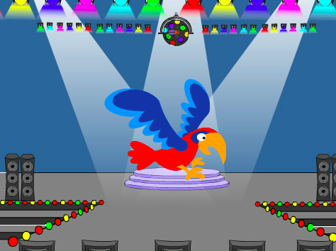
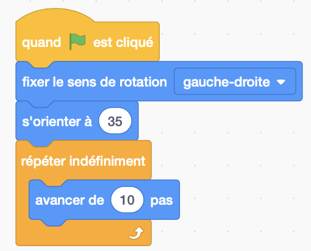

## Distraction Perroquet

<div style="display: flex; flex-wrap: wrap">
<div style="flex-basis: 200px; flex-grow: 1; margin-right: 15px;">
Pour qu'il soit plus difficile pour les joueurs de trouver et de cliquer sur le bug, tu ajouteras un perroquet ennuyeux pour les distraire. 
</div>
<div>

{:width="300px"}

</div>
</div>

--- task ---

Ajoute le sprite **Parrot**.


--- /task ---

Dans le projet [Prendre le bus](https://projects.raspberrypi.org/fr-FR/projects/catch-the-bus){:target="_blank"}, tu as utilisé une boucle `répéter`{:class="block3control"}.

Tu utiliseras une boucle différente ici. Une boucle `répéter indéfiniment`{:class="block3control"} exécute les blocs de code à l'intérieur encore et encore. C'est la boucle parfaite pour un perroquet ennuyeux qui n'arrêtera pas de voler et de gêner.

--- task ---

Ajoute du code pour faire voler le perroquet de manière distrayante :


```blocks3
when flag clicked
set rotation style [left-right v] // ne va pas à l'envers
point in direction [35] // nombre de -180 à 180
forever // continue d'être ennuyeux
move [10] steps // le nombre contrôle la vitesse
if on edge, bounce // rester sur la scène
next costume // rabat
change [color v] effect by [5] // essayer 11 ou 50
wait [0.25] seconds // essayer 0.1 ou 0.5
end
```

--- /task ---

--- task ---

**Test :** Clique sur le drapeau vert et teste à nouveau ton projet. Tu te souviens où tu as caché le bug ?

Dans Scratch, le code en cours d'exécution s'illumine d'un contour jaune :



**Astuce :** Si le perroquet devient trop ennuyeux pendant que tu codes, tu peux cliquer sur le bouton d'arrêt rouge au-dessus de la scène pour arrêter l'exécution du code.

--- /task ---

--- save ---
