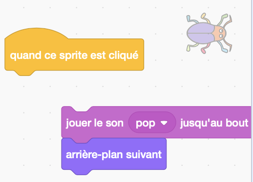
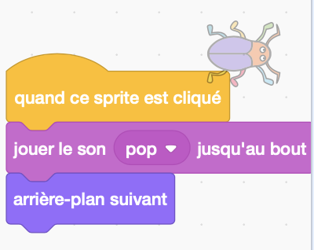

## Deuxième niveau

<div style="display: flex; flex-wrap: wrap">
<div style="flex-basis: 200px; flex-grow: 1; margin-right: 15px;">
Tu choisiras un arrière-plan pour créer un deuxième niveau pour ton jeu et rendre le bug difficile à trouver. 
</div>
<div>

{:width="300px"}

</div>
</div>

--- task ---

**Choisir :** Choisis un arrière-plan pour ton deuxième niveau. Nous avons choisi l'arrière-plan **Urban** , mais tu peux choisir celui qui te plaît le plus.


**Astuce :** N'oublie pas que les arrière-plans avec beaucoup de couleurs et de détails rendront le bug plus difficile à trouver. À quel point vas-tu rendre ton jeu difficile ?

--- /task ---

Pour pouvoir faire glisser ton bogue dans une nouvelle position, tu dois arrêter le code `quand ce sprite est cliqué`{:class="block3events"} .

--- task ---

Fais glisser les blocs loin du bloc `quand ce sprite est cliqué`{:class="block3events"} pour les empêcher de s'exécuter lorsque tu cliques sur le bug :



--- /task ---

Ton bug doit être difficile à trouver lorsque l'arrière-plan change. Tu peux redimensionner le bug pour le rendre plus difficile à trouver.

--- task ---

Ajoute du code à `mettre à la taille`{:class="block3looks"} du bug pour le deuxième niveau :


```blocks3
when backdrop switches to [Urban v] // choisir ton arrière-plan
set size to [20] % // essaye une autre taille
```

**Test :** Clique sur ton nouveau script pour l'exécuter.

--- /task ---

--- task ---

Fais glisser ton bug sur la scène vers une bonne cachette pour ce niveau.


--- /task ---

Place ton bug dans sa cachette.

--- task ---

Ajoute un bloc `aller à x: y:`{:class="block3motion"} à ton code :


```blocks3
when backdrop switches to [Urban v]
set size to [20] % // essaye une autre taille
+ go to x: [24] y: [13] // dans la vitrine
```

--- /task ---

--- task ---

Joins les blocs au bloc `quand ce sprite est cliqué`{:class="block3events"} afin que lorsque le bug est cliqué, l'arrière-plan à l'`arrière-plan suivant`{:class="block3looks"} :



--- /task ---

--- task ---

**Test :** Clique sur le drapeau vert pour tester ton projet.

--- /task ---

Ton bug peut être maintenant devant le perroquet.

--- task ---

Ajoute un script pour t'assurer que ton bug est toujours à l'`arrière`{:class="block3looks"} :


```blocks3
when flag clicked
forever
go to [back v] layer
```

Désormais, ton insecte restera toujours à l'arrière, même si tu dois changer sa position.

--- /task ---

--- save ---
