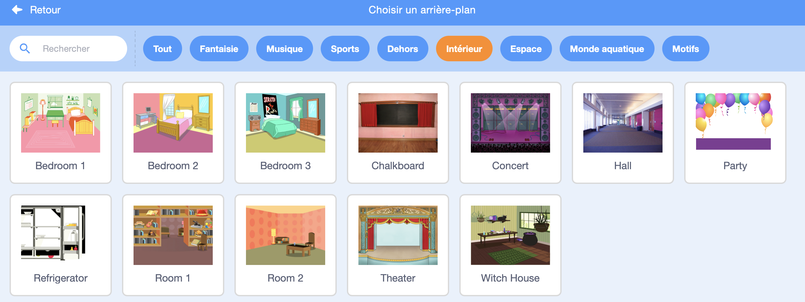
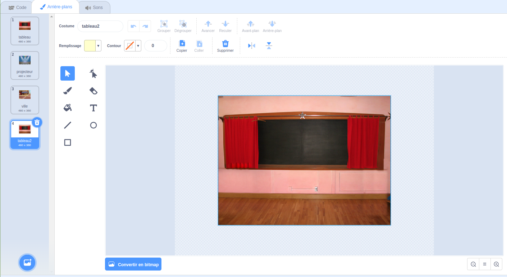
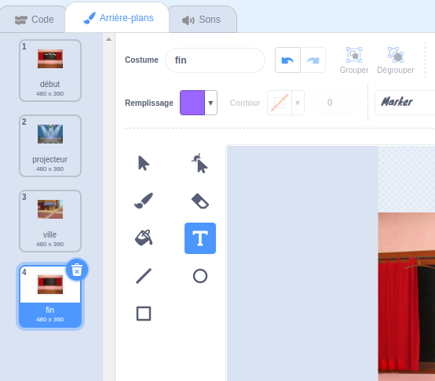
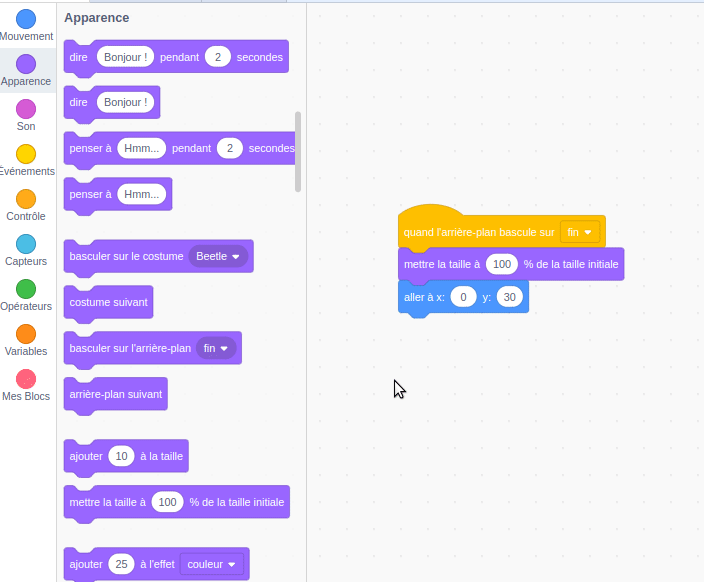

## Écran de fin

<div style="display: flex; flex-wrap: wrap">
<div style="flex-basis: 200px; flex-grow: 1; margin-right: 15px;">
Create an 'end' screen to show the number of seconds that it has taken the player to find the bugs. 
</div>
<div>

{:width="300px"}

</div>
</div>

<p style="border-left: solid; border-width:10px; border-color: #0faeb0; background-color: aliceblue; padding: 10px;">
Parfois, seulement battre le jeu n'est pas suffisant. Les joueurs aiment savoir comment ils se sont comportés contre d'autres joueurs ou contre eux-mêmes. Peux-tu penser à un jeu qui te montre à quel point tu as bien fait ?</p>

### Add another backdrop

--- task ---

Ajoute le **Chalkboard** de la catégorie **Indoors**.



**Astuce :** Dans Scratch, tu peux ajouter plusieurs fois le même arrière-plan.

--- /task ---

### Edit the backdrop

--- task ---

Clique sur l'onglet **arrière-plans** pour ouvrir l'éditeur de peinture.



--- /task ---

--- task ---

Change le nom de l'arrière-plan en `fin`:



**Astuce :** Tu renommes l'arrière-plan en **fin** pour faciliter la compréhension de ton code.

--- /task ---

### Position the bug

--- task ---

Clique sur le **bug** et ajoute du code pour positionner le bug sur l'écran 'fin' :


```blocks3
when backdrop switches to [end v]
set size to [100] % // full-sized
go to x: [0] y: [30] // on the board
```

--- /task ---

### Add a timer

Combien de temps te faut-il pour trouver et cliquer sur les bugs ? Scratch a un `chronomètre`{:class="block3sensing"} que tu peux utiliser pour le découvrir.

--- task ---

Le bloc `chronomètre`{: class = "block3sensing"} est dans le menu blocs `Capteurs`{: class = "block3sensing"} . Ajoute du code pour que le bug `dise`{:class="block3looks"} le `chronomètre`{:class="block3sensing"} sur l'écran 'fin' :


```blocks3
when backdrop switches to [end v]
set size to [100] % // full-sized
go to x: [0] y: [30] // on the board
+say (timer) // seconds taken
```



--- /task ---

--- task ---

**Test :** Clique sur le drapeau vert pour tester tes capacités de recherche. Combien de temps te faut-il pour trouver le bug ?

--- /task ---

Pour revenir à l'écran 'début', clique sur le bug sur l'écran 'fin'.

--- task ---

Ajoute du code pour que le bug arrête de dire le `chronomètre`{:class="block3sensing"} lorsque tu vas à l'écran « début » :


```blocks3
when backdrop switches to [start v]
set size to [100] % // full-sized
go to x: [0] y: [30] // on the board
+say [] // say nothing
```

--- /task ---

### Stop the timer

Si tu joues au jeu une deuxième fois, le `chronomètre`{:class="block3sensing"} continuera à compter.

--- task ---

Ajoute le code `réinitialisez le chronomètre`{:class="block3sensing"}`quand l'arrière-plan bascule sur`{:class="block3events"} le premier niveau :


```blocks3
when backdrop switches to [Spotlight v] // first level
set size to [20] % // tiny
go to x: [13] y: [132] // on the disco ball
+reset timer // start the timer
```

--- /task ---

--- task ---

**Test :** Clique sur le drapeau vert et lance le jeu. Le chronomètre devrait se réinitialiser lorsque tu cliques sur le bug sur l'écran « début » pour passer au premier niveau. Lorsque tu cliques sur le bug sur l'écran 'fin', tu devrais revenir à l'écran 'début' et voir que le bug ne dit pas le `chronomètre`{:class="block3sensing"}.

--- /task ---

