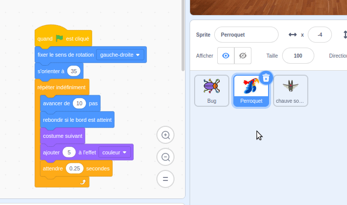

## Améliorer ton jeu

Si tu as le temps, tu peux ajouter plus de niveaux et plus de distractions à ton jeu. Tu peux également changer le sprite qui se cache et changer le texte au tableau.

Voici les blocs dont tu auras besoin pour masquer le bug à un nouveau niveau :

```blocks3
when backdrop switches to [new level v]

set size to [20] %

go to x: [0] y: [0] // drag to position the bug first

set [color v] effect to [50]
```

--- task ---

Pour chaque niveau, tu devras :
- Ajouter un arrière-plan
- Cliquer sur le volet Scène, puis sur l' onglet **Arrière-plans** , puis faire glisser le nouvel arrière-plan en position avant l'arrière-plan **fin**
- Ajoute un bloc `quand l'arrière-plan bascule sur` {:class="block3events"} pour le nouvel arrière-plan et ajoute du code pour positionner et masquer le bug

**Astuce :** Pour faire glisser le bug vers une nouvelle position cachée, tu devras « casser » le code afin que l'arrière-plan ne change pas lorsque tu cliques sur le bug pour le positionner à un nouveau niveau.

--- /task ---

--- task ---

Tu peux ajouter plus de perroquets ou choisir un autre sprite pour faire office de distraction.

Voici le code que tu as utilisé pour le perroquet :
```blocks3
when flag clicked
set rotation style [left-right v] // do not go upside down
point in direction [35] // number from -180 to 180
forever // keep being annoying
move [10] steps // the number controls the speed
if on edge, bounce // stay on the Stage
next costume // flap
change [color v] effect by [5] // try 11 or 50
wait [0.25] seconds // try 0.1 or 0.5
end
```

**Astuce :** Tu peux faire glisser le **sprite Parrot** vers un autre sprite pour accélérer la création d'un autre sprite de distraction.



--- /task ---

--- collapse ---
---
title: Le projet achevé
---

Tu peux voir le [projet terminé ici](https://scratch.mit.edu/projects/486719939/){:target="_blank"}.

--- /collapse ---

--- save ---

