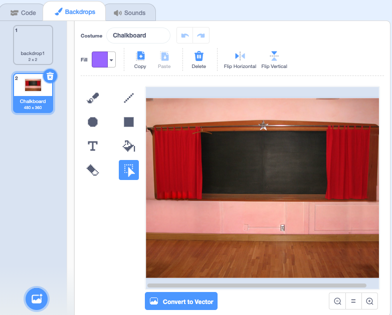
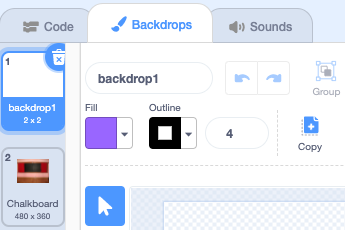

## מסך התחלה

תן למשחק שלך מסך "התחלה".

{:width="300px"}

### פתח את פרויקט ההתחלתי

--- task ---

פתח את [פרויקט פותח מצא את הבאגים](https://scratch.mit.edu/projects/582214723/editor){:target="_blank"}. סקראץ׳ ייפתח בכרטיסייה אחרת של הדפדפן.

[[[working-offline]]]

--- /task ---

### הוסף רקע

--- task ---

הוסף את רקע **לוח הגיר** מהקטגוריה **בתוך הבית**.

--- /task ---

לשלב **הבמה** יש כרטיסייה **תפאורות** במקום כרטיסייה **תלבושות** כאן תוכלו ליצור תמונות עבור **הבמה**.

--- task ---

לחץ על חלונית הבמה.

--- /task ---

### עריכת הרקע

--- task ---

לחצו על הכרטיסייה **רקעים** כדי לפתוח את עורך הציור.

--- /task ---

--- task ---

בחר **רקע1** ולחץ על סמל **מחיקה** כדי להסיר את הרקע **רקע1** מהפרויקט שלך. לא תצטרכו את הרקע **ֿרקע1** בפרויקט הזה.

--- /task ---

הרקע **לוח הגיר** יהיה כעת מודגש.

--- task ---

לחץ על **המר לווקטור**. כעת, תוכלו להוסיף טקסט שתוכלו להזיז.

--- /task ---

--- task ---

השתמש בכלי **טקסט** כדי להוסיף את הטקסט `מצא את הבאג` ללוח הגיר:

השתמשנו בגופן **מרקר** בלבן, אבל **בחרו** את הגופן והצבע שברצונכם להשתמש בהם.

**טיפ:** עבור לכלי **בחר** (חץ) כדי להזיז את הטקסט. כדי לשנות את גודל הטקסט, אחזו בפינה של הטקסט וגררו אותה.

--- /task ---

## שנה את שם הרקע

--- task ---

שנה את שם הרקע ל- `התחל`, מכיוון שתצטרך לבחור אותו בהמשך הפרויקט.

**טיפ:** אם תשתמשו בשמות הגיוניים, יהיה לכם קל יותר להבין את הפרויקט שלכם, במיוחד כשתחזרו אליו מאוחר יותר.

--- /task ---

### הוסף את ספרייט הבאג

--- task ---

מחק את הספרייט **חתול הסקראץ׳**.

--- /task ---

--- task ---

לחץ על **בחר ספרייט** והקלד `באג` בתיבת החיפוש.

**בחר:** בחר באג, אותו שחקנים יצטרכו למצוא במשחק שלך.

**טיפ:** תנו שם לפרויקט שלכם. ייתכן שתרצו לכלול את שם הבאג שבחרתם.

--- /task ---

טעות בתוכנית מחשב נקראת **באג**. מציאה והסרת שגיאות בתוכניות מחשב נקראות **דבאגינג**. גרייס הופר היא מהנדסת תוכנה מפורסמת. הצוות שלה מצא פעם עש במחשב שלהם. ברשימותיהם כתוב, "מקרה אמיתי ראשון של באג שנמצא".

