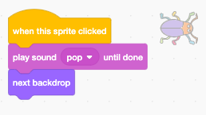

## שלב הראשון

<div style="display: flex; flex-wrap: wrap">
<div style="flex-basis: 200px; flex-grow: 1; margin-right: 15px;">
הוסף רקע חדש כשלב הראשון במשחק שלך, והסתר את הבאג.
</div>
<div>

{:width="300px"}

</div>
</div>

### הוסף רקע נוסף

--- task ---

הוסף את הרקע **זרקור** מהקטגוריה **מוזיקה**.


--- /task ---

### שנה את גודל הבאג

--- task ---

לחץ על הספרייט **באג** ברשימת הספרייטים. הוסף סקריפט כדי לשנות את ה `גודל`{:class="block3looks"} של הבאג שלך `כאשר הרקע עובר ל-זרקור`{:class="block3events"}:


```blocks3
when backdrop switches to [Spotlight v]
set size to [20] % // tiny
```

--- /task ---

--- task ---

לחץ על הקוד כדי לשנות את הגודל, לאחר מכן גרור את הבאג הקטן שלך למקום מסתור.

הוסף קוד כדי למקם את הבאג שלך:


```blocks3
when backdrop switches to [Spotlight v]
set size to [20] % // tiny
+ go to x: [13] y: [132] // on the disco ball
```

**בחר:** באפשרותך לבחור גודל ומיקום שונים, אם תרצה.

--- /task ---

### מעבר לרקע הבא

כאשר תשחקו במשחק ותמצאו בהצלחה את הבאג, המשחק יעבור לרקע הבא. כמו כן, כדי להתחיל את המשחק, עליכם ללחוץ על הבאג במסך 'התחל'.

הבלוק `רקע הבא`{:class="block3looks"} עובר לרקע הבא בסדר שבו הרקעים מופיעים כשלוחצים על הכרטיסייה **רקעים** עבור **הבמה**.

--- task ---

הוסף סקריפט ל **באג** הספרייט שלך כדי `להשמיע צליל פופ`{:class="block3sound"} ולעבור לרקע `הבא`{:class="block3looks"} `כאשר לוחצים על ספרייט זה`{:class="block3events"}:


```blocks3
when this sprite clicked
play sound [Pop v] until done
next backdrop
```

--- /task ---

### התחלת המשחק באמצעות מסך הפתיחה

--- task ---

לחץ על חלונית הבמה והוסף קוד זה ל- **במה**:


```blocks3
when flag clicked
switch backdrop to [start v] // 'start' screen
```

--- /task ---

--- task ---

**בדיקה:** לחץ על הדגל הירוק כדי לבדוק את הפרויקט שלך.

תשימו לב שבמסך ה'התחל', לבאג עדיין יהיו ההגדרות להסתתר במקום המחבוא שלו מהשלב הראשון (בדוגמה זו, על כדור הדיסקו).

**טיפ:** אחרי הרקע האחרון ברשימה, `הרקע הבא`{:class="block3looks"} יחזור לרקע הראשון.

--- /task ---

--- task ---

לחץ על הספרייט **באג** ברשימת הספרייטים. הוסף סקריפט כדי `לקבוע את הגודל`{:class="block3looks"} של הבאג כאשר הרקע `שלך עובר ל`{:class="block3events"} מסך `ההתחלה`{:class="block3events"}:


```blocks3
when backdrop switches to [start v]
set size to [100] % // full-sized
```

--- /task ---

### שנה את מיקום הבאג

--- task ---

נסה למקם את הבאג על מסך ה"התחל".

הקוד שלך יגרום לרקע להתחלף כשתלחץ על הבאג! זה לא מועיל כשאתה מנסה למקם את הבאג.

כדי לתקן את הבעיה, עליך לעצור את הקוד מלפעול בעת לחיצה על הבאג.

--- /task ---

--- task ---

לחץ על הדגל הירוק כדי לחזור למסך 'התחל'.

לחץ על הספרייט **באג** ברשימת הספרייטים וגרור את הבלוקים הרחק מהבלוק `כאשר ספרייט זה נלחץ`{:class="block3events"}:


--- /task ---

--- task ---

נסה למקם את הבאג שוב. גררו את הבאג אל הלוח הגיר, מתחת לטקסט:


הוסף קוד כדי לוודא שהבאג ממוקם על הלוח הגיר בכל פעם שרקע `שלך עובר ל-`{:class="block3events"} מסך `ההתחלה`{:class="block3events"} :


```blocks3
when backdrop switches to [start v]
set size to [100] % // full-sized
+ go to x: [0] y: [30] // on the board
```

--- /task ---

--- task ---

חברו את הבלוקים בחזרה יחד כך שבלוקי הקוד יהיו מתחת לבלוק `כאשר לוחצים על הספרייט הזה`{:class="block3events"}:



--- /task ---

--- task ---

**בדיקה:** לחץ על הדגל הירוק כדי לבדוק את הפרויקט שלך. לחץ על הבאג כדי לעבור לרקע הבא. הבאג אמור להיות גדול במסך ה"התחלה" וקטן ברמת ה"זרקור".

--- collapse ---
---
כותרת: שום דבר לא קורה כשאני לוחץ על הבאג
---

האם שכחת לחבר את הקוד בחזרה לבלוק `כשהספרייט הזה לחץ על הבלוק`{:class="block3events"}?

--- /collapse ---

--- /task ---