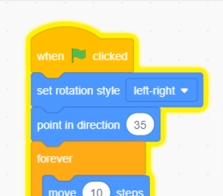

## הסחת דעת של תוכי

<div style="display: flex; flex-wrap: wrap">
<div style="flex-basis: 200px; flex-grow: 1; margin-right: 15px;">
כדי להקשות על השחקנים למצוא את הבאג וללחוץ עליו, תוסיפו תוכי מעצבן שיסיח את דעתם. 
</div>
<div>

[תוכי צבעוני על הבמה.](images/parrot-distraction.png){:width="300px"}

</div>
</div>

### הוסף את הספרייט תוכי

--- task ---

הוסף את הספרייט **תוכי** .


--- /task ---

### הנפשת הספרייט תוכי

בפרויקט [תפוס את האוטובוס](https://projects.raspberrypi.org/en/projects/catch-the-bus){:target="_blank"}, השתמשת בלולאה של `חזרה`{:class="block3control"}.

כאן תשתמש בלולאה שונה. לולאת `אינסוף`{:class="block3control"} מפעילה את בלוקי הקוד שבתוכה שוב ושוב. זוהי הלולאה המושלמת לתוכי מעצבן שלא מפסיק לעוף ולהפריע.

--- task ---

הוסיפו קוד שיגרום לתוכי להתנפנף בצורה מסיחה את הדעת. עיינו בהערות על בלוקי הקוד עבור מספרים שונים שכדאי לנסות:


```blocks3
when flag clicked
set rotation style [left-right v] // do not go upside down
point in direction [35] // number from -180 to 180
forever // keep being annoying
move [10] steps // the number controls the speed
if on edge, bounce // stay on the Stage
next costume // flap
change [color v] effect by [5] // try 11 or 50
wait [0.25] seconds // try 0.1 or 0.5
end
```

--- /task ---

--- task ---

**בדיקה:** לחצו על הדגל הירוק ובדקו שוב את הפרויקט שלכם. אתה זוכר איפה הסתרת את הבאג?

בסקראץ׳, קוד שפועל זוהר עם קווי מתאר צהובים:



**טיפ:** אם התוכי נהיה מעצבן מדי בזמן שאתם מקודדים, אתם יכולים ללחוץ על כפתור העצירה האדום מעל השלב כדי לעצור את הפעלת הקוד.

--- /task ---

