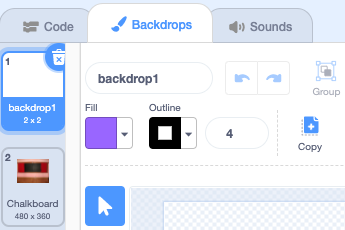

## प्रारंभ स्क्रीन

अपने गेम को 'start' स्क्रीन दें।

{:width="300px"}

### स्टार्टर प्रोजेक्ट खोलें

--- task ---

[बग खोजें स्टार्टर प्रोजेक्ट](https://scratch.mit.edu/projects/582214723/editor){:target="_blank"} खोलें। Scratch दूसरे ब्राउज़र टैब में खुलेगा।

[[[working-offline]]]

--- /task ---

### बैकड्रॉप जोड़ें

--- task ---

**Indoors** श्रेणी से **Chalkboard** बैकड्रॉप जोड़ें।

--- /task ---

**Stage** में **Costumes** टैब की जगह **Backdrops** टैब है। यह वह जगह है जहाँ आप **Stage** के लिए चित्र बना सकते हैं।

--- task ---

Stage पेन पर क्लिक करें।

--- /task ---

### बैकड्रॉप एडिट करें

--- task ---

Paint संपादक खोलने के लिए **Backdrops** टैब पर क्लिक करें।

--- /task ---

--- task ---

**backdrop1** का चयन करें और अपने प्रोजेक्ट से **backdrop1** बैकड्रॉप को हटाने के लिए **Delete** आइकन पर क्लिक करें। इस प्रोजेक्ट में आपको **backdrop1** बैकड्रॉप की आवश्यकता नहीं होगी।

--- /task ---

**Chalkboard** बैकड्रॉप अब हाइलाइट किया जाएगा।

--- task ---

**Convert to Vector** पर क्लिक करें। अब, आप उस टेक्स्ट को जोड़ने में सक्षम होंगे जिसे आप इधर-उधर कर सकते हैं।

--- /task ---

--- task ---

**Text** टूल का उपयोग करें, चॉकबोर्ड में `Find the bug` टेक्स्ट जोड़ने के लिए:

हमने सफेद रंग में **Marker** फ़ॉन्ट का उपयोग किया है, लेकिन उस फ़ॉन्ट और रंग को **चुनें** जिसे आप उपयोग करना चाहते हैं।

**टिप:** अपने टेक्स्ट को इधर-उधर करने के लिए **Select** (Arrow) टूल पर स्विच करें। टेक्स्ट का साइज़ बदलने के लिए, टेक्स्ट के कोने को पकड़ें और उसे खींचें।

--- /task ---

## बैकड्रॉप  का नाम बदलें

--- task ---

बैकड्रॉप का नाम `start` में बदलें, क्योंकि आपको इसे बाद में प्रोजेक्ट में चुनना होगा।

**टिप:** यदि आप उन नामों का उपयोग करते हैं जो अर्थपूर्ण हैं, तो आपके प्रोजेक्ट को समझना आसान हो जाएगा, खासकर जब आप बाद में प्रोजेक्ट पर वापस आते हैं।

--- /task ---

### बग स्प्राइट जोड़ें

--- task ---

**Scratch Cat** स्प्राइट हटाएं।

--- /task ---

--- task ---

**Choose a Sprite** पर क्लिक करें और सर्च बॉक्स में `bug` टाइप करें।

**चुनें:** एक बग चुनें, जिसे खिलाड़ियों को आपके गेम में खोजने की आवश्यकता होगी।

**टिप:** अपने प्रोजेक्ट को एक नाम दें। हो सकता है कि आप उस बग का नाम शामिल करना चाहें जिसे आपने अभी चुना है।

--- /task ---

कंप्यूटर प्रोग्राम में एक गलती को **bug**कहा जाता है। कंप्यूटर प्रोग्राम में गलतियाँ ढूँढ़ना और हटाना **debugging**कहलाता है। Grace Hopper एक प्रसिद्ध सॉफ्टवेयर इंजीनियर हैं। उनकी टीम को एक बार उनके कंप्यूटर में एक कीड़ा मिला। उनके नोट्स कहते हैं, "बग पाए जाने का पहला वास्तविक मामला।"

