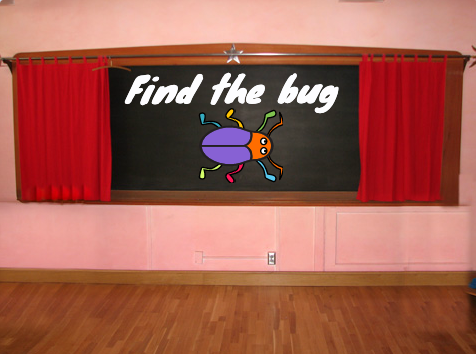

## प्रथम स्तर

<div style="display: flex; flex-wrap: wrap">
<div style="flex-basis: 200px; flex-grow: 1; margin-right: 15px;">
अपने गेम में पहले स्तर के रूप में एक नई पृष्ठभूमि जोड़ें, और बग छुपाएं।
</div>
<div>

{:width="300px"}

</div>
</div>

### Add another Backdrop

--- task ---

**Music** श्रेणी से **Spotlight** बैकड्रॉप जोड़ें।


--- /task ---

### बग का आकार बदलें

--- task ---

Sprite सूची में **bug** स्प्राइट पर क्लिक करें। अपने बग के `size`{:class="block3looks"} को बदलने के लिए एक स्क्रिप्ट जोड़ें `when the backdrop switches to Spotlight`{:class="block3events"}:


```blocks3
when backdrop switches to [Spotlight v]
set size to [20] % // tiny
```

--- /task ---

--- task ---

साइज़ बदलने के लिए कोड पर क्लिक करें, फिर अपने छोटे बग को किसी छिपने की जगह पर खींचें।

अपने बग जगह पर रखने के लिए कोड जोड़ें:


```blocks3
when backdrop switches to [Spotlight v]
set size to [20] % // tiny
+ go to x: [13] y: [132] // on the disco ball
```

**चुनें:** यदि आप चाहें तो एक अलग साइज़ और जगह चुन सकते हैं।

--- /task ---

### अगली पृष्ठभूमि पर जाएँ

जब आप गेम खेलते हैं और आप सफलतापूर्वक बग ढूंढ लेते हैं, तो गेम अगले बैकड्रॉप पर स्विच हो जाएगी। साथ ही, गेम शुरू करने के लिए, आप 'स्टार्ट' स्क्रीन पर बग पर क्लिक करेंगे।

`next backdrop`{:class="block3looks"} ब्लॉक अगले बैकड्रॉप पर उस क्रम में स्विच हो जाता है जैसे बैकड्रॉप की सूची में दिया है जब आप **Stage**के लिए **Backdrops** टैब पर क्लिक करते हैं।

--- task ---

अपने **bug** स्प्राइट में एक स्क्रिप्ट जोड़ें जिससे `play a Pop sound`{:class="block3sound"} और `next backdrop`{:class="block3looks"} पर स्विच करें `when this sprite is clicked`{:class ="block3events"}:


```blocks3
when this sprite clicked
play sound [Pop v] until done
next backdrop
```

--- /task ---

### गेम को स्टार्ट स्क्रीन से शुरू करें

--- task ---

स्टेज पेन पर क्लिक करें और इस कोड को **स्टेज**में जोड़ें:


```blocks3
when flag clicked
switch backdrop to [start v] // 'start' screen
```

--- /task ---

--- task ---

**परीक्षण:** अपने प्रोजेक्ट का परीक्षण करने के लिए हरे झंडे पर क्लिक करें।

आप देखेंगे कि 'प्रारंभ' स्क्रीन पर, बग के पास अभी भी पहले स्तर से (इस उदाहरण में, डिस्को बॉल पर) छिपने की जगह में छिपने की सेटिंग होगी।

**युक्ति:** सूची में अंतिम पृष्ठभूमि के बाद, `अगली पृष्ठभूमि`{:class="block3looks"} पहली पृष्ठभूमि पर वापस आ जाएगी।

--- /task ---

--- task ---

Stage के नीचे Sprite सूची में **shrink** स्प्राइट पर क्लिक करें। जब आपका `backdrop switches to`{:class="block3events"} `start`{:class="block3events"} स्क्रीन, तो बग के `set the size`{:class="block3looks"} में एक स्क्रिप्ट जोड़ें:


```blocks3
when backdrop switches to [start v]
set size to [100] % // full-sized
```

--- /task ---

### बग की स्थिति बदलें

--- task ---

बग को 'प्रारंभ' स्क्रीन पर रखने का प्रयास करें।

जब आप बग पर क्लिक करेंगे तो आपका कोड बैकड्रॉप स्विच कर देगा! जब आप बग को स्थापित करने का प्रयास कर रहे हों तो यह मददगार नहीं है।

समस्या को ठीक करने के लिए, आपको बग पर क्लिक करने पर कोड को चलने से रोकना होगा।

--- /task ---

--- task ---

'प्रारंभ' स्क्रीन पर लौटने के लिए हरे झंडे पर क्लिक करें।

Sprite सूची में **bug** स्प्राइट पर क्लिक करें और ब्लॉक को `when this sprite clicked `{:class="block3events"} ब्लॉक से दूर खींचें:


--- /task ---

--- task ---

बग को फिर से स्थापित करने का प्रयास करें। टेक्स्ट के नीचे, बग को चॉकबोर्ड पर खींचें:



यह सुनिश्चित करने के लिए कोड जोड़ें कि हर बार जब आपका `बैकड्रॉप`{:class="block3events"} `start`{:class="block3events"} स्क्रीन पर स्विच करता है, तो हर बार चॉकबोर्ड पर बग स्थित है:


```blocks3
when backdrop switches to [start v]
set size to [100] % // full-sized
+ go to x: [0] y: [30] // on the board
```

--- /task ---

--- task ---

ब्लॉक को वापस एक साथ जोड़ दें ताकि कोड ब्लॉक `when this sprite clicked`{:class="block3events"} ब्लॉक के नीचे आ जाएँ:


--- /task ---

--- task ---

**परीक्षण:** अपने प्रोजेक्ट का परीक्षण करने के लिए हरे झंडे पर क्लिक करें। अगली पृष्ठभूमि पर जाने के लिए बग पर क्लिक करें। बग 'प्रारंभ' स्क्रीन पर बड़ा और 'स्पॉटलाइट' स्तर पर छोटा होना चाहिए।

--- collapse ---
---
शीर्षक: जब मैं बग पर क्लिक करता हूँ तो कुछ नहीं होता है
---

क्या आप कोड को वापस `when this sprite clicked`{:class="block3events"} ब्लॉक से जोड़ना भूल गए हैं?

--- /collapse ---

--- /task ---