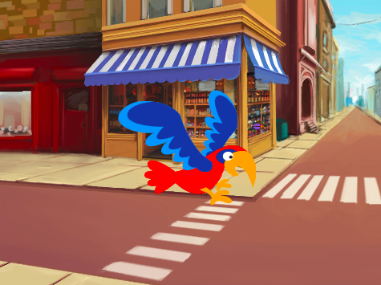

## दूसरा स्तर

<div style="display: flex; flex-wrap: wrap">
<div style="flex-basis: 200px; flex-grow: 1; margin-right: 15px;">
आप अपने गेम का दूसरा स्तर बनाने के लिए एक बैकड्रॉप चुनें, और बग को खोजने में कठिन बनाएं। 
</div>
<div>

{:width="300px"}

</div>
</div>

### एक पृष्ठभूमि जोड़ें।

--- task ---

**चुनें:** अपने दूसरे स्तर के लिए एक बैकड्रॉप चुनें। हमने **Urban** बैकड्रॉप को चुना है, लेकिन आप वह चुन सकते हैं जो आपको सबसे ज्यादा पसंद हो।


**टिप:** याद रखें कि बहुत सारे रंगों और विवरणों वाले बैकड्रॉप बग को ढूंढना कठिन बना देगा। आप अपने खेल को कितना कठिन बनाना चाहते हो?

--- /task ---

### कोड को चलने से रोकें

--- task ---

जब आप बग पर क्लिक करते हैं तो बाकी ब्लॉकों को चलने से रोकने के लिए `when this sprite clicked`{:class="block3events"} ब्लॉक से बाकी ब्लॉकों को दूर खींचें


--- /task ---

### बग का आकार बदलें

--- task ---

दूसरे स्तर के लिए बग के `set the size`{:class="block3looks"} में कोड जोड़ें:


```blocks3
when backdrop switches to [Urban v] // choose your backdrop
set size to [20] % // try another size 
```

**परीक्षण:** इसे चलाने के लिए अपनी नई स्क्रिप्ट पर क्लिक करें।

--- /task ---

### अपना बग छुपाएं

--- task ---

इस स्तर के लिए अपने बग को Stage के किसी अच्छे छिपने वाले स्थान की तरफ खींचें।


--- /task ---

अपने बग को उसके छिपने की जगह पर रखें।

--- task ---

अपने कोड में `go to x: y:`{:class="block3motion"} ब्लॉक को जोड़ें:


```blocks3
when backdrop switches to [Urban v]
set size to [20] % // try another size 
+ go to x: [24] y: [13] // in the shop window
```

--- /task ---

### अपने कोड का परीक्षण करें

--- task ---

ब्लॉक को वापस `when this sprite clicked`{:class="block3events"} में शामिल करें ताकि जब बग क्लिक किया जाए, तो बैकड्रॉप `next backdrop`{:class="block3looks"} पर स्विच हो जाए:


--- /task ---

--- task ---

**परीक्षण:** अपने प्रोजेक्ट का परीक्षण करने के लिए हरे झंडे पर क्लिक करें।

--- /task ---

आपका बग अब parrot के सामने हो सकता है।

--- task ---

यह सुनिश्चित करने के लिए एक स्क्रिप्ट जोड़ें कि आपका बग हमेशा `बैक`{:class="block3looks"} पर है:


```blocks3
when flag clicked
forever
go to [back v] layer
```

अब, आपका बग हमेशा पीछे रहेगा, भले ही आपको इसकी स्थिति बदलने की आवश्यकता हो।

--- /task ---
