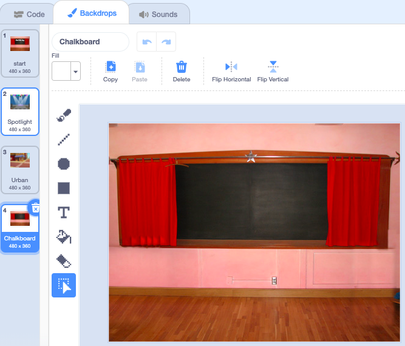

## आखिरी (एंड) स्क्रीन

<div style="display: flex; flex-wrap: wrap">
<div style="flex-basis: 200px; flex-grow: 1; margin-right: 15px;">
आप एक 'end' स्क्रीन बनाएंगे, जिसमें यह दिखाया जाएगा कि खिलाड़ी को बग ढूंढने में कितने सेकंड लगे हैं। 
</div>
<div>

{:width="300px"}

</div>
</div>

<p style="border-left: solid; border-width:10px; border-color: #0faeb0; background-color: aliceblue; padding: 10px;">
कभी-कभी, केवल खेल को हरा देना ही काफी नहीं होता। खिलाड़ी यह जानना पसंद करते हैं कि उन्होंने अन्य खिलाड़ियों या खुद के खिलाफ कैसा प्रदर्शन किया। क्या आप किसी ऐसे खेल के बारे में सोच सकते हैं जो आपको दिखाता हो कि आपने कितना अच्छा किया?</p>

### एक पृष्ठभूमि जोड़ें।

--- task ---

**इंडोर्स** श्रेणी से **Chalkboard** बैकड्रॉप जोड़ें।


**टिप:** Scratch में, आप एक ही बैकड्रॉप को एक से अधिक बार जोड़ सकते हैं।

--- /task ---

### बैकड्रॉप एडिट करें

--- task ---

Paint संपादक खोलने के लिए **Backdrops** टैब पर क्लिक करें।



--- /task ---

--- task ---

बैकड्रॉप का नाम `end` में बदलें:


**टिप:** आप अपने कोड को आसानी से समझने के लिए बैकड्रॉप का नाम बदलकर **end** कर दें।

--- /task ---

### शंकु को जगह पर लगाएँ

--- task ---

**bug** स्प्राइट पर क्लिक करें और बग को 'end' स्क्रीन पर रखने के लिए कोड जोड़ें:


```blocks3
when backdrop switches to [end v]
set size to [100] % // full-sized
go to x: [0] y: [30] // on the board
```

--- /task ---

### टाइमर जोड़ें

बग्स को खोजने और उन पर क्लिक करने में आपको कितना समय लगता है? Scratch में एक `timer`{:class="block3sensing"} है जिसका उपयोग आप पता लगाने के लिए कर सकते हैं।

--- task ---

`Sensing`{:class="block3sensing"} ब्लॉक मेन्यू से `timer`{:class="block3sensing"} ब्लॉक आता है। 'एंड' स्क्रीन पर बग `say`{:class="block3looks"} `timer`{:class="block3sensing"} के लिए कोड जोड़ें


```blocks3
when backdrop switches to [end v]
set size to [100] % // full-sized
go to x: [0] y: [30] // on the board
+say (timer) // seconds taken
```


--- /task ---

--- task ---

**परीक्षण:** अपने खोज कौशल का परीक्षण करने के लिए हरे झंडे पर क्लिक करें। आपको बग खोजने में कितना समय लगता है?

--- /task ---

'start' स्क्रीन पर वापस जाने के लिए, 'end' स्क्रीन में बग पर क्लिक करें।

--- task ---

जब आप 'स्टार्ट' स्क्रीन पर जाते हैं तब बग से `timer`{:class="block3sensing"} ना कहलवाने के लिए कोड जोड़ें:


```blocks3
when backdrop switches to [start v]
set size to [100] % // full-sized
go to x: [0] y: [30] // on the board
+say [] // say nothing
```

--- /task ---

### टाइमर शुरू करो

अगर आप दूसरी बार गेम खेलते हैं, तो `timer`{:class="block3sensing"} गिनती करता रहेगा।

--- task ---

जब `backdrop switches to`{:class="block3events"} पहला स्तर तब `reset the timer`{:class="block3sensing"} में कोड जोड़ें


```blocks3
when backdrop switches to [Spotlight v] // first level
set size to [20] % // tiny
go to x: [13] y: [132] // on the disco ball
+reset timer // start the timer
```

--- /task ---

--- task ---

**परीक्षण:** हरे झंडे पर क्लिक करें और गेम खेलें। जब आप पहले स्तर पर जाने के लिए 'start' स्क्रीन पर बग पर क्लिक करते हैं तो टाइमर रीसेट हो जाना चाहिए। जब आप 'end' स्क्रीन पर बग पर क्लिक करते हैं, तब आपको 'start' स्क्रीन पर वापस लौटना चाहिए और देखना चाहिए कि बग `timer`{:class="block3sensing"} नहीं दिखा रहा है।

--- /task ---

