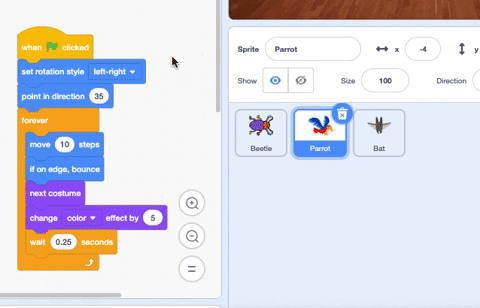

## अपना गेम अपग्रेड करें

यदि आपके पास समय है, तो आप अपने खेल में अधिक स्तर और अधिक ध्यान भटकाने के तरीके जोड़ सकते हैं। आप छिपे हुए स्प्राइट को भी बदल सकते हैं और चॉकबोर्ड पर टेक्स्ट को बदल सकते हैं।

--- task ---

अपना गेम खेलें और देखें कि आप कितनी जल्दी बग ढूंढ सकते हैं।

क्या कोई और है जो आपके गेम को ट्राई कर सकता है? वे कितनी तेजी से बग ढूंढ पा रहे हैं? उन्हें नहीं पता होगा कि आपने उन्हें कहाँ छिपाया है, इसलिए इसमें उन्हें थोड़ा अधिक समय लग सकता है!

क्या ऐसा कुछ है जिसे आप बदलना चाहते हैं?

आप ऐसा कर सकते हैं:
- तोते से और भी परेशानी ला दो
- बग को छोटा करके
- प्रत्येक स्तर पर बग को छिपाने के लिए `color effect`{:class="block3looks"} बदलें
- टेक्स्ट का फ़ॉन्ट या रंग बदलें

--- /task ---

### अधिक विवरण जोड़ें

--- task ---

यहां वे ब्लॉक हैं जिनकी आपको नए स्तर पर बग को छिपाने के लिए आवश्यकता होगी:

```blocks3
when backdrop switches to [new level v]

set size to [20] %

go to x: [0] y: [0] // drag to position the bug first

set [color v] effect to [50]
```

प्रत्येक दरवाजे के लिए आपको निम्न की आवश्यकता होगी:
- एक पृष्ठभूमि जोड़ें
- Stage पेन पर क्लिक करें, फिर **Backdrops** टैब पर, फिर नई बैकड्रॉप को **end** बैकड्रॉप से पिछले स्थिति में खींचें।
- `when backdrop switches to`{:class="block3events"} ब्लॉक को नए बैकड्रॉप के लिए जोड़ें और जगह(पोजीशन) में कोड जोड़ें और बग छुपाएं

**टिप:** बग को छिपाने की नई जगह में खींचने के लिए, आपको कोड को 'ब्रेक' करना होगा ताकि जब आप बग को नए स्तर पर रखने के लिए उस पर क्लिक करें तो बैकड्रॉप स्विच न करे।

--- /task ---

### अधिक विकर्षण जोड़ें

--- task ---

आप ध्यान भटकाने के लिए अधिक तोते जोड़ सकते हैं या कोई और स्प्राइट चुन सकते हैं।

यहाँ वह कोड है जिसका उपयोग आपने तोते के लिए किया था:

```blocks3
when flag clicked
set rotation style [left-right v] // do not go upside down
point in direction [35] // number from -180 to 180
forever // keep being annoying
move [10] steps // the number controls the speed
if on edge, bounce // stay on the Stage
next costume // flap
change [color v] effect by [5] // try 11 or 50
wait [0.25] seconds // try 0.1 or 0.5
end
```

**टिप:** आप **Parrot** स्प्राइट के कोड को दूसरे स्प्राइट में खींच सकते हैं ताकि इसे तेजी से एक और भटकाने वाले स्प्राइट बनाने के लिए इस्तेमाल किया जा सके।



--- /task ---

--- collapse ---
---
title: पूर्ण परियोजना
---

आप [ पूर्ण प्रोजेक्ट यहां से प्राप्त कर सकते हैं ](https://scratch.mit.edu/projects/486719939/) {: target = "_ blank"}.

--- /collapse ---