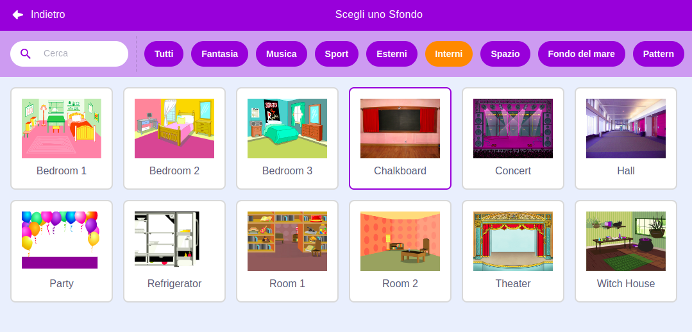

## Schermata iniziale

Dai al tuo gioco una schermata di 'inizio'.

{:width="300px"}

### Apri il progetto iniziale

--- task ---

Apri il [progetto iniziale di Trova l'insetto](https://scratch.mit.edu/projects/582214723/editor){:target="_blank"}. Scratch si aprirà in una nuova scheda del browser.

[[[working-offline]]]

--- /task ---

### Aggiungi uno sfondo

--- task ---

Aggiungi lo sfondo **Chalkboard** dalla categoria **Interni**.

--- /task ---

Lo **Stage** ha una scheda **Sfondi** invece della scheda **Costumi**. Qui è dove puoi creare immagini per lo **Stage**.

--- task ---

Fai clic sullo pannello degli Stage.

--- /task ---

### Modifica lo sfondo

--- task ---

Fai clic sulla scheda **Sfondi** per aprire l'editor Paint.

--- /task ---

--- task ---

Seleziona **backdrop1** e fai clic sull'icona **Cancella** per rimuovere lo sfondo **backdrop1** dal tuo progetto. Non avrai bisogno dello sfondo **backdrop1** in questo progetto.

--- /task ---

Lo sfondo **Chalkboard** verrà ora evidenziato.

--- task ---

Fai clic su **Converti in vettoriale**. Ora sarai in grado di aggiungere un testo che puoi spostare.

--- /task ---

--- task ---

Utilizza lo strumento **Testo** per aggiungere il testo `Trova l'insetto` alla lavagna:

Abbiamo utilizzato il carattere **Marker** in bianco, ma **scegli** il carattere e il colore che desideri utilizzare.

**Suggerimento:** Passa allo strumento **Seleziona** (Freccia) per spostare il testo. Per modificare la dimensione del testo, prendi l'angolo del testo e trascinalo.

--- /task ---

## Rinomina lo sfondo

--- task ---

Cambia il nome dello sfondo in `inizio`, perché dovrai selezionarlo più avanti nel progetto.

**Suggerimento:** Se usi nomi che hanno un senso, sarà più facile capire il tuo progetto, soprattutto quando tornerai su un progetto in seguito.

--- /task ---

### Aggiungi lo sprite Bug

--- task ---

Elimina lo sprite **Scratch Cat**.

--- /task ---

--- task ---

Clicca su **Scegli uno Sprite** e digita `bug` nella casella di ricerca.

**Scegli:** Scegli un insetto che i giocatori dovranno trovare nel tuo gioco.

**Suggerimento:** Dai un nome al tuo progetto. Potresti includere il nome del bug che hai appena scelto.

--- /task ---

Un errore in un programma per computer è chiamato **bug**. Trovare e rimuovere errori nei programmi del computer si dice **debuggare**. Grace Hopper è una famosa ingegnera del software. La sua squadra una volta trovò una falena nel loro computer. Le loro note dicono: "È stato trovato il primo caso reale di bug."

