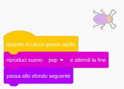

## Primo livello

<div style="display: flex; flex-wrap: wrap">
<div style="flex-basis: 200px; flex-grow: 1; margin-right: 15px;">
Aggiungi un nuovo sfondo come primo livello nel tuo gioco e nascondi l'insetto.
</div>
<div>

{:width="300px"}

</div>
</div>

### Aggiungi un altro sfondo

--- task ---

Aggiungi lo sfondo **Spotlight** dalla categoria **Musica**.


--- /task ---

### Ridimensiona il bug

--- task ---

Clicca sullo sprite **bug** nell'elenco degli Sprite. Aggiungi uno script per cambiare la `dimensione`{:class="block3looks"} del tuo bug `quando lo sfondo passa a Spotlight`{:class="block3events"}:


```blocks3
when backdrop switches to [Spotlight v]
set size to [20] % // tiny
```

--- /task ---

--- task ---

Fai clic sul codice per cambiare la dimensione, e poi trascina il tuo piccolo bug in un nascondiglio.

Aggiungi il codice per posizionare il tuo bug:


```blocks3
when backdrop switches to [Spotlight v]
set size to [20] % // tiny
+ go to x: [13] y: [132] // on the disco ball
```

**Scegli:** Puoi scegliere una dimensione e una posizione diversa, se preferisci.

--- /task ---

### Passa allo sfondo successivo

Quando giochi e trovi il bug, il gioco passerà allo sfondo successivo. Inoltre, per cominciare il gioco, dovrai fare clic sul bug nella schermata di 'inizio'.

Il blocco `passa allo sfondo seguente`{:class="block3looks"} passa allo sfondo successivo nell'ordine degli sfondi che hai inserito nella scheda **Sfondi** per lo **Stage**.

--- task ---

Aggiungi uno script al tuo sprite **bug**, `avvia riproduzione suono Pop`{:class="block3sound"} e `passa allo sfondo seguente`{:class="block3looks"} `quando si clicca su questo sprite`{:class ="block3events"}:


```blocks3
when this sprite clicked
play sound [Pop v] until done
next backdrop
```

--- /task ---

### Fai iniziare il gioco dalla schermata Inizio

--- task ---

Fai clic sul pannello degli Stage e aggiungi questo codice allo **Stage**:


```blocks3
when flag clicked
switch backdrop to [start v] // 'start' screen
```

--- /task ---

--- task ---

**Prova:** Clicca sulla bandierina verde per testare il tuo progetto.

Noterai che nella schermata 'inizio', l'insetto avrà ancora le impostazioni per nascondersi nel suo nascondiglio dal primo livello (in questo esempio, sulla palla da discoteca).

**Suggerimento:** Dopo l'ultimo sfondo nell'elenco, `passa allo sfondo seguente`{:class="block3looks"} tornerà al primo sfondo.

--- /task ---

--- task ---

Clicca sullo sprite **bug** nell'elenco degli Sprite. Aggiungi uno script su `porta dimensione a`{:class="block3looks"} del bug `quando lo sfondo passa a`{:class="block3events"} `inizio`{:class="block3events"}:


```blocks3
when backdrop switches to [start v]
set size to [100] % // full-sized
```

--- /task ---

### Cambia la posizione del bug

--- task ---

Prova a posizionare l'insetto nella schermata 'inizio'.

Il tuo codice farà cambiare lo sfondo quando fai clic sul bug! Questo non è utile quando stai cercando di posizionare il bug.

Per risolvere il problema, devi interrompere l'esecuzione del codice quando fai clic sul bug.

--- /task ---

--- task ---

Fai clic sulla bandierina verde per tornare alla schermata 'inizio'.

Fai clic sullo sprite **bug** nell'elenco degli Sprite e trascina i blocchi lontano dal blocco `quando si clicca su questo sprite`{:class="block3events"}:


--- /task ---

--- task ---

Prova a posizionare il bug di nuovo. Trascina il bug nella lavagna, sotto il testo:


Aggiungi il codice per assicurarti che il bug sia posizionato sulla lavagna ogni volta che `quando lo sfondo passa a`{:class="block3events"} `inizio`{:class="block3events"}:


```blocks3
when backdrop switches to [start v]
set size to [100] % // full-sized
+ go to x: [0] y: [30] // on the board
```

--- /task ---

--- task ---

Unisci nuovamente i blocchi in modo che i blocchi di codice siano sotto al blocco `quando si clicca su questo sprite`{:class="block3events"}:



--- /task ---

--- task ---

**Prova:** Clicca sulla bandierina verde per testare il tuo progetto. Fai clic sul bug per muoverlo allo sfondo seguente. Il bug dovrebbe essere grande nello sfondo 'inizio' e piccolo nello sfondo 'Spotlight'.

--- collapse ---
---
title: Non succede nulla quando clicco sull'insetto
---

Hai dimenticato di unire nuovamente il codice blocco `quando si clicca su questo sprite`{:class="block3events"}?

--- /collapse ---

--- /task ---