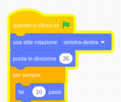

## Il pappagallo disturbatore

<div style="display: flex; flex-wrap: wrap">
<div style="flex-basis: 200px; flex-grow: 1; margin-right: 15px;">
Per rendere più difficile per i giocatori trovare e cliccare sul bug, aggiungerai un fastidioso pappagallo (lo sprite parrot) per distrarli. 
</div>
<div>

{:width="300px"}

</div>
</div>

### Aggiungi lo sprite Parrot

--- task ---

Aggiungi lo sprite **Parrot**.


--- /task ---

### Anima lo sprite Parrot

Nel progetto [Prendi l'autobus](https://projects.raspberrypi.org/en/projects/catch-the-bus){:target="_blank"}, hai utilizzato un ciclo `ripeti`{:class="block3control"}.

Utilizzerai un ciclo diverso qui. Un ciclo `per sempre`{:class="block3control"} esegue ripetutamente i blocchi di codice al suo interno. È il ciclo perfetto per un pappagallo che distrae e che continuerà a volare in giro mettendosi in mezzo per intralciare.

--- task ---

Aggiungi il codice per far svolazzare il pappagallo e distrarre:


```blocks3
when flag clicked
set rotation style [left-right v] // do not go upside down
point in direction [35] // number from -180 to 180
forever // keep being annoying
move [10] steps // the number controls the speed
if on edge, bounce // stay on the Stage
next costume // flap
change [color v] effect by [5] // try 11 or 50
wait [0.25] seconds // try 0.1 or 0.5
end
```

--- /task ---

--- task ---

**Prova:** Clicca sulla bandierina verde e prova nuovamente il tuo progetto. Ricordi dove hai nascosto l'insetto?

In Scratch, il codice in esecuzione si illumina con un contorno giallo:



**Suggerimento:** Se il pappagallo diventa troppo fastidioso mentre stai scrivendo il codice, puoi fare clic sul pulsante rosso di arresto sopra lo Stage per interrompere l'esecuzione del codice.

--- /task ---

