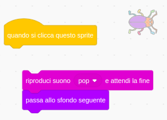

## Secondo livello

<div style="display: flex; flex-wrap: wrap">
<div style="flex-basis: 200px; flex-grow: 1; margin-right: 15px;">
Scegli uno sfondo per creare un secondo livello per il tuo gioco e rendere ancora più difficile trovare il bug. 
</div>
<div>

{:width="300px"}

</div>
</div>

### Aggiungi un altro sfondo

--- task ---

**Scegli:** Scegli uno sfondo per il tuo secondo livello. Noi abbiamo scelto lo sfondo **Urban**, ma tu puoi scegliere quello che più ti piace.


**Suggerimento:** Ricorda che sfondi con molti colori e dettagli renderanno più difficile trovare l'insetto. Quanto puoi rendere difficile il tuo gioco?

--- /task ---

### Ferma l'esecuzione del codice

--- task ---

Separa i comandi dal blocco `quando si clicca su questo sprite`{:class="block3events"} per impedire l'esecuzione quando fai clic sull'insetto:



--- /task ---

### Ridimensiona l'insetto

--- task ---

Aggiungi il codice a `porta dimensione a`{:class="block3looks"} del bug per il secondo livello:


```blocks3
when backdrop switches to [Urban v] // scegli il tuo sfondo
set size to [20] % // prova un'altra dimensione
```

**Prova:** Fai clic sul nuovo script per eseguirlo.

--- /task ---

### Nascondi il tuo insetto

--- task ---

Trascina il tuo insetto sullo Stage, in un buon nascondiglio per questo livello.


--- /task ---

Posiziona il tuo insetto nel suo nascondiglio.

--- task ---

Aggiungi un blocco `vai a x: y:`{:class="block3motion"} nel tuo codice:


```blocks3
when backdrop switches to [Urban v]
set size to [20] % // prova un'altra dimensione
+ go to x: [24] y: [13] // nella vetrina del negozio
```

--- /task ---

### Prova il tuo codice

--- task ---

Unisci i blocchi al blocco `quando si clicca su questo sprite`{:class="block3events"} in modo che quando si fa clic sul bug, lo sfondo`passa allo sfondo seguente`{:class="block3looks"}:


--- /task ---

--- task ---

**Prova:** Clicca sulla bandierina verde per testare il tuo progetto.

--- /task ---

Il tuo insetto potrebbe trovarsi davanti al tuo pappagallo.

--- task ---

Aggiungi uno script per assicurarti che il tuo insetto sia sempre `in secondo piano`{:class="block3looks"}:


```blocks3
when flag clicked
forever
go to [back v] layer
```

Ora il tuo bug resterà sempre dietro, anche quando gli cambierai posizione.

--- /task ---
