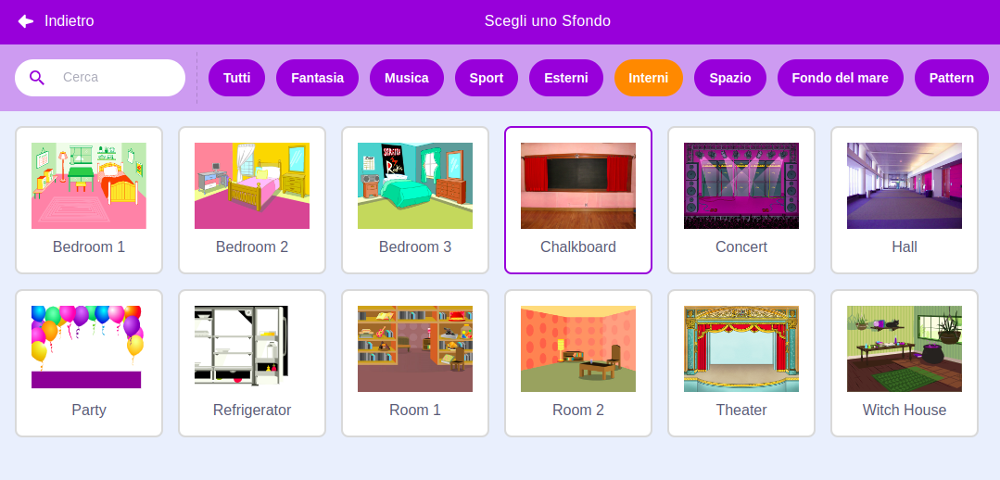
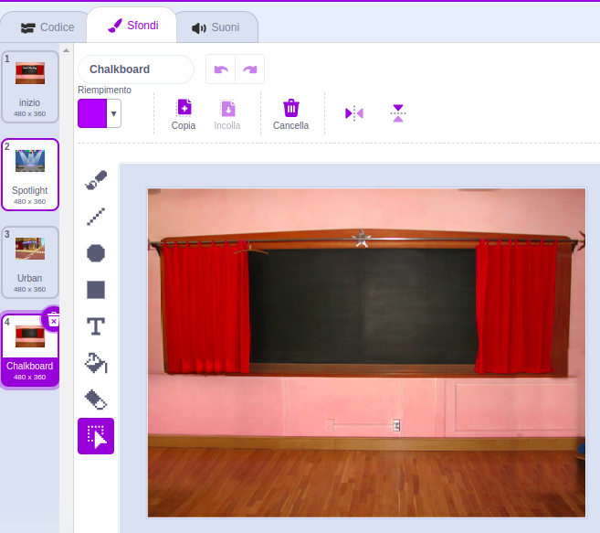
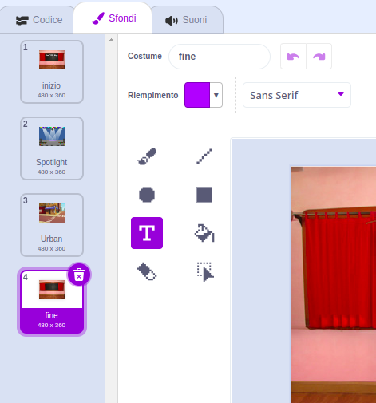
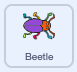
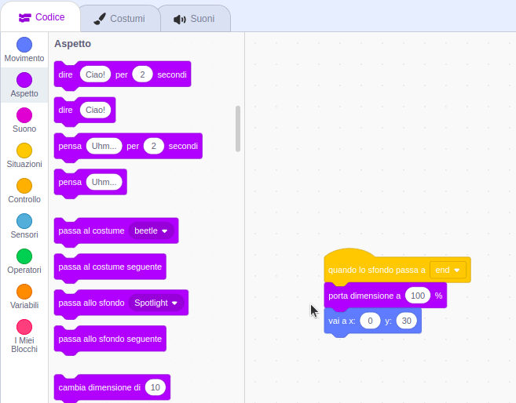

## Schermata finale

<div style="display: flex; flex-wrap: wrap">
<div style="flex-basis: 200px; flex-grow: 1; margin-right: 15px;">
Crea una schermata 'fine' per mostrare il numero di secondi impiegati dal giocatore per trovare i bug. 
</div>
<div>

{:width="300px"}

</div>
</div>

<p style="border-left: solid; border-width:10px; border-color: #0faeb0; background-color: aliceblue; padding: 10px;">
A volte, completare un gioco non è sufficiente. Ai giocatori piace sapere come si sono comportati contro altri giocatori o contro loro stessi. Riesci a pensare a un gioco che ti dimostri quanto sei stato bravo nel completarlo?</p>

### Aggiungi un altro sfondo

--- task ---

Aggiungi lo sfondo **Chalkboard** dalla categoria **Interni**.



**Suggerimento:** In Scratch puoi aggiungere lo stesso sfondo più di una volta.

--- /task ---

### Modifica lo sfondo

--- task ---

Fai clic sulla scheda **Sfondi** per aprire l'editor Paint.



--- /task ---

--- task ---

Cambia il nome dello sfondo in `fine`:



**Suggerimento:** Rinomina lo sfondo in **fine** per capire meglio il codice che scriverai.

--- /task ---

### Posiziona l'insetto

--- task ---

Fai clic sullo sprite **bug** e aggiungi il codice per posizionare l'insetto nella schermata 'fine':



```blocks3
when backdrop switches to [end v]
set size to [100] % // dimensione originale
go to x: [0] y: [30] // sulla lavagna
```

--- /task ---

### Aggiungi un cronometro

Quanto tempo impieghi per trovare e fare clic sugli insetti? Scratch ha un `cronometro`{:class="block3sensing"} che puoi utilizzare per scoprirlo.

--- task ---

Il blocco `cronometro`{:class="block3sensing"} si trova nel menu dei blocchi `Sensori`{:class="block3sensing"}. Aggiungi il codice per fare in modo che l'insetto `dica`{:class="block3looks"} la `durata`{:class="block3sensing"} nella schermata 'fine':


```blocks3
when backdrop switches to [end v]
set size to [100] % // dimensione originale
go to x: [0] y: [30] // sulla lavagna
+say (timer) // secondi impiegati
```



--- /task ---

--- task ---

**Prova:** Clicca sulla bandierina verde per mettere alla prova la tua vista e velocità. Quanto tempo impieghi per trovare il bug?

--- /task ---

Per tornare alla schermata 'inizio', fare clic sull'insetto nella schermata 'fine'.

--- task ---

Aggiungi il codice per fare in modo che l'insetto smetta di dire il valore del `cronometro`{:class="block3sensing"} quando vai alla schermata 'inizio':


```blocks3
when backdrop switches to [inizio v]
set size to [100] % // dimensione originale
go to x: [0] y: [30] // sulla lavagna
+say [] // non dire niente
```

--- /task ---

### Ferma il cronometro

Se giochi una seconda volta, il `cronometro`{:class="block3sensing"} continuerà a contare.

--- task ---

Aggiungi il codice `azzera il cronometro`{:class="block3sensing"} `quando lo sfondo passa a`{:class="block3events"} il primo livello:


```blocks3
when backdrop switches to [Spotlight v] // primo livello
set size to [20] % // piccolino
go to x: [13] y: [132] // sulla palla della discoteca
+reset timer // avvia il cronometro
```

--- /task ---

--- task ---

**Prova:** Clicca sulla bandierina verde e gioca. Il cronometro dovrebbe azzerarsi quando si fa clic sull'insetto nella schermata 'inizio' per passare al primo livello. Quando fai clic sull'insetto nella schermata 'fine', dovresti tornare alla schermata 'inizio' e vedere che il bug non dice il valore del `cronometro`{:class="block3sensing"}.

--- /task ---

