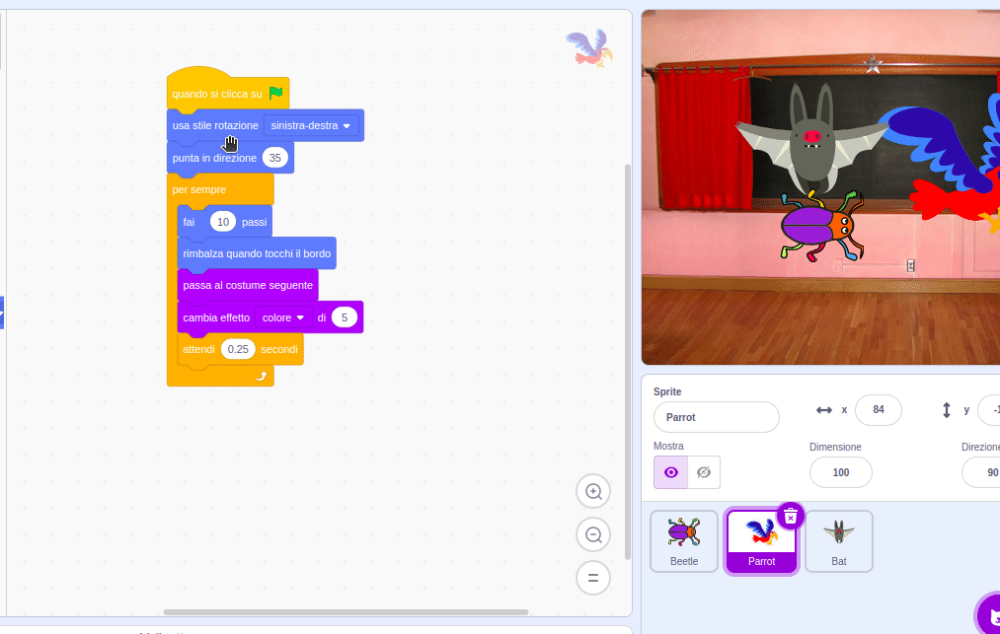

## Migliora il tuo gioco

Se hai tempo, puoi aggiungere più livelli e più distrazioni al tuo gioco. Potresti anche cambiare lo sprite che si nasconde e cambiare il testo sulla lavagna.

--- task ---

Gioca e scopri quanto sei veloce a trovare gli insetti.

C'è qualcun altro che può provare il tuo gioco? Quanto velocemente riescono a trovare i bug? Non sapranno dove li hai nascosti, quindi potrebbe volerci un po' più di tempo!

C'è qualcosa che vuoi cambiare?

Potresti:
- Rendere il pappagallo più fastidioso
- Rimpicciolire l'insetto
- Cambiare l'`effetto colore`{:class="block3looks"} per camuffare il bug su ogni livello
- Cambiare il carattere o il colore del testo

--- /task ---

### Aggiungi più livelli

--- task ---

Ecco i blocchi di cui avrai bisogno per nascondere l'insetto su un nuovo livello:

```blocks3
when backdrop switches to [new level v]

set size to [20] %

go to x: [0] y: [0] // drag to position the bug first

set [color v] effect to [50]
```

Per ogni livello, dovrai:
- Aggiungere uno sfondo
- Fare clic sul pannello Stage, quindi sulla scheda **Sfondi**, poi trascinare il nuovo sfondo in posizione prima dello sfondo **fine**
- Aggiungi un blocco `quando lo sfondo passa a`{:class="block3events"} per il nuovo sfondo e aggiungi il codice per posizionare e nascondere l'insetto

**Suggerimento:** Per trascinare l'insetto in un nuovo nascondiglio, dovrai 'smontare' il codice in modo che lo sfondo non cambi quando fai clic sul bug per posizionarlo nel nuovo livello.

--- /task ---

### Aggiungi più distrazioni

--- task ---

Potresti aggiungere altri pappagalli o scegliere un altro sprite come distrazione.

Ecco il codice che hai usato per il pappagallo:

```blocks3
when flag clicked
set rotation style [left-right v] // do not go upside down
point in direction [35] // number from -180 to 180
forever // keep being annoying
move [10] steps // the number controls the speed
if on edge, bounce // stay on the Stage
next costume // flap
change [color v] effect by [5] // try 11 or 50
wait [0.25] seconds // try 0.1 or 0.5
end
```

**Suggerimento:** Puoi trascinare il codice dello sprite **Parrot** su un altro sprite per rendere più veloce la creazione di un altro sprite distrattore.



--- /task ---

--- collapse ---
---
title: Il progetto completo
---

Puoi visualizzare il [progetto completato qui](https://scratch.mit.edu/projects/486719939/){:target="_blank"}.

--- /collapse ---