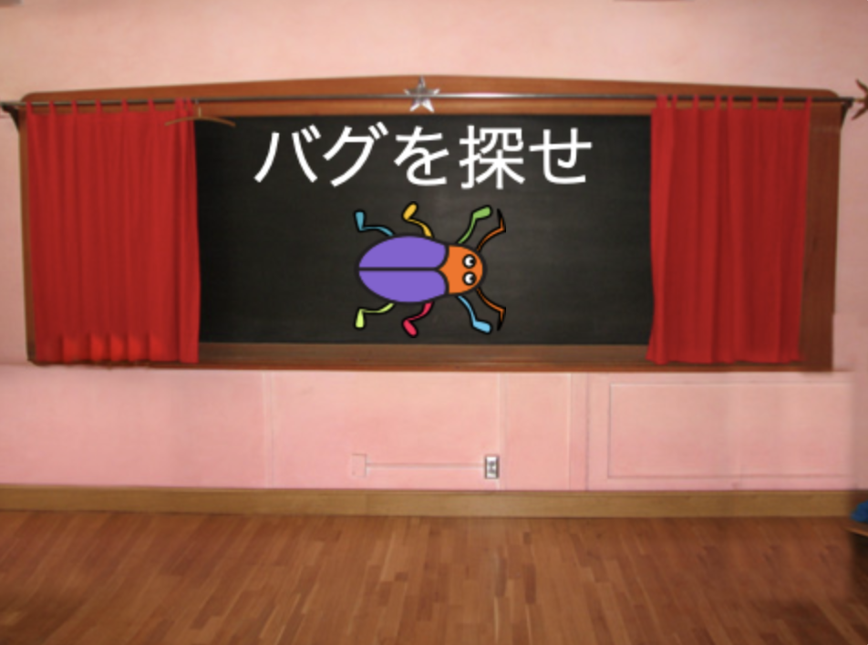
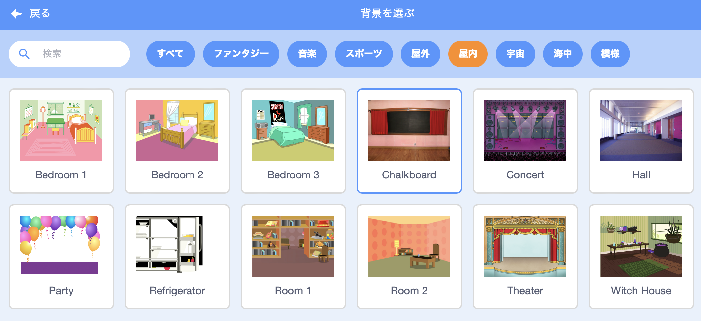
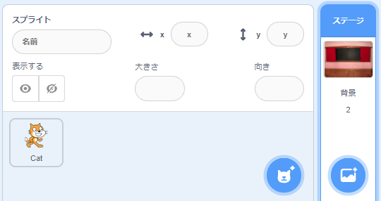
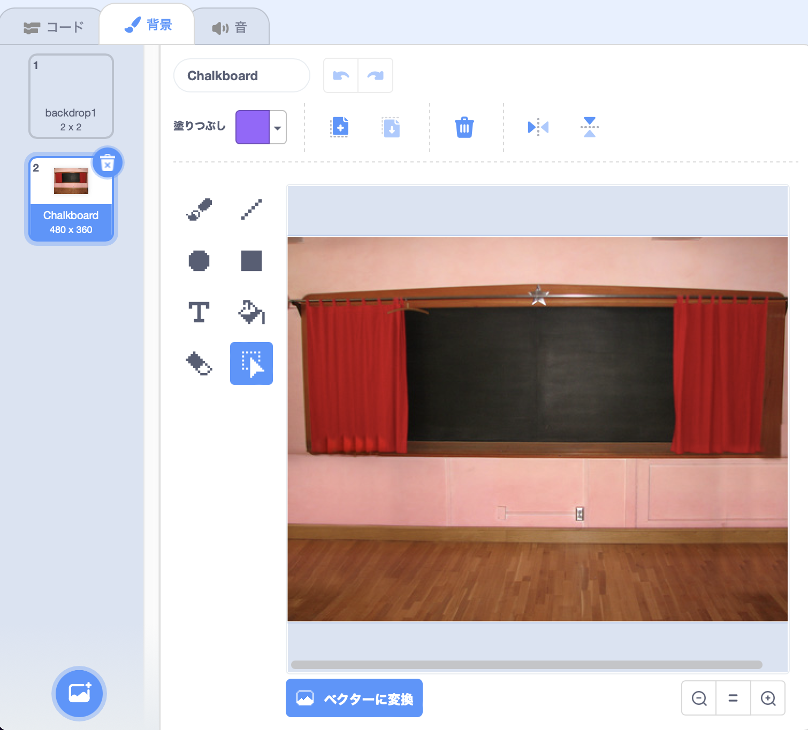
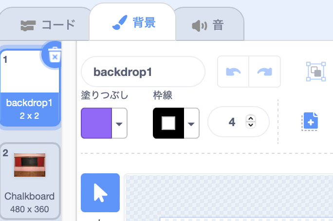
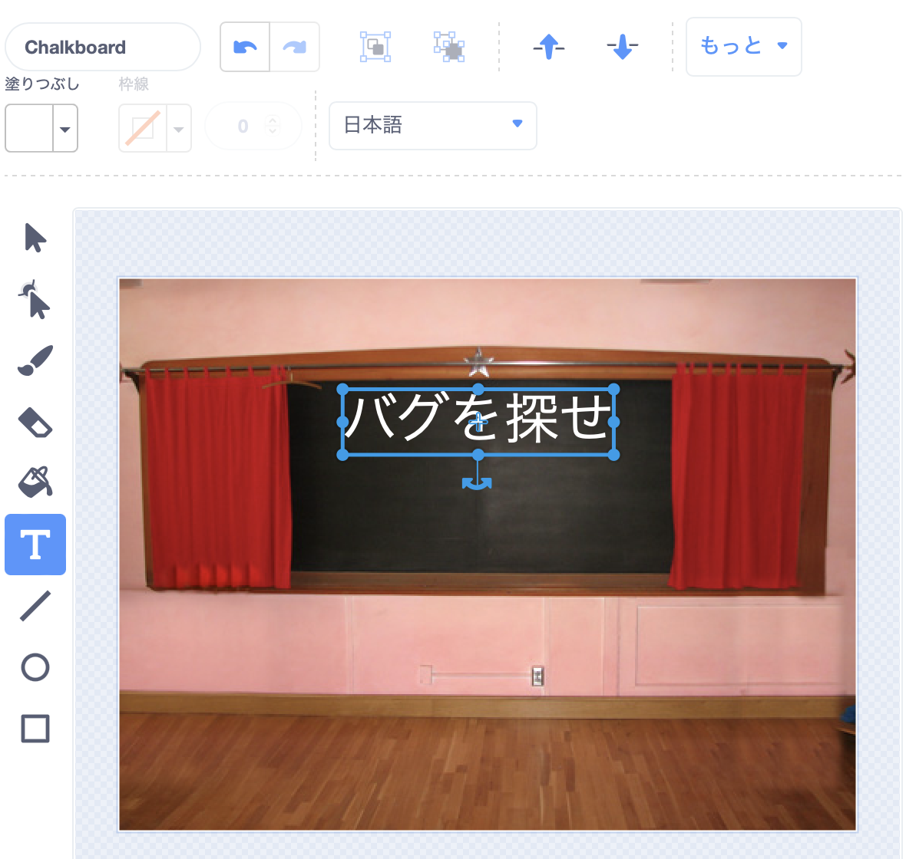
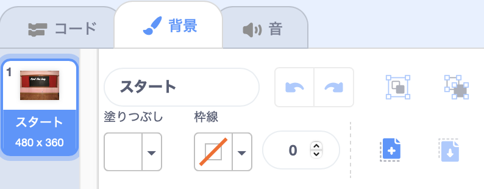
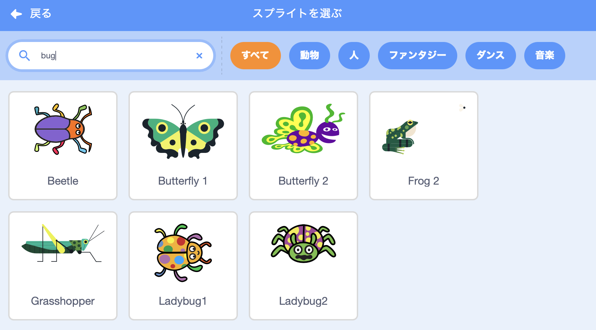

## スタート画面

ゲームはスタート画面で始まります。プレイヤーはバグをクリックして第1レベルに進みます。

{:width="300px"}

--- task ---

[「バグを見つけよう」スタータープロジェクト](https://scratch.mit.edu/projects/582214723/editor){:target="_blank"}を開きます。 Scratchはブラウザの別のタブで開きます。

[[[working-offline]]]

--- /task ---

--- task ---

**Chalkboard** (黒板) の背景を **屋内** カテゴリから追加します。

![[背景を選ぶ] アイコン。](images/backdrop-button.png)

--- /task ---

**ステージ** には、 **コスチューム** タブではなく、 **背景** タブがあります。 そこで**ステージ**のイメージを作成できます。

--- task ---

ステージのペインをクリックします。

--- /task ---

--- task ---

**背景** タブをクリックして、ペイントエディタを開きます。

--- /task ---

--- task ---

**背景1**を選択し、 **ゴミ箱**アイコンをクリックすると、**背景1**が プロジェクトから削除されます。 このプロジェクトで **背景1** は必要ありません。

--- /task ---

**Chalkboard** の背景が強調表示されました。

--- task ---

**ベクターに変換**をクリックします。 これで、移動できるテキストを追加できるようになります。

![[ベクターに変換] ボタン。](images/vector-button.png)

--- /task ---

--- task ---

**テキスト** ツールを使用して `バグを探せ` の文字を黒板に追加します。

ここでは **日本語** フォントの白色を使用しましたが 、使いたいフォントと色を** 選択 ** してください。

**ヒント：** **選択** (矢印) ツールに切り替えて、テキストを移動します。 テキストのサイズを変更するには、テキストの隅をつかんでドラッグします。

--- /task ---

--- task ---

背景の名前を `スタート` に変更します。あとからプロジェクトで、その名前を指定する必要があります。

**ヒント:** 意味のある名前を使用すると、特に後でプロジェクトに戻ったときに、プロジェクトを理解しやすくなります。

--- /task ---

--- task ---

**Scratch Cat**スプライトを削除します。

--- /task ---

--- task ---

**スプライトを選ぶ** をクリックして、検索ボックスに `bug` と打ち込みます 。

**選ぶ:** プレイヤーがゲームで見つけるバグを選択します。

**ヒント:** プロジェクトに名前を付けます。 選択したバグの名前を含めておくとよいでしょう。

--- /task ---

コンピュータプログラムの間違いは **バグ**と呼ばれます。 コンピュータプログラムの間違いを見つけて取り除くことを **デバッグ**と呼ばれます。 グレースホッパーは有名なソフトウェアエンジニアです。 彼女のチームは、コンピューターの中に蛾が入っているのを見つけたことがありました。 彼らのメモには、「バグが発見された最初の実際のケース」と書かれています。

--- save ---

