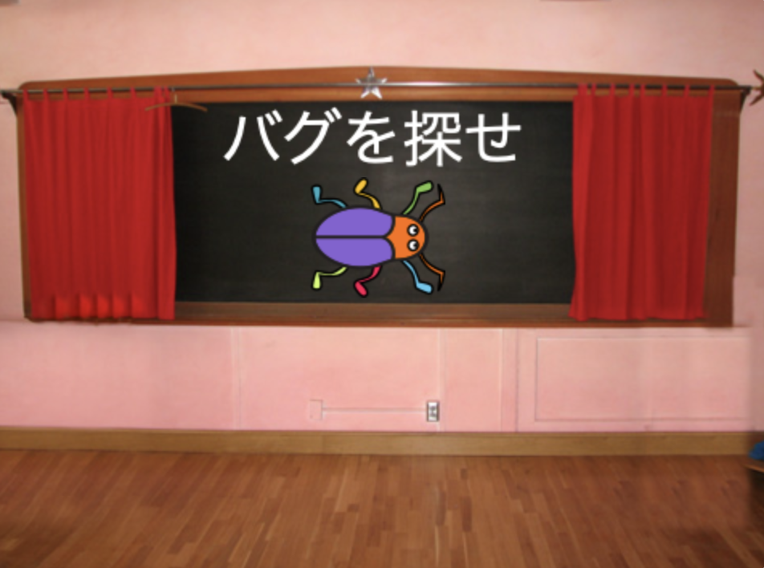

## 第1レベル

<div style="display: flex; flex-wrap: wrap">
<div style="flex-basis: 200px; flex-grow: 1; margin-right: 15px;">
ゲームの第1レベルとして新しい背景を追加し、バグを隠します。
</div>
<div>

{:width="300px"}

</div>
</div>

### Add another Backdrop

--- task ---

**Spotlight** (スポットライト) の背景を **音楽** カテゴリから追加します。

![[背景を選ぶ] アイコン。](images/backdrop-button.png)

--- /task ---

### Resize the bug

--- task ---

スプライトリストにある **バグ** スプライトをクリックします。 `背景がSpotlightに切り替わった時`{:class="block3eventsを"}、バグの`大きさ`{:class="block3looks"}を変えるスクリプトを追加します:


```blocks3
when backdrop switches to [Spotlight v]
set size to [20] % // tiny
```

--- /task ---

--- task ---

コードをクリックしてサイズを変更して、小さくなったバグを隠れ場所にドラッグします。

バグを配置するコードを追加します。


```blocks3
when backdrop switches to [Spotlight v]
set size to [20] % // tiny
+ go to x: [13] y: [132] // on the disco ball
```

**選ぶ:** お望みであれば、別のサイズや場所を選ぶことができます。

--- /task ---

### Move to the next Backdrop

ゲームをプレイしてバグを見つけると、ゲームは次の背景に切り替わります。 また、ゲームを開始するには、「スタート」画面でバグをクリックします。

`次の背景にする`{:class="block3looks"} ブロックは**ステージ**の**背景**タブをクリックしたときに並んでいる順序で次の背景に切り替えます。

--- task ---

`このスプライトが押されたとき`{:class="block3events"}に`Popの音を鳴らして`{:class="block3sound"}`次の背景にする`{:class="block3looks"}スクリプトを**バグ** スプライトに追加します:


```blocks3
when this sprite clicked
play sound [Pop v] until done
next backdrop
```

--- /task ---

### Make the game start with the Start Screen

--- task ---

ステージペインをクリックして、このコードを **ステージ**追加します。


```blocks3
when flag clicked
switch backdrop to [start v] // 'start' screen
```

--- /task ---

--- task ---

**テスト:** 緑色のフラグをクリックして、プロジェクトをテストします。

「スタート」画面では、第1レベル(この例では、ミラーボール) の隠れ場所に隠れる設定がバグに残っていることがわかります。

**ヒント:** リストの最後の背景の後、 `次の背景`{:class="block3looks"}で最初の背景に戻ります。

--- /task ---

--- task ---

スプライトリストにある **バグ** スプライトをクリックします。 `背景が`{:class="block3events"}`スタート`{:class="block3events"}`になったとき`{:class="block3events"}にバグの`大きさを設定する`{:class="block3looks"}スクリプトを追加します:


```blocks3
when backdrop switches to [start v]
set size to [100] % // full-sized
```

--- /task ---

### Change the position of the bug

--- task ---

プロジェクトは「スタート」画面から始まるようにする必要があります。

バグをクリックすると、コードによって背景が切り替わってしまいます。 バグを配置しようとしているとき、これは不便です。

この問題を修正するには、バグをクリックしたときにコードが実行されるのを止める必要があります。

--- /task ---

--- task ---

緑の旗をクリックして、「スタート」画面に戻ります。

スプライトリストで**バグ**スプライトをクリックし、`このスプライトが押されたとき`{:class="block3events"}ブロックから他のブロックを引き離します。


--- /task ---

--- task ---

バグをもう一度配置してみてください。 バグを黒板のテキストの下にドラッグします。



`背景が`{:class="block3events"} `スタート`{:class="block3events"}画面`になるたびに`{:class="block3events"}、バグが必ず黒板に配置されるコードを追加します。


```blocks3
when backdrop switches to [start v]
set size to [100] % // full-sized
+ go to x: [0] y: [30] // on the board
```

--- /task ---

--- task ---

コードブロックがもう一度`このスプライトが押されたとき`{:class="block3events"}ブロックの下にになるように、引き離したブロックをくっつけます。


--- /task ---

--- task ---

**テスト:** 緑色のフラグをクリックして、プロジェクトをテストします。 バグをクリックして、次の背景に移動します。 バグは「スタート」画面では大きく、「Spotlight」レベルでは小さいはずです。

--- collapse ---
---
title: バグをクリックしても何も起こりません
---

`このスプライトが押されたとき`{:class="block3events"}ブロックにコードブロックをつなぎ戻すのを忘れてしまいましたか？

--- /collapse ---

--- /task ---