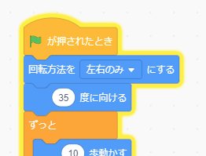

## オウムが気を散らす

<div style="display: flex; flex-wrap: wrap">
<div style="flex-basis: 200px; flex-grow: 1; margin-right: 15px;">
プレイヤーがバグを見つけてクリックするのを難しくするために、迷惑なオウムを追加して気を散らさせます。 
</div>
<div>

{:width="300px"}

</div>
</div>

--- task ---

**Parrot** スプライトを追加します。


--- /task ---

[Catch the bus](https://projects.raspberrypi.org/ja-JP/projects/catch-the-bus){:target="_blank"}プロジェクトでは、 `繰り返す`{:class="block3control"}ループを使用しました。

ここでは別のループを使用します。 `ずっと`{:class="block3control"}ループは、その中のコードブロックを何度も実行します。 飛び回ったり邪魔になったりするのを止めない迷惑なオウムにとっては完璧なループです。

--- task ---

コードを追加して、オウムを気が散るような方法で羽ばたかせます。


```blocks3
when flag clicked
set rotation style [left-right v] // 上下がひっくり返らないように
point in direction [35] // -180から180の間の数字
forever // 邪魔をさせ続ける
move [10] steps // 数字によってスピードが変わる
if on edge, bounce // ステージに居続ける
next costume // コスチュームを変える
change [color v] effect by [5] // 11と50も試してみる
wait [0.25] seconds // 0.1と0.5も試してみる
end
```

--- /task ---

--- task ---

**テスト:** 緑色のフラグをクリックして、プロジェクトをまたテストします。 バグを隠した場所を覚えていますか？

Scratchでは、実行中のコードが黄色のアウトラインで光ります。



**ヒント:** コーディング中にオウムが煩わしすぎる場合は、ステージの上にある赤い停止ボタンをクリックして、コードの実行を停止できます。

--- /task ---

--- save ---
