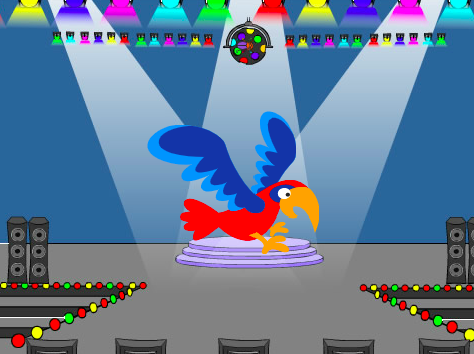

## オウムが気を散らす

<div style="display: flex; flex-wrap: wrap">
<div style="flex-basis: 200px; flex-grow: 1; margin-right: 15px;">
プレイヤーがバグを見つけてクリックするのを難しくするために、迷惑なオウムを追加して気を散らさせます。 
</div>
<div>

{:width="300px"}

</div>
</div>

### **Parrot** スプライトを追加します。

--- task ---

**Parrot** スプライトを追加します。


--- /task ---

### Parrotのスプライト。

[Catch the bus](https://projects.raspberrypi.org/en/projects/catch-the-bus){:target="_ blank"}プロジェクトでは、 `繰り返す`{:class="block3control"}ループを使用しました。

ここでは別のループを使用します。 `ずっと`{:class="block3control"}ループは、その中のコードブロックを何度も実行します。 飛び回ったり邪魔になったりするのを止めない迷惑なオウムにとっては完璧なループです。

--- task ---

コードを追加して、オウムを気が散るような方法で羽ばたかせます。 Look at the comments on the code blocks for some different numbers to try:


```blocks3
when flag clicked
set rotation style [left-right v] // do not go upside down
point in direction [35] // number from -180 to 180
forever // keep being annoying
move [10] steps // the number controls the speed
if on edge, bounce // stay on the Stage
next costume // flap
change [color v] effect by [5] // try 11 or 50
wait [0.25] seconds // try 0.1 or 0.5
end
```

--- /task ---

--- task ---

**テスト:** 緑色のフラグをクリックして、プロジェクトをまたテストします。 バグを隠した場所を覚えていますか？

Scratchでは、実行中のコードが黄色のアウトラインで光ります。


**ヒント:** コーディング中にオウムが煩わしすぎる場合は、ステージの上にある赤い停止ボタンをクリックして、コードの実行を停止できます。

--- /task ---

