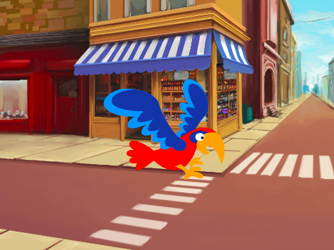
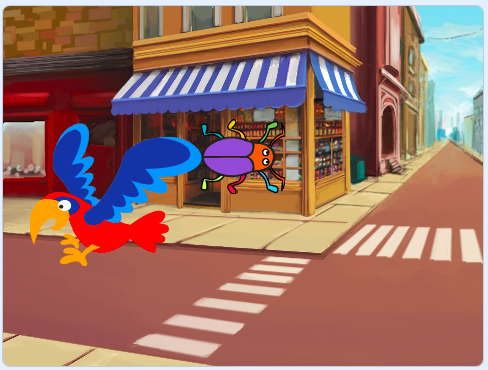
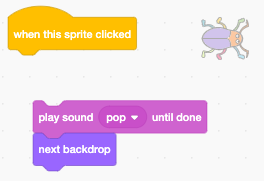
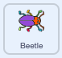
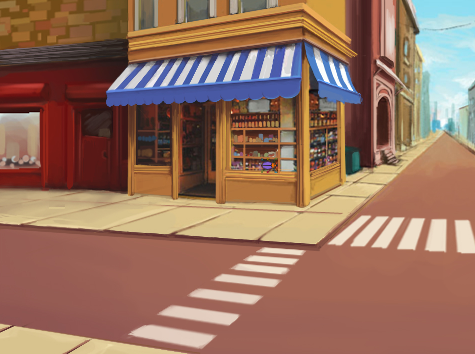
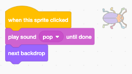

## 第2レベル

<div style="display: flex; flex-wrap: wrap">
<div style="flex-basis: 200px; flex-grow: 1; margin-right: 15px;">
背景を選択してゲームの第2レベルを作成し、バグを見つけにくくします。 
</div>
<div>

{:width="300px"}

</div>
</div>

### 別の背景を追加する

--- task ---

**選ぶ:** 第2レベルの背景を選択します。 **Urban** の背景を選択しましたが、あなたの一番の好みのものを選択できます。



**ヒント:** たくさんの色や細部のある背景を使うとバグを見つけるのが難しくなることを覚えておいてください。 ゲームをどれだけ難しくしますか？

--- /task ---

### 実行中のコードを停止する

--- task ---

`このスプライトが押されたら`{:class="block3events"}ブロックからブロックを引き離し、バグをクリックしたときにブロックが実行されないようにします：



--- /task ---

### バグのサイズを変更する

--- task ---

第2レベルのためにバグの`大きさを･･･%にする`{:class="block3looks"}にコードを追加します：



```blocks3
when backdrop switches to [Urban v] // 背景を選ぶ
set size to [20] % // 違うサイズも試してみる
```

**テスト:** 新しいスクリプトをクリックして実行します。

--- /task ---

### バグを隠す

--- task ---

ステージ上のバグをこのレベルの適切な隠れ場所にドラッグします。



--- /task ---

バグを隠れ場所に配置します。

--- task ---

コードに `x座標を ()、y座標を () にする`{:class="block3motion"} ブロックを追加します：


```blocks3
when backdrop switches to [Urban v]
set size to [20] % // 違うサイズも試してみる
+ go to x: [24] y: [13] // ショーウィンドウに
```

--- /task ---

### コードをテストする

--- task ---

ブロックを`このスプライトが押されたとき`{:class="block3events"}ブロックに戻し、バグがクリックされたときに背景が `次の背景`{:class="block3looks"}に切り替わるようにします。



--- /task ---

--- task ---

**テスト:** 緑の旗をクリックして、プロジェクトをテストします。

--- /task ---

バグがオウムより手前に見えるかもしれません。

--- task ---

スクリプトを追加して、バグが常に`最背面`{:class="block3looks"}にあるようにします。


```blocks3
when flag clicked
forever
go to [最背面 v] layer
```

これで、バグの位置を変更する必要がある場合でも、バグは常に背面に留まります。

--- /task ---
