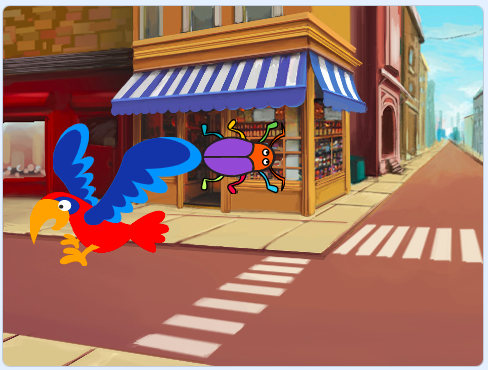

## 第2レベル

<div style="display: flex; flex-wrap: wrap">
<div style="flex-basis: 200px; flex-grow: 1; margin-right: 15px;">
背景を選択してゲームの第2レベルを作成し、バグを見つけにくくします。 
</div>
<div>

{:width="300px"}

</div>
</div>

--- task ---

**選ぶ:** 第2レベルの背景を選択します。 **Urban** の背景を選択しましたが、最も好きなものを選択できます。



**ヒント:** 色や細かい部分がたくさんある背景では、バグを見つけるのが難しくなることを忘れないでください。 ゲームをどれだけ難しくしますか？

--- /task ---

バグを新しい位置にドラッグできるようにするには、`このスプライトが押されたとき`{:class="block3events"}スクリプトの実行を止める必要があります。

--- task ---

`このスプライトが押されたら`{:class="block3events"}からブロックを引き離し、バグをクリックしたときにブロックが実行されないようにします。


--- /task ---

背景が変わったときにバグを見つけるのを難しくする必要があります。 バグのサイズを変更して、見つけにくくすることができます。

--- task ---

コードに `大きさを･･･%にする`{:class="block3looks"}追加して、第2レベルのバグのサイズを設定します。


```blocks3
when backdrop switches to [Urban v] // 背景を選ぶ
set size to [20] % // 違うサイズも試してみる
```

**テスト:** 新しいスクリプトをクリックして実行します。

--- /task ---

--- task ---

ステージ上のバグをこのレベルの適切な隠れ場所にドラッグします。


--- /task ---

バグを隠れ場所に配置します。

--- task ---

`x座標を〇〇、y座標を〇〇にする`{:class="block3motion"} ブロックを追加します。:


```blocks3
when backdrop switches to [Urban v]
set size to [20] % // 違うサイズも試してみる
+ go to x: [24] y: [13] // ショーウィンドウに
```

--- /task ---

--- task ---

ブロックを`このスプライトが押されたとき`{:class="block3events"}ブロックに戻し、バグがクリックされたときに背景が `次の背景`{:class="block3looks"}に切り替わるようにします。


--- /task ---

--- task ---

**テスト:** 緑色のフラグをクリックして、プロジェクトをテストします。

--- /task ---

あなたのバグはオウムより手前に見えるかもしれません。

--- task ---

スクリプトを追加して、バグが常に `最背面`{:class="block3looks"}にあるようにします:


```blocks3
when flag clicked
forever
go to [back v] layer
```

これで、バグの位置を変更する必要がある場合でも、バグは常に背面に留まります。

--- /task ---

--- save ---
