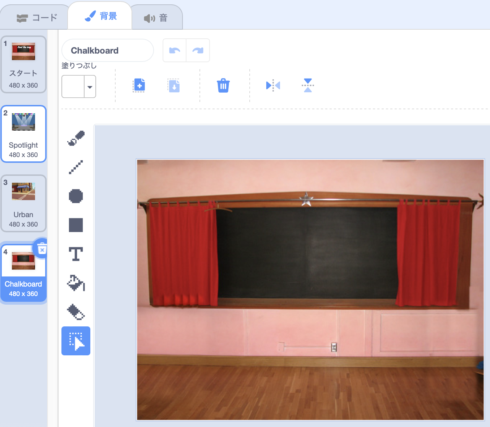

## 終了画面

<div style="display: flex; flex-wrap: wrap">
<div style="flex-basis: 200px; flex-grow: 1; margin-right: 15px;">
プレイヤーがバグを見つけるのにかかった秒数を表示する「終了」画面を作成します。 
</div>
<div>

{:width="300px"}

</div>
</div>

<p style="border-left: solid; border-width:10px; border-color: #0faeb0; background-color: aliceblue; padding: 10px;">
ゲームに勝つだけでは十分ではない時があります。 プレイヤーは、他のプレイヤーや自分自身に対してどうだったかを知りたがっています。 あなたがどれだけうまくやったかを示すゲームを思いつくことができますか？</p>

--- task ---

**Chalkboard** (黒板) の背景を **屋内** カテゴリから追加します。


**ヒント:** Scratchでは、同じ背景を何度も使うことができます。

--- /task ---

--- task ---

**背景** タブをクリックして、ペイントエディタを開きます。



--- /task ---

--- task ---

背景の名前を`終了`に変更します:


**ヒント:** 背景の名前を**終了**に変更することで、コードを簡単に理解できるようなります。

--- /task ---

--- task ---

**バグ** スプライトをクリックし、「終了」画面にバグを配置するコードを追加します。


```blocks3
when backdrop switches to [終了 v]
set size to [100] % // フルサイズ
go to x: [0] y: [30] // 黒板に
```

--- /task ---

バグを見つけてクリックするのにどのくらい時間がかかりますか？ Scratchには `タイマー`{:class="block3sensing"}があり、これを使用して調べることができます。

--- task ---

`タイマー`{:class="block3sensing"}ブロックは、 `調べる`{:class="block3sensing"}ブロックメニューにあります。 バグが`タイマー`{:class="block3sensing"}の数値を`言う`{:class="block3looks"} ようにコードを追加します。


```blocks3
when backdrop switches to [終了 v]
set size to [100] % // フルサイズ
go to x: [0] y: [30] // 黒板に
+say (timer) // かかった秒数
```


--- /task ---

--- task ---

**テスト:** 緑色のフラグをクリックして、あなたの探す能力ををテストします。 バグを見つけるのにどれくらい時間がかかりますか？

--- /task ---

「スタート」画面に戻るには、「終了」画面のバグをクリックします。

--- task ---

「スタート」画面に移動したときに `タイマー`{:class="block3sensing"}の値を言うのをやめるコードを追加します。


```blocks3
when backdrop switches to [スタート v]
set size to [100] % // フルサイズ
go to x: [0] y: [30] // 黒板に
+say [] // 何も言わない
```

--- /task ---

2回目にゲームをプレイすると、 `タイマー`{:class="block3sensing"}はカウントし続けています。

--- task ---

`背景が`{:class="block3events"}最初のレベル`になったとき`{:class="block3events"}、`タイマーをリセット`{:class="block3sensing"}するコードをを追加します。


```blocks3
when backdrop switches to [Spotlight v] // 第1レベル
set size to [20] % // 小さく
go to x: [13] y: [132] // ミラーボールに
+reset timer // タイマーをスタート
```

--- /task ---

--- task ---

**テスト：** 緑色のフラグをクリックして、ゲームをプレイします。 「開始」画面でバグをクリックして最初のレベルに移るとき、タイマーがリセットされます。 「終了」画面でバグをクリックすると、「スタート」画面に戻り、バグが `タイマー`{:class="block3sensing"}の値を言っていないことがわかるでしょう。

--- /task ---

--- save ---
