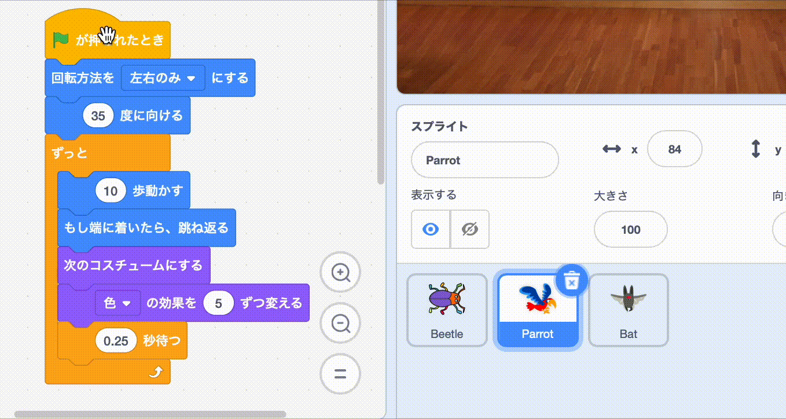

## ゲームをアップグレードする

時間があれば、ゲームにさらに多くのレベルや気を散らす要素を追加できます。 隠れているスプライトを変更したり、黒板のテキストを変更したりすることもできます。

--- task ---

ゲームをプレイして、バグをどれだけ早く見つけられるか試してみましょう。

他に誰か、あなたのゲームを試してくれる人はいますか？ どのくらい早くバグを見つけられるでしょうか？ どこに隠したか知らないので、少し時間がかかるかもしれません。

何か変えたいことはありますか？

こんなことができます。
- オウムをもっと迷惑にする
- バグをもっと小さくする
- `色の効果`{:class="block3looks"}を変更して、各レベルのバグをカモフラージュする
- テキストのフォントや色を変更する

--- /task ---

### レベルを追加する

--- task ---

新しいレベルでバグを隠すために必要なブロックは次のとおりです。

```blocks3
when backdrop switches to [new level v]

set size to [20] %

go to x: [0] y: [0] // drag to position the bug first

set [color v] effect to [50]
```

レベルごとに、次のことを行う必要があります。
- 背景を追加する
- ステージペインをクリックしてから、**背景**タブで新しい背景を、**終了**背景より前の位置にドラッグする
- `背景が～になったとき`{:class="block3events"}ブロックを新しい背景用に追加し、バグを配置し隠すコードを追加する

**ヒント:** バグを新しい隠し場所にドラッグするには、コードを「分割」して、新しいレベルに配置するためにバグをクリックしても背景が切り替わらないようにします。

--- /task ---

### もっと気を散らすものを追加する

--- task ---

気を散らす要素として、オウムを追加したり、別のスプライトを選択することができます。

オウムに使用したコードは次のとおりです。

```blocks3
when flag clicked
set rotation style [left-right v] // do not go upside down
point in direction [35] // number from -180 to 180
forever // keep being annoying
move [10] steps // the number controls the speed
if on edge, bounce // stay on the Stage
next costume // flap
change [color v] effect by [5] // try 11 or 50
wait [0.25] seconds // try 0.1 or 0.5
end
```

**ヒント:** **Parrot**スプライトのコードを別のスプライトにドラッグすると、別の気を散らすスプライトをすばやく作成できます。



--- /task ---

--- collapse ---
---
title: 完成したプロジェクト
---

[完成したプロジェクトはこちら](https://scratch.mit.edu/projects/486719939/){:target="_blank"}で確認できます。

--- /collapse ---