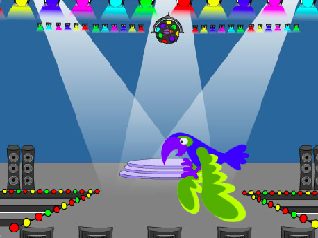

## You will make

Create a game in which you have to find a hidden bug 🐞 on each level. The game will have 'start' and 'end' screen backdrops, and a timer ⌚ to show the player how quickly they found the bugs.

ನೀವು ಮಾಡಬೇಕಾಗಿರುವುದು:
+ `next backdrop`{:class="block3looks"} ಮತ್ತು `when backdrop switches to`{:class="block3events"} ಬ್ಲಾಕ್ ಗಳನ್ನೂ ಬಳಸಿಕೊಂಡು ನಿಮ್ಮ ಆಟಕ್ಕೆ ಹಂತಗಳನ್ನು ರಚಿಸಿ
+ ಕೋಡ್ ಬ್ಲಾಕ್‌ಗಳನ್ನು ಚಾಲನೆಯಲ್ಲಿ ಇರಿಸಲು `forever`{:class="block3control"} ಲೂಪ್ ಬಳಸಿ
+ ಆಟಗಾರರು ದೋಷಗಳನ್ನು ಎಷ್ಟು ಬೇಗನೆ ಕಂಡುಹಿಡಿದರು ಎಂದು ತಿಳಿದುಕೊಳ್ಳಲು `timer`{:class="block3sensing"} **variable** ಉಪಯೋಗಿಸಿ

--- no-print --- --- task ---
### Play ▶️

  
ಆಟವನ್ನು ಪ್ರಾರಂಭಿಸಲು ದೋಷದ ಮೇಲೆ ಕ್ಲಿಕ್ ಮಾಡಿ.

ಪ್ರತಿ ಹಂತದಲ್ಲಿ ದೋಷವನ್ನು ಕಂಡುಹಿಡಿಯಲು ಪ್ರಯತ್ನಿಸಿ.

ದೋಷಗಳು ಎಷ್ಟು ಚೆನ್ನಾಗಿ ಮರೆಮಾಚಲ್ಪಟ್ಟಿವೆ? ನೀವು ನಿಮ್ಮ ಸ್ವಂತ ಹಂತಗಳನ್ನು ಸೇರಿಸಲು ಅವಕಾಶವಿದೆ ಮತ್ತು ಅದನ್ನು ನೀವು ಇಷ್ಟಪಡುವಷ್ಟು ಸುಲಭ ಅಥವಾ ಕಷ್ಟಕರವಾಗಿಸಬಹುದು.

  <iframe allowtransparency="true" width="485" height="402" src="https://scratch.mit.edu/projects/embed/486719939/?autostart=false" frameborder="0"></iframe>

--- /task ---

--- /no-print ---

--- print-only ---

--- /print-only ---

ಪ್ರತಿ ವರ್ಷ 2.5 ಶತಕೋಟಿಗೂ ಹೆಚ್ಚು ಜನರು ವಿಡಿಯೋ ಗೇಮ್‌ಗಳನ್ನು ಆಡುತ್ತಾರೆ. ಆ ಆಟಗಳನ್ನು ರಚಿಸುವಲ್ಲಿ ಎಷ್ಟು ಜನರು ತೊಡಗಿಸಿಕೊಂಡಿದ್ದಾರೆ ಎಂದು ಒಮ್ಮೆ ಯೋಚಿಸಿ. ಇತರ ಜನರು ಆಟವಾಡಲು ಅನಕೂಲ ಮಾಡುವ ಎಂದರೆ, ಆಟಗಳ ವಿನ್ಯಾಸ, ಕೋಡಿಂಗ್ ಮತ್ತು ಆಟಗಳ ಪರೀಕ್ಷೆ ಮಾಡುವ ಉದ್ಯೋಗಗಳು ನಿಮಗೆ ಇಷ್ಟವೇ? 

