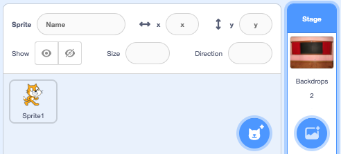
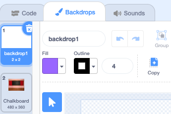

## ಪ್ರಾರಂಭದ ಪರದೆ

Give your game a 'start' screen.

{:width="300px"}

### Open the starter project

--- task ---

[Find the bug starter project](https://scratch.mit.edu/projects/582214723/editor){:target="_blank"} ತೆರೆಯಿರಿ. Scratch ಇನ್ನೊಂದು ಬ್ರೌಸರ್ ಟ್ಯಾಬ್‌ನಲ್ಲಿ ತೆರೆಯುತ್ತದೆ.

[[[working-offline]]]

--- /task ---

### Add a Backdrop

--- task ---

**Chalkboard** ಹಿನ್ನೆಲೆವನ್ನು **Indoors**ವರ್ಗದಿಂದ ಸೇರಿಸಿ.

--- /task ---

**Stage** **Backdrops**‌ ಟ್ಯಾಬ್ ಬದಲು **Costumes** ಟ್ಯಾಬ್ ಹೊಂದಿದೆ. ಇಲ್ಲಿ ನೀವು **Stage** ಗೆ ಚಿತ್ರಗಳನ್ನು ರಚಿಸಬಹುದು.

--- task ---

Stage ಫಲಕದ ಮೇಲೆ ಕ್ಲಿಕ್ ಮಾಡಿ.

--- /task ---

### Edit the Backdrop

--- task ---

ಪೇಂಟ್ ಎಡಿಟರ್ ತೆರೆಯಲು **Backdrops** ಟ್ಯಾಬ್ ಮೇಲೆ ಕ್ಲಿಕ್ ಮಾಡಿ.

--- /task ---

--- task ---

ನಿಮ್ಮ ಪ್ರಾಜೆಕ್ಟ್‌ನಿಂದ **backdrop1** ಬ್ಯಾಕ್‌ಡ್ರಾಪ್ ಅನ್ನು ತೆಗೆದುಹಾಕಲು **backdrop1** ಆಯ್ಕೆ ಮಾಡಿ ನಂತರ **Delete** ಐಕಾನ್ ಮೇಲೆ ಕ್ಲಿಕ್ ಮಾಡಿ. ಈ ಪ್ರಾಜೆಕ್ಟ್‌ನಲ್ಲಿ ನಿಮಗೆ **backdrop1** ಬ್ಯಾಕ್‌ಡ್ರಾಪ್ ಅವಶ್ಯಕತೆವಿರುವುದಿಲ್ಲ.

--- /task ---

**Chalkboard** ಬ್ಯಾಕ್‌ಡ್ರಾಪ್ ಅನ್ನು ಈಗ ಹೈಲೈಟ್ ಮಾಡಲಾಗುತ್ತದೆ.

--- task ---

<**Convert to Vector** ಮೇಲೆ ಕ್ಲಿಕ್ ಮಾಡಿ. ಈಗ, ನೀವು ಚಲಿಸಬಹುದಾದ ಪಠ್ಯವನ್ನು ಸೇರಿಸಲು ನಿಮಗೆ ಸಾಧ್ಯವಾಗುತ್ತದೆ.

--- /task ---

--- task ---

`Find the bug` ಪಠ್ಯವನ್ನು ಚಾಕ್‌ಬೋರ್ಡ್‌ಗೆ ಸೇರಿಸಲು **Text** ಟೂಲ್‌ನ್ನು ಬಳಸಿ:

ನಾವು **Marker** ಬಿಳಿ ಫಾಂಟ್ ಬಣ್ಣವನ್ನು ಆರಿಸಿದೆವು, ಆದರೆ ನೀವು **ನಿಮಗೆ ಇಷ್ಟವಾದ<0> ಫಾಂಟ್ ಮತ್ತು ಬಣ್ಣವನ್ನು ಆರಿಸಕೊಳ್ಳಬಹುದು.

** ಸಲಹೆ:** ನಿಮ್ಮ ಪಠ್ಯವನ್ನು ಚಲಿಸಲು **Select** (ಬಾಣ) ಟೂಲ್‌ಗೆ ಬದಲಾಯಿಸಿ. ಪಠ್ಯದ ಗಾತ್ರವನ್ನು ಬದಲಾಯಿಸಲು, ಪಠ್ಯದ ಮೂಲೆಯನ್ನು ಹಿಡಿದು ಅದನ್ನು ಎಳೆಯಿರಿ.

--- /task ---

## Rename the Backdrop

--- task ---

ಬ್ಯಾಕ್‌ಡ್ರಾಪ್‌ನ ಹೆಸರನ್ನು `start` ಎಂದು ಬದಲಿಸಿ, ಏಕೆಂದರೆ ನೀವು ಇದನ್ನು ಪ್ರಾಜೆಕ್ಟ್‌ನಲ್ಲಿ ನಂತರ ಆಯ್ಕೆ ಮಾಡಬೇಕಾಗುತ್ತದೆ.

**ಸಲಹೆ:** ನೀವು ಅರ್ಥಪೂರ್ಣವಾದ ಹೆಸರುಗಳನ್ನು ಬಳಸಿದರೆ,, ವಿಶೇಷವಾಗಿ ನೀವು ನಂತರ ಪ್ರಾಜೆಕ್ಟ್‌ಗೆ ಹಿಂತಿರುಗಿದಾಗ. ನಿಮ್ಮ ಪ್ರಾಜೆಕ್ಟ್ ಅನ್ನು ಅರ್ಥಮಾಡಿಕೊಳ್ಳುವುದು ಸುಲಭವಾಗುತ್ತದೆ.

--- /task ---

### Add the Bug Sprite

--- task ---

**Scratch Cat** ಸ್ಪ್ರೈಟ್ ಅನ್ನು ಅಳಿಸಿ.

--- /task ---

--- task ---

**Choose a Sprite** ಕ್ಲಿಕ್‌ ಮಾಡಿ ಮತ್ತು ಸರ್ಚ್‌ ಬಾಕ್ಸ್‌ನಲ್ಲಿ `bug` ಟೈಪ್‌ ಮಾಡಿ.

**Choose:** ನಿಮ್ಮ ಆಟದಲ್ಲಿ ಆಟಗಾರರು ಕಂಡು ಹಿಡಿಯಬೇಕಾದ ದೋಷವನ್ನು ಆರಿಸಿ.

**ಸಲಹೆ** ನಿಮ್ಮ ಪ್ರಾಜೆಕ್ಟ್‌ಗೆ ಒಂದು ಹೆಸರನ್ನು ನೀಡಿ. ನೀವು ಈಗ ತಾನೆ ಆಯ್ಕೆ ಮಾಡಿದ ದೋಷದ ಹೆಸರನ್ನು ಸೇರಿಸಲು ಬಯಸಬಹುದು.

--- /task ---

ಕಂಪ್ಯೂಟರ್ ಪ್ರೋಗ್ರಾಂನಲ್ಲಿನ ತಪ್ಪನ್ನು **bug** ಎಂದು ಕರೆಯಲಾಗುತ್ತದೆ. ಕಂಪ್ಯೂಟರ್ ಪ್ರೋಗ್ರಾಂಗಳಲ್ಲಿ ತಪ್ಪುಗಳನ್ನು ಕಂಡುಹಿಡಿದು ತೆಗೆದು ಹಾಕುವ ವಿಧಾನವನ್ನು **debugging** ಎಂದು ಕರೆಯಲಾಗುತದೆ. ಗ್ರೇಸ್ ಹಾಪರ್ ಒಬ್ಬ ಪ್ರಸಿದ್ಧ ಸಾಫ್ಟ್‌ವೇರ್ ಎಂಜಿನಿಯರ್. ಆಕೆಯ ತಂಡವು ಒಮ್ಮೆ ತಮ್ಮ ಕಂಪ್ಯೂಟರ್‌ನಲ್ಲಿ ಒಂದು ಪತಂಗವನ್ನು ಕಂಡಿತು. ಅವರ ಟಿಪ್ಪಣಿಗಳು "ಹುಳ ಪತ್ತೆಯಾದ ಮೊದಲ ನೈಜ ಪ್ರಕರಣ" ಎಂದು ಹೇಳುತ್ತದೆ

