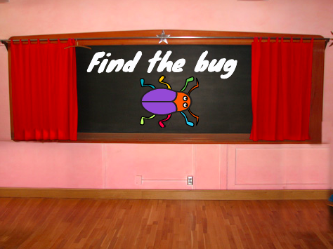
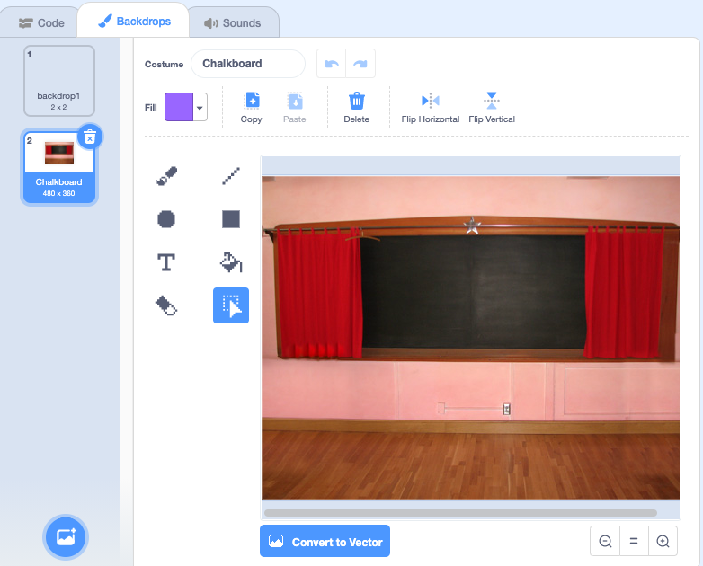

## ಪರದೆಯನ್ನು ಪ್ರಾರಂಭಿಸಿ

ನಿಮ್ಮ ಆಟವು 'Start' ಪರದೆಯೊಂದಿಗೆ ಪ್ರಾರಂಭವಾಗುತ್ತದೆ ಮತ್ತು ಆಟಗಾರರು ಮೊದಲ ಹಂತಕ್ಕೆ ಹೋಗಲು ದೋಷದ ಮೇಲೆ ಕ್ಲಿಕ್ ಮಾಡುತ್ತಾರೆ.

{:width="300px"}

--- task ---

Open the [Find the bug starter project](https://scratch.mit.edu/projects/582214723/editor){:target="_blank"}. ಸ್ಕ್ರಾಚ್ ಇನ್ನೊಂದು ಬ್ರೌಸರ್ ಟ್ಯಾಬ್‌ನಲ್ಲಿ ತೆರೆಯುತ್ತದೆ.

[[[working-offline]]]

--- /task ---

--- task ---

**Chalkboard** ಹಿನ್ನೆಲೆವನ್ನು **Indoors**ವರ್ಗದಿಂದ ಸೇರಿಸಿ.

--- /task ---

**Stage** ಅಂಕಣವು **Backdrops** tab ಬದಲು **Costumes** tab ಹೊಂದಿದೆ. ಇಲ್ಲಿ ನೀವು **Stage** ಚಿತ್ರಗಳನ್ನು ರಚಿಸಬಹುದು.

--- task ---

Stage ಹಂತ ಫಲಕದ ಮೇಲೆ ಕ್ಲಿಕ್ ಮಾಡಿ.

--- /task ---

--- task ---

ಪೇಂಟ್ ಎಡಿಟರ್ ತೆರೆಯಲು **Backdrops** ಟ್ಯಾಬ್ ಮೇಲೆ ಕ್ಲಿಕ್ ಮಾಡಿ.

--- /task ---

--- task ---

ನಿಮ್ಮ ಯೋಜನೆಯಿಂದ **backdrop1** ಬ್ಯಾಕ್‌ಡ್ರಾಪ್ ಅನ್ನು ತೆಗೆದುಹಾಕಲು **backdrop1** ಆಯ್ಕೆ ಮಾಡಿ ನಂತರ **Delete** ಐಕಾನ್ ಮೇಲೆ ಕ್ಲಿಕ್ ಮಾಡಿ. ಈ ಯೋಜನೆಯಲ್ಲಿ ನಿಮಗೆ **backdrop1** ಅವಶ್ಯಕತೆವಿರುವುದಿಲ್ಲ.

--- /task ---

**Chalkboard** ಬ್ಯಾಕ್‌ಡ್ರಾಪ್ ಅನ್ನು ಈಗ ಹೈಲೈಟ್ ಮಾಡಲಾಗುತ್ತದೆ.

--- task ---

<**Convert to Vector** ಮೇಲೆ ಕ್ಲಿಕ್ ಮಾಡಿ. ಈಗ, ನೀವು ತಿರುಗಾಡಬಹುದಾದ ಪಠ್ಯವನ್ನು ಸೇರಿಸಲು ನಿಮಗೆ ಸಾಧ್ಯವಾಗುತ್ತದೆ.

--- /task ---

--- task ---

`Find the bug` ಪಠ್ಯವನ್ನು ಚಾಕೆಬೊರ್ಡುಗೆ ಸೇರಿಸಲು **Text** ಉಪಕರಣವನ್ನು ಬಳಸಿ:

ನಾವು **Marker** ಫಾಂಟ್ ಅನ್ನು ಬಿಳಿ ಬಣ್ಣದಲ್ಲಿ ಆರಿಸಿದೆವು, ಆದರೆ **ನಿಮಗೆ ಇಷ್ಟವಾದ<0> ಫಾಂಟ್ ಮತ್ತು ಬಣ್ಣವನ್ನು ಬಳಸಲು ಆರಿಸಕೊಳ್ಳಬಹುದು.

** ಇನಾಮು:** ನಿಮ್ಮ ಆಯ್ಕೆ**Select** (ಬಾಣ) ಉಪಕರಣಕ್ಕೆ ಬದಲಿಸಿ. ಪಠ್ಯದ ಗಾತ್ರವನ್ನು ಬದಲಾಯಿಸಲು, ಪಠ್ಯದ ಮೂಲೆಯನ್ನು ಹಿಡಿದು ಅದನ್ನು ಎಳೆಯಿರಿ.

--- /task ---

--- task ---

ಬ್ಯಾಕ್‌ಡ್ರಾಪ್‌ನ ಹೆಸರನ್ನು `start` ಎಂದು ಬದಲಿಸಿ, ಏಕೆಂದರೆ ನೀವು ಅದನ್ನು ನಂತರ ಪ್ರಾಜೆಕ್ಟ್‌ನಲ್ಲಿ ಆಯ್ಕೆ ಮಾಡಬೇಕಾಗುತ್ತದೆ.

**Tip:** ನೀವು ಅರ್ಥಪೂರ್ಣವಾದ ಹೆಸರುಗಳನ್ನು ಬಳಸಿದರೆ, ನಿಮ್ಮ ಯೋಜನೆಯನ್ನು ಅರ್ಥಮಾಡಿಕೊಳ್ಳುವುದು ಸುಲಭವಾಗುತ್ತದೆ, ವಿಶೇಷವಾಗಿ ನೀವು ನಂತರ ಯೋಜನೆಗೆ ಹಿಂತಿರುಗಿದಾಗ.

--- /task ---

--- task ---

**Scratch Cat** ಸ್ಪ್ರೈಟ್ ಅನ್ನು ಅಳಿಸಿ.

--- /task ---

--- task ---

**Choose a Sprite** ಆಯ್ಕೆ ಮಾಡಿ ಮತ್ತು ಹುಡುಕಾಟ ಪೆಟ್ಟಿಗೆಯಲ್ಲಿ `bug`ಟೈಪ್ ಮಾಡಿ.

**Choose:** ನಿಮ್ಮ ಆಟದಲ್ಲಿ ಆಟಗಾರರು ಕಂಡುಕೊಳ್ಳಬೇಕಾದ ದೋಷವನ್ನು ಆರಿಸಿ.

**ಇನಾಮು** ನಿಮ್ಮ ಯೋಜನೆಗೆ ಹೆಸರನ್ನು ನೀಡಿ. ನೀವು ಈಗ ಆಯ್ಕೆ ಮಾಡಿದ ದೋಷದ ಹೆಸರನ್ನು ಸೇರಿಸಲು ನೀವು ಬಯಸಬಹುದು.

--- /task ---

ಕಂಪ್ಯೂಟರ್ ಪ್ರೋಗ್ರಾಂನಲ್ಲಿನ ತಪ್ಪನ್ನು **bug** ಎಂದು ಕರೆಯಲಾಗುತ್ತದೆ. ಕಂಪ್ಯೂಟರ್ ಪ್ರೋಗ್ರಾಂಗಳಲ್ಲಿ ತಪ್ಪುಗಳನ್ನು ಕಂಡುಹಿಡಿಯುವುದು ಮತ್ತು ತೆಗೆದುಹಾಕುವುದು **debugging** ಎಂದು ಕರೆಯಲ್ಪಡುತ್ತದೆ. ಗ್ರೇಸ್ ಹಾಪರ್ ಒಬ್ಬ ಪ್ರಸಿದ್ಧ ಸಾಫ್ಟ್‌ವೇರ್ ಎಂಜಿನಿಯರ್. ಆಕೆಯ ತಂಡವು ಒಮ್ಮೆ ತಮ್ಮ ಕಂಪ್ಯೂಟರ್‌ನಲ್ಲಿ ಒಂದು ಪತಂಗವನ್ನು ಕಂಡುಕೊಂಡಿತು. ಅವರ ಟಿಪ್ಪಣಿಗಳು "ದೋಷ ಪತ್ತೆಯಾದ ಮೊದಲ ನೈಜ ಪ್ರಕರಣ" ಎಂದು ಹೇಳುತ್ತದೆ

--- save ---

