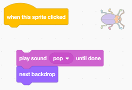

## ಎರಡನೇ ಹಂತ

<div style="display: flex; flex-wrap: wrap">
<div style="flex-basis: 200px; flex-grow: 1; margin-right: 15px;">
ನಿಮ್ಮ ಆಟಕ್ಕೆ ಎರಡನೇ ಹಂತವನ್ನು ಮಾಡಲು ನೀವು ಬ್ಯಾಕ್‌ಡ್ರಾಪ್ ಅನ್ನು ಆಯ್ಕೆ ಮಾಡಿಕೊಳ್ಳುತ್ತೀರಿ ಮತ್ತು ದೋಷವನ್ನು ಕಂಡುಹಿಡಿಯುವುದು ಕಷ್ಟಕರವಾಗಿ ಮಾಡುತೀರಿ. 
</div>
<div>

! [ಗುಪ್ತ ದೋಷವಿರುವ ಬೀದಿ ದೃಶ್ಯ.](images/second-level.png){:width="300px"}

</div>
</div>

--- task ---

**Choose:** ನಿಮ್ಮ ಎರಡನೇ ಹಂತಕ್ಕೆ ಬ್ಯಾಕ್‌ಡ್ರಾಪ್ ಆಯ್ಕೆಮಾಡಿ. **Urban** ಬ್ಯಾಕ್‌ಡ್ರಾಪ್ ಅನ್ನು ಆಯ್ಕೆ ಮಾಡಿದ್ದೇವೆ, ಆದರೆ ನೀವು ಹೆಚ್ಚು ಇಷ್ಟಪಡುವಂತಹದನ್ನು ನೀವು ಆಯ್ಕೆ ಮಾಡಬಹುದು.


**Tip:** ಸಾಕಷ್ಟು ಬಣ್ಣಗಳು ಮತ್ತು ವಿವರಗಳನ್ನು ಹೊಂದಿರುವ ಬ್ಯಾಕ್‌ಡ್ರಾಪ್‌ಗಳು ದೋಷವನ್ನು ಕಂಡುಹಿಡಿಯುವುದು ಕಷ್ಟಕರವಾಗಿಸುತ್ತದೆ ಎಂಬುದನ್ನು ನೆನಪಿಡಿ. ನಿಮ್ಮ ಆಟವನ್ನು ನೀವು ಎಷ್ಟು ಕಷ್ಟಕರವಾಗಿಸುತ್ತೀರಿ?

--- /task ---

ನಿಮ್ಮ ದೋಷವನ್ನು ಹೊಸ ಸ್ಥಾನಕ್ಕೆ ಎಳೆಯಲು, `when this sprite clicked`{:class="block3events"} ಸ್ಕ್ರಿಪ್ಟ್ ಅನ್ನು ತಡೆಯಿರಿ.

--- task ---

ನೀವು ದೋಷದ ಮೇಲೆ ಕ್ಲಿಕ್ ಮಾಡಿದಾಗ ಈ ಸ್ಪ್ರೈಟ್<`when this sprite clicked`{:class="block3events"}ನಿಂದ ದೂರ ಎಳೆಯಿರಿ:



--- /task ---

ಹಿನ್ನೆಲೆ ಬದಲಾದಾಗ ನಿಮ್ಮ ದೋಷವನ್ನು ಕಂಡುಹಿಡಿಯುವುದು ಕಷ್ಟವಾಗಬೇಕು. ಕಂಡುಹಿಡಿಯಲು ಕಷ್ಟವಾಗುವಂತೆ ನೀವು ದೋಷದ ಮರುಗಾತ್ರಗೊಳಿಸಬಹುದು.

--- task ---

ಎರಡನೇ ಹಂತಕ್ಕೆ ಬಗ್‌ನ `set the size`{:class="block3looks"} ಕೋಡ್ ಸೇರಿಸಿ:


```blocks3
when backdrop switches to [Urban v] // choose your backdrop
set size to [20] % // try another size 
```

**Test:** ನಿಮ್ಮ ಹೊಸ ಸ್ಕ್ರಿಪ್ಟ್ ಅನ್ನು ಚಲಾಯಿಸಲು ಅದರ ಮೇಲೆ ಕ್ಲಿಕ್ ಮಾಡಿ.

--- /task ---

--- task ---

ಈ ಹಂತಕ್ಕಾಗಿ ನಿಮ್ಮ ದೋಷವನ್ನು ಉತ್ತಮ ಅಡಗುತಾಣಕ್ಕೆ ಎಳೆಯಿರಿ.


--- /task ---

ನಿಮ್ಮ ದೋಷವನ್ನು ಅದರ ಅಡಗಿರುವ ಸ್ಥಳದಲ್ಲಿ ಇರಿಸಿ.

--- task ---

`go to x: y:`{:class="block3motion"}ಬ್ಲಾಕ್ ಅನ್ನು ನಿಮ್ಮ ಕೋಡ್‌ಗೆ ಸೇರಿಸಿ:


```blocks3
when backdrop switches to [Urban v]
set size to [20] % // try another size 
+ go to x: [24] y: [13] // in the shop window
```

--- /task ---

--- task ---

ಬ್ಲಾಕ್ಗಳನ್ನು ಬೆಂಬಲಿಸಿ ಸೇರಿ `when this sprite clicked`{:class="block3events"} ಬ್ಲಾಕ್ ಆದ್ದರಿಂದ ದೋಷ ಕ್ಲಿಕ್ ಮಾಡಿದಾಗ, ಬ್ಯಾಕ್ಟ್ರಾಪ್ಗೆ ಸ್ವಿಚ್ಚಿಂಗ್ `next backdrop`{:class="block3looks"}:


--- /task ---

--- task ---

**Test:** ನಿಮ್ಮ ಯೋಜನೆಯನ್ನು ಪರೀಕ್ಷಿಸಲು ಹಸಿರು ಧ್ವಜದ ಮೇಲೆ ಕ್ಲಿಕ್ ಮಾಡಿ.

--- /task ---

ನಿಮ್ಮ ದೋಷ ಈಗ ಗಿಳಿಯ ಮುಂದೆ ಇರಬಹುದು.

--- task ---

ನಿಮ್ಮ ದೋಷ ಯಾವಾಗಲೂ `back`{:class="block3looks"} ಎಂದು ಖಚಿತಪಡಿಸಿಕೊಳ್ಳಲು ಸ್ಕ್ರಿಪ್ಟ್ ಸೇರಿಸಿ:


```blocks3
when flag clicked
forever
go to [back v] layer
```

ಈಗ, ನಿಮ್ಮ ದೋಷವು ಯಾವಾಗಲೂ ಹಿಂಭಾಗದಲ್ಲಿ ಉಳಿಯುತ್ತದೆ, ನೀವು ಅದರ ಸ್ಥಾನವನ್ನು ಬದಲಾಯಿಸಬೇಕಾದರೂ ಸಹ.

--- /task ---

--- save ---
