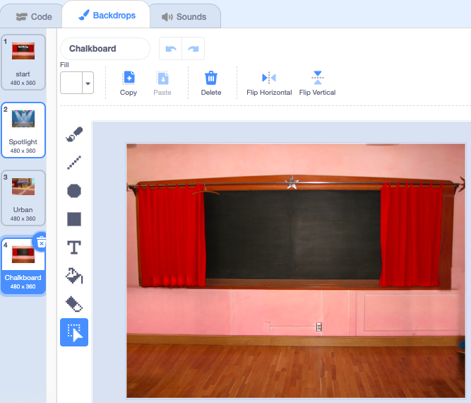

## ಅಂತಿಮ ಪರದೆ

<div style="display: flex; flex-wrap: wrap">
<div style="flex-basis: 200px; flex-grow: 1; margin-right: 15px;">
Create an 'end' screen to show the number of seconds that it has taken the player to find the bugs. 
</div>
<div>

! [ ಭಾಷಣದ ಗುಳ್ಳೆಯಲ್ಲಿ ಹುಳಗಳು ಮತ್ತು ಅದನ್ನು ಕಂಡುಹಿಡಿಯಲು ತೆಗೆದುಕೊಂಡ ಸಮಯ](images/end-screen.png){:width="300px"}

</div>
</div>

<p style="border-left: solid; border-width:10px; border-color: #0faeb0; background-color: aliceblue; padding: 10px;">
ಕೆಲವೊಮ್ಮೆ, ಆಟವನ್ನು ಸೋಲಿಸುವುದು ಸಾಕಾಗುವುದಿಲ್ಲ. ಆಟಗಾರಿಗೆ ತಾವು ಇತರ ಆಟಗಾರರು ಅಥವಾ ತಮ್ಮ ವಿರುದ್ಧ ಹೇಗೆ ಆಡಿದೆವು ಎಂದು ತಿಳಿಯಲು ಇಷ್ಟವಾಗುತ್ತದೆ. ನೀವು ಎಷ್ಟು ಚೆನ್ನಾಗಿ ಆಡಿದ್ದೀರಿ ಎಂದು ತೋರಿಸುವ ಆಟದ ಬಗ್ಗೆ ಯೋಚಿಸಬಹುದೇ?</p>

### Add another backdrop

--- task ---

**Indoors**ವರ್ಗದಿಂದ **Chalkboard** ವರ್ಗವನ್ನು ಸೇರಿಸಿ.


**ಸಲಹೆ:** Scratch ನಲ್ಲಿ, ನೀವು ಒಂದೇ ಬ್ಯಾಕ್‌ಡ್ರಾಪ್ ಅನ್ನು ಒಂದಕ್ಕಿಂತ ಹೆಚ್ಚು ಬಾರಿ ಸೇರಿಸಬಹುದು.

--- /task ---

### Edit the backdrop

--- task ---

ಪೇಂಟ್ ಎಡಿಟರ್ ತೆರೆಯಲು **Backdrops** ಟ್ಯಾಬ್ ಮೇಲೆ ಕ್ಲಿಕ್ ಮಾಡಿ.



--- /task ---

--- task ---

ಬ್ಯಾಕ್‌ಡ್ರಾಪ್‌ನ ಹೆಸರನ್ನು `end` ಎಂದು ಬದಲಾಯಿಸಿ:


**ಸಲಹೆ:** ನಿಮ್ಮ ಕೋಡ್ ಅನ್ನು ಸುಲಭವಾಗಿ ಅರ್ಥಮಾಡಿಕೊಳ್ಳಲು ನೀವು ಬ್ಯಾಕ್‌ಡ್ರಾಪ್ ಅನ್ನು **end** ಎಂದು ಬದಲಾಯಿಸಿದಿರಿ.

--- /task ---

### Position the bug

--- task ---

**bug** ಸ್ಪ್ರೈಟ್ ಮೇಲೆ ಕ್ಲಿಕ್ ಮಾಡಿ ಮತ್ತು ಬಗ್ ಅನ್ನು 'ಅಂತಿಮ' ಪರದೆಯ ಮೇಲೆ ಇರಿಸಲು ಕೋಡ್ ಸೇರಿಸಿ:


```blocks3
when backdrop switches to [end v]
set size to [100] % // full-sized
go to x: [0] y: [30] // on the board
```

--- /task ---

### Add a timer

ದೋಷಗಳನ್ನು ಹುಡುಕಲು ಮತ್ತು ಕ್ಲಿಕ್ ಮಾಡಲು ನಿಮಗೆ ಎಷ್ಟು ಸಮಯ ತೆಗೆದುಕೊಳ್ಳುತ್ತದೆ? ಕಂಡುಹಿಡಿಯಲು Scratch ನಲ್ಲಿ ಇರುವ `timer`{:class="block3sensing"} ಅನ್ನು ನೀವು ಬಳಸಬಹುದು.

--- task ---

`timer`{:class="block3sensing"} ಬ್ಲಾಕ್ `Sensing`{:class="block3sensing"} 
ಬ್ಲಾಕ್‌ಗಳ ಮೆನುವಿನಲ್ಲಿ ಇದೆ. 'end' ಪರದೆಯಲ್ಲಿ ದೋಷವು `say`{:class="block3looks"} `timer`{:class="block3sensing"} ಮಾಡಲು ಕೋಡ್ ಸೇರಿಸಿ:


```blocks3
when backdrop switches to [end v]
set size to [100] % // full-sized
go to x: [0] y: [30] // on the board
+say (timer) // seconds taken
```


--- /task ---

--- task ---

**ಪರೀಕ್ಷೆ:** ನಿಮ್ಮಹುಡುಕುವ ಜಾಣ್ಮೆಯನ್ನು ಪರೀಕ್ಷಿಸಲು ಹಸಿರು ಬಾವುಟದ ಮೇಲೆ ಕ್ಲಿಕ್ ಮಾಡಿ. ದೋಷಗಳನ್ನು ಹುಡುಕಲು ನಿಮಗೆ ಎಷ್ಟು ಸಮಯ ತೆಗೆದುಕೊಳ್ಳುತ್ತದೆ?

--- /task ---

'ಪ್ರಾರಂಭದ' ಪರದೆಗೆ ಹಿಂತಿರುಗಲು, 'ಅಂತಿಮ' ಪರದೆಯ ಮೇಲಿನ ದೋಷದ ಮೇಲೆ ಕ್ಲಿಕ್ ಮಾಡಿ.

--- task ---

ನೀವು "ಪ್ರಾರಂಭದ" ಪರದೆಗೆ ಹೋದಾಗ`timer`{:class="block3sensing"} ಎಂದು ದೋಷಗಳು ಹೇಳುವುದನ್ನು ನಿಲ್ಲಿಸಲು ಕೋಡ್ ಸೇರಿಸಿ:


```blocks3
when backdrop switches to [start v]
set size to [100] % // full-sized
go to x: [0] y: [30] // on the board
+say [] // say nothing
```

--- /task ---

### Stop the timer

ನೀವು ಎರಡನೇ ಬಾರಿಗೆ ಆಟವನ್ನು ಆಡಿದರೆ, `timer`{:class="block3sensing"} ಎಣಿಸುತ್ತಲೇ ಇರುತ್ತದೆ.

--- task ---

ಬ್ಯಾಕ್‌ಡ್ರಾಪ್‌ ಮೊದಲ ಹಂತಕ್ಕೆ `backdrop switches to`{:class="block3events"} ಮಾಡಿದಾಗ `reset the timer`{:class="block3sensing"} ಮಾಡಲು ಕೋಡ್ ಸೇರಿಸಿ:


```blocks3
when backdrop switches to [Spotlight v] // first level
set size to [20] % // tiny
go to x: [13] y: [132] // on the disco ball
+reset timer // start the timer
```

--- /task ---

--- task ---

**ಪರೀಕ್ಷೆ:** ಹಸಿರು ಬಾವುಟದ ಮೇಲೆ ಕ್ಲಿಕ್ ಮಾಡಿ ಮತ್ತು ಆಟವನ್ನು ಆಡಿ. ಮೊದಲ ಹಂತಕ್ಕೆ ಹೋಗಲು ನೀವು 'ಪ್ರಾಂಭದ' ಪರದೆಯಲ್ಲಿರುವ ದೋಷದ ಮೇಲೆ ಕ್ಲಿಕ್ ಮಾಡಿದಾಗ ಟೈಮರ್ ರಿಸೆಟ್ ಆಗಬೇಕು. ನೀವು 'ಅಂತ್ಯ' ಪರದೆಯ ಮೇಲೆ ದೋಷದ ಮೇಲೆ ಕ್ಲಿಕ್ ಮಾಡಿದಾಗ, ನೀವು 'ಪ್ರಾರಂಭ' ಪರದೆಗೆ ಹಿಂತಿರುಗಬೇಕು ಮತ್ತು ಹುಳವು `timer`{:class="block3sensing"} ಅನ್ನು ಹೇಳುತ್ತಿಲ್ಲ ಎಂಬುದನ್ನು ನೋಡಬೇಕು.

--- /task ---

