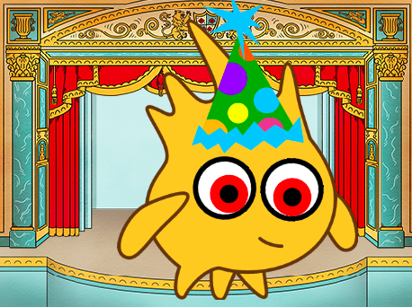

## पुढे काय?

जर तुम्ही [स्क्रॅचचा परिचय](https://projects.raspberrypi.org/en/pathways/scratch-intro) मार्ग वापरात असाल, तर तुम्ही [मूर्ख डोळे](https://projects.raspberrypi.org/en/projects/silly-eyes) प्रोजेक्टवर जाऊ शकता. या प्रकल्पात, तुम्ही माउस हलवताना माउस पॉइंटरकडे पाहणाऱ्या डोळ्यांचे तुमचे स्वतःचे पात्र डिझाइन कराल!

--- print-only ---

--- /print-only ---

--- no-print ---

  <iframe allowtransparency="true" width="485" height="402" src="https://scratch.mit.edu/projects/embed/495141114/?autostart=false" frameborder="0"></iframe>

--- /no-print ---
