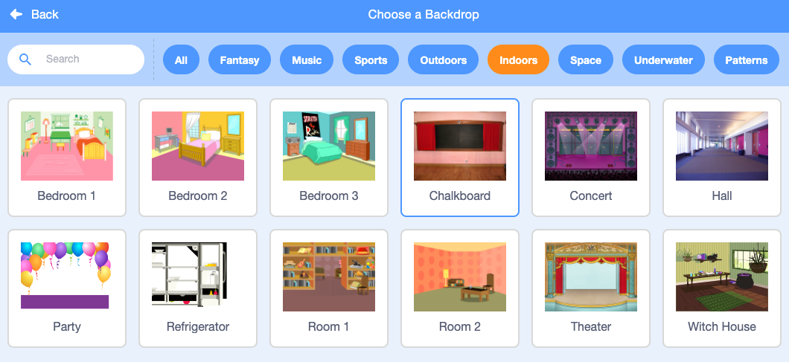
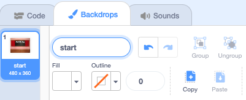

## प्रारंभी स्क्रीन

तुमच्या गेमला 'स्टार्ट' स्क्रीन द्या.

{:width="300px"}

### स्टार्टर प्रोजेक्ट उघडा

--- task ---

[किडा शोधा स्टार्टर प्रकल्प](https://scratch.mit.edu/projects/582214723/editor){:target="_blank"} उघडा. Scratch दुसऱ्या ब्राऊजर टॅब मध्ये उघडेल.

[[[working-offline]]]

--- /task ---

### एक पार्श्वभूमी जोडा

--- task ---

**Indoors** श्रेणीतील **Chalkboard** बॅकड्रॉप जोडा.

--- /task ---

**Stage** मध्ये **Costumes** टॅबऐवजी **Backdrops** टॅब आहे. येथे तुम्ही **Stage** साठी प्रतिमा तयार करू शकता.

--- task ---

Stage फलकावर वर क्लिक करा.

--- /task ---

### पार्श्वभूमी संपादित करा

--- task ---

पेंट एडिटर उघडण्यासाठी **Backdrops** टॅबवर क्लिक करा.

--- /task ---

--- task ---

तुमच्या प्रोजेक्टमधून **backdrop1** हा बॅकड्रॉप काढण्यासाठी **backdrop1** निवडा आणि **Delete** आयकॉनवर क्लिक करा. तुम्हाला या प्रकल्पात **backdrop1** बॅकड्रॉप आवश्यकता नाही.

--- /task ---

**Chalkboard** बॅकड्रॉप आता हायलाइट केला जाईल.

--- task ---

**Convert to Vector**वर क्लिक करा. आता, तुम्ही फिरवू शकाल असा मजकूर जोडण्यास सक्षम असाल.

--- /task ---

--- task ---

चॉकबोर्डवर `Find the bug` हा मजकूर लिहिण्यासाठी **Text** साधनाचा वापर करा:

आम्ही पांढऱ्या रंगात **Marker** फॉन्ट वापरला आहे, परंतु तुम्हाला वापरायचा असलेला फॉन्ट आणि रंग **निवडा**.

**टीप:** तुमचा मजकूर फिरवण्यासाठी **Select** (बाण) टूलवर जा. मजकूराचा आकार बदलण्यासाठी, मजकूराचा कोपरा पकडा आणि तो ड्रॅग करा.

--- /task ---

## पार्श्वभूमीचे नाव बदला

--- task ---

बॅकड्रॉपचे नाव `Start` असे बदला, कारण तुम्हाला ते नंतर प्रोजेक्टमध्ये निवडावे लागेल.

**टीप:** जर तुम्ही अर्थपूर्ण नावे वापरत असाल, तर तुमचा प्रकल्प समजून घेणे सोपे होईल, विशेषत: जेव्हा तुम्ही नंतर एखाद्या प्रकल्पावर परत येता.

--- /task ---

### बग स्प्राइट जोडा

--- task ---

**Scratch Cat** स्प्राइट हटवा.

--- /task ---

--- task ---

**Choose a Sprite** वर क्लिक करा आणि सर्च बॉक्समध्ये `Bug` टाइप करा.

**निवडा:** एक किडा निवडा, जो खेळाडूंना तुमच्या गेममध्ये शोधण्याची आवश्यकता असेल.

**टीप:** तुमच्या प्रोजेक्टला नाव द्या. तुम्ही नुकतेच निवडलेल्या किड्याचे नाव समाविष्ट करायला तुम्हाला आवडेल.

--- /task ---

कॉम्प्युटर प्रोग्रॅममधील चुकांना **bug** म्हणतात. संगणक प्रोग्राममधील चुका शोधणे आणि दूर करणे याला **debugging** म्हणतात. ग्रेस हॉपर ह्या प्रसिद्ध सॉफ्टवेअर अभियंता आहेत. त्यांच्या टीमला एकदा त्यांच्या कॉम्प्युटरमध्ये एक पतंग सापडला. त्यांच्या नोंदीमध्ये म्हटले आहे, "बग सापडल्याची पहिली वास्तविक घटना."

