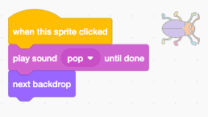

## पहिली लेवल

<div style="display: flex; flex-wrap: wrap">
<div style="flex-basis: 200px; flex-grow: 1; margin-right: 15px;">
तुमच्या गेममधील प्रथम स्तर म्हणून नवीन पार्श्वभूमी जोडा आणि बग लपवा.
</div>
<div>

{:width="300px"}

</div>
</div>

### दुसरी पार्श्वभूमी जोडा

--- task ---

**संगीत** श्रेणीतील **स्पॉटलाइट** पार्श्वभूमी जोडा.


--- /task ---

### बगचा आकार बदला

--- task ---

Sprite यादीतील **किडा** स्प्राइटवर क्लिक करा. तुमच्या किड्याची `Size`{:class="block3looks"} बदलण्यासाठी `when the backdrop switches to Spotlight `{:class="block3events"} हि स्क्रिप्ट जोडा:


```blocks3
when backdrop switches to [Spotlight v]
set size to [20] % // tiny
```

--- /task ---

--- task ---

आकार बदलण्यासाठी कोडवर क्लिक करा, नंतर तुमचा लहान किडा लपवण्याच्या ठिकाणी ड्रॅग करा.

तुमचा किडा ठेवण्यासाठी कोड जोडा:


```blocks3
when backdrop switches to [Spotlight v]
set size to [20] % // tiny
+ go to x: [13] y: [132] // on the disco ball
```

**निवडा:** तुम्ही इच्छित असल्यास, तुम्ही भिन्न आकार आणि स्थान निवडू शकता.

--- /task ---

### पुढील पार्श्वभूमीवर जा

जेव्हा तुम्ही गेम खेळता आणि तुम्‍हाला यशस्‍वीपणे किडा सापडेल, तेव्हा गेम पुढील बॅकड्रॉपवर बदलेल. तसेच, गेम सुरू करण्यासाठी, तुम्ही 'start' स्क्रीनवरील किड्यावर क्लिक कराल.

`next backdrop`{:class="block3looks"} ब्लॉक पुढील बॅकड्रॉपवर बदलतो ज्या क्रमाने तुम्ही **Stage**साठी **Backdrops** टॅबवर क्लिक करता तेव्हा बॅकड्रॉप सूचीबद्ध केली जाते.

--- task ---

तुमच्या **किडा** स्प्राइटमध्ये `play a Pop sound`{:class="block3sound"} स्क्रिप्ट जोडा आणि `next backdrop`{:class="block3looks"} `when this sprite is clicked`{:class="block3events"} वर जा:


```blocks3
when this sprite clicked
play sound [Pop v] until done
next backdrop
```

--- /task ---

### स्टार्ट स्क्रीनने गेम सुरू करा

--- task ---

स्टेज उपखंडावर क्लिक करा आणि हा कोड **स्टेज**मध्ये जोडा:


```blocks3
when flag clicked
switch backdrop to [start v] // 'start' screen
```

--- /task ---

--- task ---

**चाचणी:** तुमच्या प्रकल्पाची चाचणी घेण्यासाठी हिरव्या ध्वजावर क्लिक करा.

तुमच्या लक्षात येईल की 'प्रारंभ' स्क्रीनवर, बगला पहिल्या स्तरापासून (या उदाहरणात, डिस्को बॉलवर) लपविण्याच्या ठिकाणी लपण्यासाठी सेटिंग्ज असतील.

**टीप:** सूचीतील शेवटच्या पार्श्वभूमीनंतर, `पुढील पार्श्वभूमी`{:class="block3looks"} पहिल्या पार्श्वभूमीवर परत जाईल.

--- /task ---

--- task ---

स्प्राईट यादीतील **बग** स्प्राइटवर क्लिक करा. `मध्ये स्क्रिप्ट जोडा बगचा आकार`{:class="block3looks"} सेट करा जेव्हा तुमची `पार्श्वभूमी`{:class="block3events"} `स्टार्ट`{:class="block3events"} स्क्रीनवर स्विच करते:


```blocks3
when backdrop switches to [start v]
set size to [100] % // full-sized
```

--- /task ---

### बगची स्थिती बदला

--- task ---

'प्रारंभ' स्क्रीनवर बग ठेवण्याचा प्रयत्न करा.

तुम्ही बगवर क्लिक करता तेव्हा तुमचा कोड बॅकड्रॉप स्विच करेल! जेव्हा तुम्ही बग ठेवण्याचा प्रयत्न करत असाल तेव्हा ते उपयुक्त नाही.

समस्येचे निराकरण करण्यासाठी, जेव्हा तुम्ही बगवर क्लिक करता तेव्हा तुम्हाला कोड चालू होण्यापासून थांबवणे आवश्यक आहे.

--- /task ---

--- task ---

'स्टार्ट' स्क्रीनवर परत येण्यासाठी हिरव्या ध्वजावर क्लिक करा.

स्प्राईट सूचीमधील **बग** स्प्राइटवर क्लिक करा आणि जेव्हा या स्प्राईटने</code>{:class="block3events"} ब्लॉकवर क्लिक केले तेव्हा ब्लॉक्स `पासून दूर ड्रॅग करा:</p>

<p spaces-before="0"></p>

<p spaces-before="0">--- /task ---</p>

<p spaces-before="0">--- task ---</p>

<p spaces-before="0">बग पुन्हा ठेवण्याचा प्रयत्न करा. मजकुराच्या खाली चॉकबोर्डवर बग ड्रॅग करा: </p>

<p spaces-before="0"></p>

<p spaces-before="0">प्रत्येक वेळी तुमचा <code>पार्श्वभूमी`{:class="block3events"} `start`{:class="block3events"} स्क्रीनवर स्विच करतेवेळी बग चॉकबोर्डवर स्थित आहे याची खात्री करण्यासाठी कोड जोडा:


```blocks3
when backdrop switches to [start v]
set size to [100] % // full-sized
+ go to x: [0] y: [30] // on the board
```

--- /task ---

--- task ---

ब्लॉक पुन्हा एकत्र जोडा म्हणजे कोड ब्लॉक्स `च्या खाली असतील जेव्हा या स्प्राईटने पुन्हा`{:class="block3events"} ब्लॉकवर क्लिक केले:



--- /task ---

--- task ---

**चाचणी:** तुमच्या प्रकल्पाची चाचणी घेण्यासाठी हिरव्या ध्वजावर क्लिक करा. पुढील पार्श्वभूमीवर जाण्यासाठी बगवर क्लिक करा. बग 'स्टार्ट' स्क्रीनवर मोठा आणि 'स्पॉटलाइट' स्तरावर लहान असावा.

--- collapse ---
---
शीर्षक: मी बगवर क्लिक केल्यावर काहीही होत नाही
---

जेव्हा या स्प्राईटने</code>{:class="block3events"} ब्लॉकवर क्लिक केले तेव्हा तुम्ही कोडमध्ये परत मध्ये सामील व्हायला विसरलात का?</p>

<p spaces-before="0">--- /collapse ---</p>

<p spaces-before="0">--- /task ---</p>