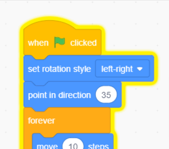

## पोपट विचलित करणे

<div style="display: flex; flex-wrap: wrap">
<div style="flex-basis: 200px; flex-grow: 1; margin-right: 15px;">
खेळाडूंना किडा शोधणे आणि त्यावर क्लिक करणे कठिण करण्यासाठी, त्यांचे लक्ष विचलित करण्यासाठी तुम्ही त्रासदायक पोपट जोडाल. 
</div>
<div>

{:width="300px"}

</div>
</div>

### पोपट स्प्राइट घाला

--- task ---

**Parrot** स्प्राइट जोडा.


--- /task ---

### पोपट स्प्राइटला अॅनिमेट करा

[बस पकडा](https://projects.raspberrypi.org/en/projects/catch-the-bus){:target="_blank"} प्रोजेक्टमध्ये, तुम्ही `repeat`{:class="block3control"} लूप वापरला आहे.

तुम्ही येथे वेगळा लूप वापराल. `forever`{:class="block3control"} लूप त्याच्या आत कोड ब्लॉक्स पुन्हा पुन्हा चालवतो. त्रासदायक पोपटासाठी हा एक योग्य लूप आहे जो इकडे तिकडे उडणे आणि मार्गात येण्याचे थांबणार नाही.

--- task ---

Add code to make the parrot flap around in a distracting way. Look at the comments on the code blocks for some different numbers to try:


```blocks3
when flag clicked
set rotation style [left-right v] // do not go upside down
point in direction [35] // number from -180 to 180
forever // keep being annoying
move [10] steps // the number controls the speed
if on edge, bounce // stay on the Stage
next costume // flap
change [color v] effect by [5] // try 11 or 50
wait [0.25] seconds // try 0.1 or 0.5
end
```

--- /task ---

--- task ---

**चाचणी:** हिरव्या ध्वजावर क्लिक करा आणि तुमच्या प्रकल्पाची पुन्हा चाचणी करा. तुम्ही किडा कुठे लपवला होता ते आठवते का?

Scratch मध्ये, चालू असलेला कोड पिवळ्या बाह्यरेषेसह चमकतो:



**टीप:** जर तुम्ही कोडिंग करत असताना पोपट खूप त्रासदायक होत असेल, तर तुम्ही कोड चालू होण्यापासून थांबवण्यासाठी Stage च्या वर असलेल्या लाल स्टॉप बटणावर क्लिक करू शकता.

--- /task ---

