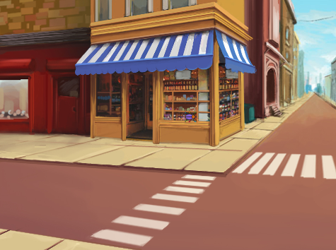

## दुसरी लेवल

<div style="display: flex; flex-wrap: wrap">
<div style="flex-basis: 200px; flex-grow: 1; margin-right: 15px;">
तुमच्या गेमसाठी दुसरा स्तर बनवण्यासाठी पार्श्वभूमी निवडा आणि बग शोधणे कठीण करा. 
</div>
<div>

{:width="300px"}

</div>
</div>

### दुसरी पार्श्वभूमी जोडा

--- task ---

**निवडा:** तुमच्या दुसऱ्या लेवलसाठी बॅकड्रॉप निवडा. आम्ही **Urban** बॅकड्रॉप निवडला आहे, परंतु तुम्हाला सर्वात जास्त आवडेल तो बॅकड्रॉप तुम्ही निवडू शकता.


**टीप:** लक्षात ठेवा की अनेक रंग आणि तपशीलांसह असलेला बॅकड्रॉप बग शोधणे कठीण करेल. तुम्ही तुमचा खेळ किती कठीण बनवाल?

--- /task ---

### कोड चालू होण्यापासून थांबवा

--- task ---

जेव्हा तुम्ही बगवर क्लिक करता तेव्हा या स्प्राईटने</code>{:class="block3events"} ब्लॉकवर क्लिक केल्यावर ब्लॉक्स `पासून दूर ड्रॅग करा:</p>

<p spaces-before="0"></p>

<p spaces-before="0">--- /task ---</p>

<h3 spaces-before="0">बगचा आकार बदला</h3>

<p spaces-before="0">--- task ---</p>

<p spaces-before="0"><code>मध्ये कोड जोडा दुसऱ्या स्तरासाठी बगचा आकार`{:class="block3looks"} सेट करा:


```blocks3
when backdrop switches to [Urban v] // choose your backdrop
set size to [20] % // try another size 
```

**चाचणी:** ती चालवण्यासाठी तुमच्या नवीन स्क्रिप्टवर क्लिक करा.

--- /task ---

### तुमचा बग लपवा

--- task ---

तुमचा बग स्टेजवर या स्तरासाठी चांगल्या लपण्याच्या ठिकाणी ड्रॅग करा.



--- /task ---

तुमचा बग लपण्याच्या जागी ठेवा.

--- task ---

तुमच्या कोडमध्ये x: y:</code>{:class="block3motion"} ब्लॉकमध्ये `जोडा:</p>

<p spaces-before="0"></p>

<pre><code class="blocks3">when backdrop switches to [Urban v]
set size to [20] % // try another size 
+ go to x: [24] y: [13] // in the shop window
`</pre>

--- /task ---

### तुमच्या कोडची चाचणी घ्या

--- task ---

जेव्हा या स्प्राईटने</code>{:class="block3events"} ब्लॉकवर क्लिक केले तेव्हा ब्लॉकमध्ये परत `मध्ये सामील व्हा जेणेकरून बग क्लिक केल्यावर, पार्श्वभूमी <code>पुढील पार्श्वभूमी`{:class="block3looks"} वर स्विच करेल:


--- /task ---

--- task ---

**चाचणी:** तुमच्या प्रकल्पाची चाचणी घेण्यासाठी हिरव्या ध्वजावर क्लिक करा.

--- /task ---

तुमचा बग आता पोपटाच्या समोर असू शकतो.

--- task ---

तुमचा बग नेहमी `बॅक`{:class="block3looks"} वर असतो याची खात्री करण्यासाठी स्क्रिप्ट जोडा:


```blocks3
when flag clicked
forever
go to [back v] layer
```

आता, तुमचा बग नेहमी मागे राहील, तुम्हाला त्याची स्थिती बदलण्याची आवश्यकता असली तरीही.

--- /task ---
