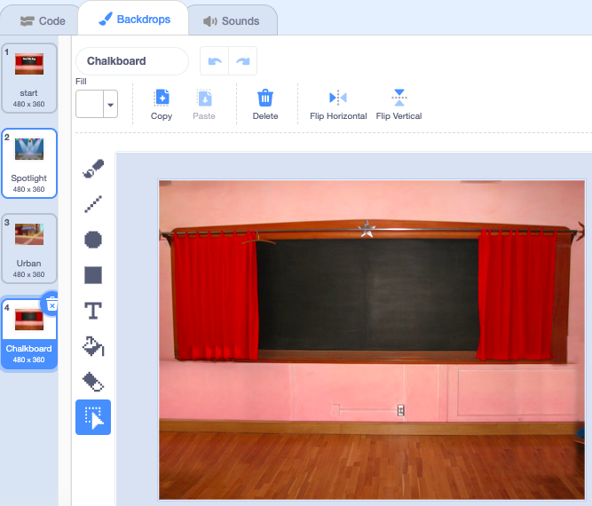

## शेवट स्क्रीन

<div style="display: flex; flex-wrap: wrap">
<div style="flex-basis: 200px; flex-grow: 1; margin-right: 15px;">
बग शोधण्यासाठी खेळाडूला किती सेकंद लागले हे दाखवण्यासाठी 'एंड' स्क्रीन तयार करा. 
</div>
<div>

{:width="300px"}

</div>
</div>

<p style="border-left: solid; border-width:10px; border-color: #0faeb0; background-color: aliceblue; padding: 10px;">
काहीवेळा, फक्त खेळ मारणे पुरेसे नसते. खेळाडूंना हे जाणून घ्यायला आवडते की त्यांनी इतर खेळाडूंविरुद्ध किंवा स्वतःविरुद्ध कसे केले. तुम्ही अशा खेळाचा विचार करू शकता जो तुम्हाला दाखवेल की तुम्ही किती चांगले केले?</p>

### दुसरी पार्श्वभूमी जोडा

--- task ---

**Indoors** श्रेणीतील **Chalkboard** बॅकड्रॉप जोडा.


**टीप:** Scratch मध्ये, तुम्ही समान बॅकड्रॉप एकापेक्षा जास्त वेळा जोडू शकता.

--- /task ---

### पार्श्वभूमी संपादित करा

--- task ---

पेंट एडिटर उघडण्यासाठी **Backdrops** टॅबवर क्लिक करा.



--- /task ---

--- task ---

पार्श्वभूमीचे नाव `end` असे बदला:


**टीप:** तुमचा कोड समजणे सोपे होण्यासाठी तुम्ही बॅकड्रॉपचे नाव **end** असे बदला.

--- /task ---

### बग स्थान द्या

--- task ---

**किडा** स्प्राइटवर क्लिक करा आणि 'शेवटची' स्क्रीनवर किडा ठेवण्यासाठी कोड जोडा:


```blocks3
when backdrop switches to [end v]
set size to [100] % // full-sized
go to x: [0] y: [30] // on the board
```

--- /task ---

### टाइमर जोडा

किडा शोधण्यासाठी आणि त्यावर क्लिक करण्यासाठी तुम्हाला किती वेळ लागेल? स्क्रॅचमध्ये `टायमर`{:class="block3sensing"} आहे जो तुम्ही शोधण्यासाठी वापरू शकता.

--- task ---

`टाइमर`{:class="block3sensing"} ब्लॉक `Sensing`{:class="block3sensing"} ब्लॉक मेनूमध्ये आहे. 'एंड' स्क्रीनवर बग `म्हणण्यासाठी`{:class="block3looks"} `टाइमर`{:class="block3sensing"} करण्यासाठी कोड जोडा:


```blocks3
when backdrop switches to [end v]
set size to [100] % // full-sized
go to x: [0] y: [30] // on the board
+say (timer) // seconds taken
```


--- /task ---

--- task ---

**चाचणी:** तुमच्या शोध कौशल्याची चाचणी घेण्यासाठी हिरव्या ध्वजावर क्लिक करा. किडा शोधण्यासाठी तुम्हाला किती वेळ लागेल?

--- /task ---

'start' स्क्रीनवर परत जाण्यासाठी, 'end' स्क्रीनवरील किड्यावर क्लिक करा.

--- task ---

तुम्ही 'start' स्क्रीनवर जाता तेव्हा किड्याने `timer`{:class="block3sensing"} म्हणणे थांबवण्यासाठी कोड जोडा:


```blocks3
when backdrop switches to [start v]
set size to [100] % // full-sized
go to x: [0] y: [30] // on the board
+say [] // say nothing
```

--- /task ---

### टाइमर थांबवा

तुम्ही दुसऱ्यांदा गेम खेळल्यास, `टायमर (timer)`{:class="block3sensing"} मोजत राहील.

--- task ---

`मध्ये कोड जोडा टाइमर`{:class="block3sensing"} रीसेट करा जेव्हा `बॅकड्रॉप`{:class="block3events"} वर स्विच करते तेव्हा:


```blocks3
when backdrop switches to [Spotlight v] // first level
set size to [20] % // tiny
go to x: [13] y: [132] // on the disco ball
+reset timer // start the timer
```

--- /task ---

--- task ---

**चाचणी:** हिरव्या ध्वजावर क्लिक करा आणि गेम खेळा. पहिल्या लेवलवर जाण्यासाठी तुम्ही 'start' स्क्रीनवरील बगवर क्लिक करता तेव्हा टायमर रीसेट झाला पाहिजे. जेव्हा तुम्ही 'end' स्क्रीनवरील किड्यावर क्लिक करता, तेव्हा तुम्ही 'start' स्क्रीनवर परत यावे आणि किडा `timer`{:class="block3sensing"} म्हणत नाही हे पाहावे.

--- /task ---

