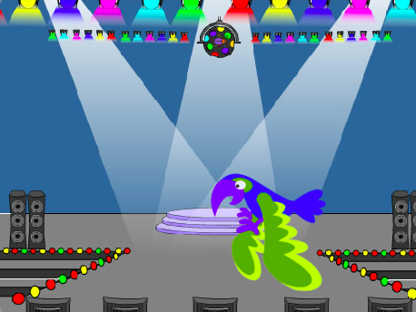

## Inleiding

In dit project maak je een spel waarin je op elk niveau een verborgen kever moet vinden. Het spel heeft een 'start' en 'eind' achtergrond, en een klok die de speler laat zien hoe snel ze de kevers gevonden hebben.

Je gaat:
+ Niveaus maken voor je spel met behulp van `volgende achtergrond`{:class="block3looks"} en `verander achtergrond naar`{:class="block3looks"} blokken
+ Een `herhaal`{:class="block3control"} lus gebruiken om het script continu uit te voeren
+ Een `klok`{:class="block3sensing"} **variabele** gebruiken om de speler te laten weten hoe snel ze de kevers hebben gevonden

--- no-print --- --- task ---
### Probeer het uit

  
Klik op de kever om het spel te starten.

Probeer op elk niveau de kever te vinden.

Hoe goed zijn de kevers verborgen? Je gaat je eigen niveaus toevoegen en het zo makkelijk of moeilijk maken als jij wilt.

  <iframe allowtransparency="true" width="485" height="402" src="https://scratch.mit.edu/projects/embed/600272350/?autostart=false" frameborder="0"></iframe>

--- /task ---

--- /no-print ---

--- print-only ---

--- /print-only ---

Jaarlijks spelen meer dan 2,5 miljard mensen videogames. Bedenk eens hoeveel mensen betrokken zijn bij het maken van die spellen. Zou jij een baan willen als het ontwerpen, coderen of testen van games die andere mensen kunnen spelen? 

