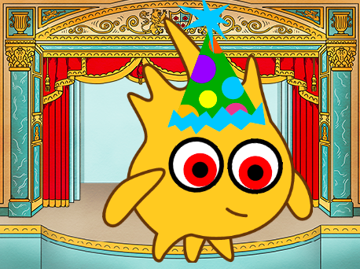

## Wat kun je verder nog doen?

Als je het [Introductie tot Scratch](https://projects.raspberrypi.org/nl-NL/pathways/scratch-intro) pad volgt, kun je doorgaan naar het [Maffe ogen](https://projects.raspberrypi.org/nl-NL/projects/silly-eyes) project. In dit project ontwerp je je eigen karakter met ogen die naar de muisaanwijzer kijken wanneer je de muis beweegt!

--- print-only ---

--- /print-only ---

--- no-print ---

  <iframe allowtransparency="true" width="485" height="402" src="https://scratch.mit.edu/projects/embed/495141114/?autostart=false" frameborder="0"></iframe>

--- /no-print ---

***
Dit project werd vertaald door vrijwilligers:

Sanneke van der Meer
Robert-Jan Kempenaar

Dankzij vrijwilligers kunnen we mensen over de hele wereld de kans geven om in hun eigen taal te leren. Jij kunt ons helpen meer mensen te bereiken door vrijwillig te starten met vertalen - meer informatie op [rpf.io/translate](https://rpf.io/translate).
