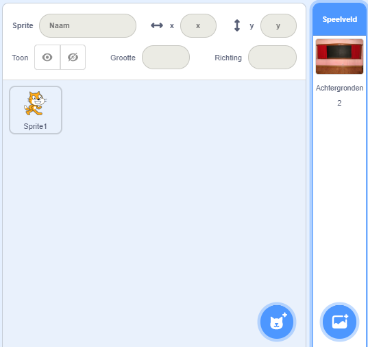
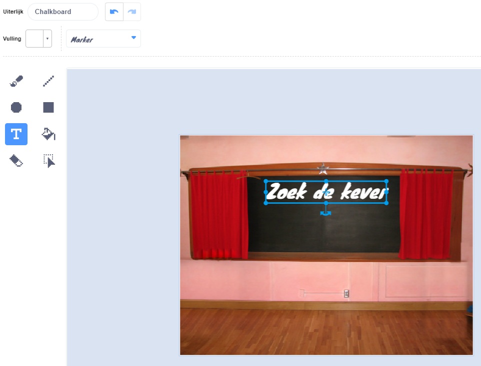

## Startscherm

Geef je spel een 'start' scherm.

{:width="300px"}

### Open het startersproject

--- task ---

Open het [Vind de kever startproject](https://scratch.mit.edu/projects/582214723/editor){:target="_blank"}. Scratch wordt in een nieuw browsertabblad geopend.

[[[working-offline]]]

--- /task ---

### Een achtergrond toevoegen

--- task ---

Voeg de **Chalkboard** (schoolbord) achtergrond uit de categorie **Binnen** toe.

--- /task ---

Het **Speelveld** heeft een **Achtergronden** tabblad in plaats van een **Uiterlijken** tabblad. Hier kun je afbeeldingen voor het **Speelveld** maken.

--- task ---

Klik op het Speelveld.

--- /task ---

### Bewerk de achtergrond

--- task ---

Klik op het **Achtergronden** tabblad om de Teken-editor te openen.

--- /task ---

--- task ---

Selecteer **backdrop1** en klik op het **Verwijder** icoon om de **backdrop1** achtergrond uit je project te verwijderen. Je hebt de **backdrop1** achtergrond niet nodig in dit project.

--- /task ---

De **Chalkboard** achtergrond wordt nu gemarkeerd.

--- task ---

Klik op **Zet om naar vector**. Nu kun je tekst toevoegen die je kunt verplaatsen.

--- /task ---

--- task ---

Gebruik de **Tekst** knop om de tekst `Zoek de kever` toe te voegen aan het bord:

We hebben het **Marker** font in het wit gebruikt, maar **kies** het lettertype en de kleur die jij wil gebruiken.

**Tip:** Schakel over naar het **Selecteren** (pijl) gereedschap om je tekst te verplaatsen. Om de grootte van de tekst te wijzigen, pak je de hoek van de tekst en sleep je deze.

--- /task ---

## Hernoem de achtergrond

--- task ---

Verander de naam van de achtergrond in `start`, omdat je deze later in het project moet selecteren.

**Tip:** Als je namen gebruikt die logisch zijn, is het gemakkelijker om je project te begrijpen, vooral wanneer je later bij een project terugkomt.

--- /task ---

### Voeg de Bug Sprite toe

--- task ---

Verwijder de **Scratch kat** sprite.

--- /task ---

--- task ---

Klik op **Kies een Sprite** en typ `bug` in het zoekvak.

**Kies:** Kies een kever die spelers in je spel moeten vinden.

**Tip:** Geef je project een naam. Misschien wil je de naam van de kever die je gekozen hebt, toevoegen.

--- /task ---

Een fout in een computerprogramma heet een **bug** (kever). Fouten vinden en verwijderen in computerprogramma's heet **debugging**. Grace Hopper is een beroemde software-engineer. Haar team heeft ooit een mot in hun computer gevonden. In hun aantekeningen staat: "Eerste echte geval van bug gevonden."

