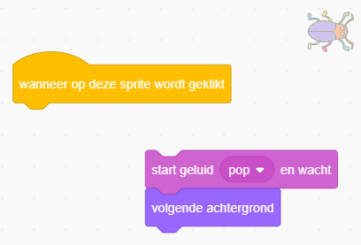
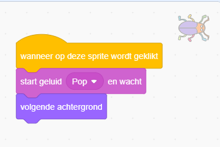

## Eerste niveau

<div style="display: flex; flex-wrap: wrap">
<div style="flex-basis: 200px; flex-grow: 1; margin-right: 15px;">
Je voegt een nieuwe achtergrond toe als het eerste niveau in je spel en verbergt de kever.
</div>
<div>

{:width="300px"}

</div>
</div>

--- task ---

Voeg de **Spotlight** (schijnwerpers) achtergrond uit de categorie **Binnen** toe.


--- /task ---

--- task ---

Klik op de **kever** in het Sprite-venster. Voeg een script toe om de `grootte`{:class="block3looks"} van je kever te veranderen `wanneer de achtergrond verandert naar Spotlight`{:class="block3events"}:


```blocks3
when backdrop switches to [Spotlight v]
set size to [20] % // tiny
```

--- /task ---

--- task ---

Klik op de code om de grootte te wijzigen en sleep vervolgens je kleine kever naar een schuilplaats.

Voeg code toe om je kever te positioneren:


```blocks3
when backdrop switches to [Spotlight v]
set size to [20] % // tiny
+ go to x: [13] y: [132] // on the disco ball
```

**Kies:** Je kunt een andere grootte en positie kiezen als je dat wilt.

--- /task ---

Wanneer je het spel speelt en je de kever vindt, schakelt het spel over naar de volgende achtergrond. Ook om het spel te starten, klik je op de kever in het 'start'-scherm.

Het `volgende achtergrond`{:class="block3looks"} blok schakelt over naar de volgende achtergrond in de volgorde van de lijst met achtergronden als je klikt op het **Achtergronden** tabblad voor het **Speelveld**.

--- task ---

Voeg een script toe aan je **kever** sprite om een `startgeluid`{:class="block3sound"} af te spelen en schakel over naar de `volgende achtergrond`{:class="block3looks"} `wanneer op deze sprite wordt geklikt`{:class ="blok3events"}:


```blocks3
when this sprite clicked
play sound [Pop v] until done
next backdrop
```

--- /task ---

Je project moet beginnen op het 'start' scherm.

--- task ---

Klik op het speelveld en voeg deze code toe aan het **speelveld**:


```blocks3
when flag clicked
switch backdrop to [start v] // 'start' screen
```

--- /task ---

--- task ---

**Test:** Klik op de groene vlag om je project te testen.

Je zult merken dat op het 'start' scherm de kever nog code heeft om zich te verstoppen op zijn verstopplek van het eerste niveau (in dit voorbeeld op de discobal).

**Tip:** Na de laatste achtergrond uit de lijst zal `volgende achtergrond`{:class="block3looks"} teruggaan naar de eerste achtergrond.

--- /task ---

--- task ---

Klik op de **kever** in het Sprite-venster. Voeg een script toe en gebruik `maak grootte`{:class="block3looks"} van de kever wanneer je `achtergrond overschakelt naar`{:class="block3events"} het `start`{:class="block3events"} scherm:


```blocks3
when backdrop switches to [start v]
set size to [100] % // full-sized
```

--- /task ---

--- task ---

Probeer de kever op het 'start'-scherm te plaatsen.

Je code zorgt ervoor dat de achtergrond verandert als je op de kever klikt! Dat is niet handig als je de juiste positie van je kever wilt kiezen.

--- /task ---

Om dat op te lossen, moet je voorkomen dat de code wordt uitgevoerd als je op de kever klikt.

--- task ---

Klik op de groene vlag om terug te keren naar het 'start'-scherm.

Klik op de **kever** sprite in de Sprite-lijst en sleep de blokken weg van het `wanneer op deze sprite wordt geklikt`{:class="block3events"} blok:



--- /task ---

--- task ---

Probeer de kever opnieuw te positioneren. Sleep de kever naar het bord, onder de tekst:


Voeg code toe om ervoor te zorgen dat de kever op het bord wordt gepositioneerd telkens wanneer je `achtergrond overschakelt naar`{:class="block3events"} het `start`{:class="block3events"} scherm:


```blocks3
when backdrop switches to [start v]
set size to [100] % // full-sized
+ go to x: [0] y: [30] // on the board
```

--- /task ---

--- task ---

Voeg de blokken weer bij elkaar zodat de codeblokken weer onder het `wanneer op deze sprite wordt geklikt`{:class="block3events"} blok staan:



--- /task ---

--- task ---

**Test:** Klik op de groene vlag om je project te testen. Klik op de kever om naar de volgende achtergrond te gaan. De kever moet groot zijn op het 'start'-scherm en klein op het 'Spotlight'-niveau.

--- collapse ---
---
title: Er gebeurt niets als ik op de kever klik
---

Ben je vergeten de code terug te plaatsen onder het `wanneer op deze sprite wordt geklikt`{:class="block3events"} blok?

--- /collapse ---

--- /task ---

--- save ---
