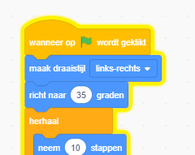

## Papegaai afleiding

<div style="display: flex; flex-wrap: wrap">
<div style="flex-basis: 200px; flex-grow: 1; margin-right: 15px;">
Om het voor spelers moeilijker te maken om de kever te vinden en erop te klikken, voeg je een vervelende papegaai toe om ze af te leiden. 
</div>
<div>

{:width="300px"}

</div>
</div>

### Voeg de Parrot sprite toe

--- task ---

Voeg de **Parrot** (papegaai) sprite toe.


--- /task ---

### De Parrot sprite.

In het [Neem de bus](https://projects.raspberrypi.org/nl-NL/projects/catch-the-bus){:target="_blank"}-project heb je een `herhaal`{:class="block3control"} blok gebruikt.

Je gebruikt hier een andere lus. Een `herhaal`{:class="block3control"} lus voert de codeblokken daarbinnen keer op keer uit. Het is de perfecte lus voor een vervelende papegaai die niet stopt met rondvliegen en in de weg zitten.

--- task ---

Voeg code toe om de papegaai op een afleidende manier te laten fladderen:


```blocks3
when flag clicked
set rotation style [left-right v] // draai niet ondersteboven
point in direction [35] // getal van -180 tot 180
forever // blijf vervelend doen
move [10] steps // het getal bepaalt de snelheid
if on edge, bounce // blijf op het speelveld
next costume // flapper
change [color v] effect by [5] // probeer 11 of 50
wait [0.25] seconds // probeer 0.1 of 0.5
end
```

--- /task ---

--- task ---

**Test:** Klik op de groene vlag en test jouw project. Weet je nog waar je de kever verstopt hebt?

In Scratch heeft de code die uitgevoerd wordt een gele omtrek:



**Tip:** Als de papegaai tijdens het coderen te vervelend wordt, kun je op de rode stop knop boven het speelveld klikken om te voorkomen dat de code wordt uitgevoerd.

--- /task ---

