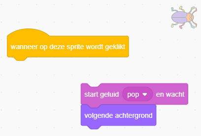
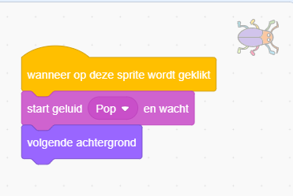

## Tweede niveau

<div style="display: flex; flex-wrap: wrap">
<div style="flex-basis: 200px; flex-grow: 1; margin-right: 15px;">
Je kiest een achtergrond om een tweede niveau voor je spel te maken en maakt het moeilijker om de kever te vinden. 
</div>
<div>

{:width="300px"}

</div>
</div>

--- task ---

**Kies:** Kies een achtergrond voor je tweede niveau. We hebben de **Urban** (stedelijk) achtergrond gekozen, maar je kunt degene kiezen die jij het leukst vindt.


**Tip:** Onthoud dat achtergronden met veel kleuren en details het moeilijker maken om de kever te vinden. Hoe moeilijk ga jij je spel maken?

--- /task ---

Om je kever naar een nieuwe positie te kunnen slepen, moet je het `wanneer op deze sprite wordt geklikt`{:class="block3events"}-script stoppen zodat het niet uitgevoerd wordt.

--- task ---

Sleep de blokken weg van het `wanneer op deze sprite wordt geklikt`{:class="block3events"} blok om te voorkomen dat ze worden uitgevoerd wanneer je op de kever klikt:



--- /task ---

Je kever moet moeilijker te vinden zijn als de achtergrond verandert. Je kunt de grootte van de kever veranderen om het moeilijker te maken hem te vinden.

--- task ---

Voeg code toe aan `maak grootte`{:class="block3looks"} voor de kever van het tweede niveau:


```blocks3
when backdrop switches to [Urban v] // kies je achtergrond
set size to [20] % // probeer een andere grootte
```

**Test:** Klik op je nieuwe script om het uit te voeren.

--- /task ---

--- task ---

Sleep je kever op het speelveld naar een goede verstopplek op dit niveau.


--- /task ---

Plaats je kever in zijn verstopplek.

--- task ---

Voeg een `ga naar x: y:`{:class="block3motion"} blok toe:


```blocks3
when backdrop switches to [Urban v]
set size to [20] % // probeer een andere grootte
+ go to x: [24] y: [13] // in de etalage
```

--- /task ---

--- task ---

Voeg de blokken weer toe aan het `wanneer op deze sprite wordt geklikt`{:class="block3events"} blok zodat wanneer op de kever wordt geklikt de achtergrond overschakelt naar de `volgende achtergrond`{:class="block3looks"}:



--- /task ---

--- task ---

**Test:** Klik op de groene vlag om je project te testen.

--- /task ---

Je kever kan nu vóór de papegaai zitten.

--- task ---

Voeg een script toe om ervoor te zorgen dat je kever altijd op de `achtergrond`{:class="block3looks"} zit:


```blocks3
when flag clicked
forever
go to [back v] layer
```

Nu blijft je kever altijd achterin, zelfs als je zijn positie moet veranderen.

--- /task ---

--- save ---
