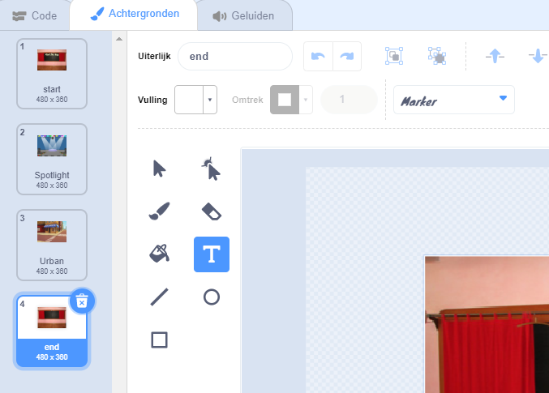
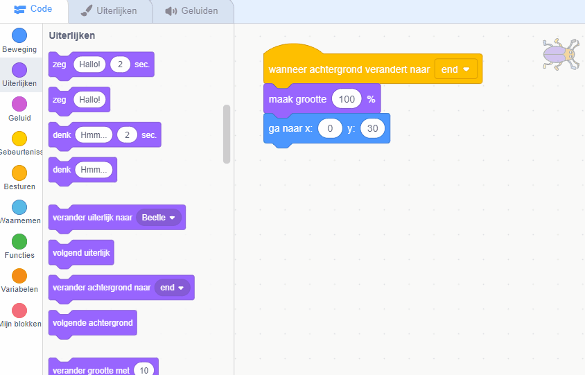

## Eindscherm

<div style="display: flex; flex-wrap: wrap">
<div style="flex-basis: 200px; flex-grow: 1; margin-right: 15px;">
Create an 'end' screen to show the number of seconds that it has taken the player to find the bugs. 
</div>
<div>

{:width="300px"}

</div>
</div>

<p style="border-left: solid; border-width:10px; border-color: #0faeb0; background-color: aliceblue; padding: 10px;">
Soms is alleen het verslaan van een spel niet genoeg. Spelers willen graag weten hoe ze het hebben gedaan tegen andere spelers of tegen zichzelf. Kun je een spel bedenken dat laat zien hoe goed je het hebt gedaan?</p>

### Add another backdrop

--- task ---

Voeg de **Chalkboard** (bord) achtergrond uit de categorie **Binnen** toe.


**Tip:** In Scratch kun je dezelfde achtergrond meer dan één keer toevoegen.

--- /task ---

### Edit the backdrop

--- task ---

Klik op het **Achtergronden** tabblad om de Teken-editor te openen.


--- /task ---

--- task ---

Verander de naam van de achtergrond in `end` (einde):



**Tip:** Je hernoemt je achtergrond naar **end** om je code makkelijker te begrijpen.

--- /task ---

### Position the bug

--- task ---

Klik op de **kever** sprite en voeg code toe om de kever op het 'eind' scherm te plaatsen:


```blocks3
when backdrop switches to [end v]
set size to [100] % // full-sized
go to x: [0] y: [30] // on the board
```

--- /task ---

### Add a timer

Hoeveel tijd kost het je om de kevers te vinden en erop te klikken? Scratch heeft een `klok`{:class="block3sensing"} die je hiervoor kunt gebruiken.

--- task ---

Het `klok`{:class="block3sensing"} blok komt uit het `Waarnemen`{:class="block3sensing"} blokkenmenu. Voeg code toe om de kever de `klok`{:class="block3sensing"} te laten `zeggen`{:class="block3looks"} op het 'eind' scherm:


```blocks3
when backdrop switches to [end v]
set size to [100] % // full-sized
go to x: [0] y: [30] // on the board
+say (timer) // seconds taken
```



--- /task ---

--- task ---

**Test:** Klik op de groene vlag om je zoekvaardigheid te testen. Hoeveel tijd kost het je om de kevers te vinden en erop te klikken?

--- /task ---

Om terug te gaan naar het 'start' scherm, klik je op de kever in het 'eind' scherm.

--- task ---

Voeg code toe om ervoor te zorgen dat de kever stopt met het zeggen van de `klok`{:class="block3sensing"} wanneer je naar het 'start' scherm gaat:


```blocks3
when backdrop switches to [start v]
set size to [100] % // full-sized
go to x: [0] y: [30] // on the board
+say [] // say nothing
```

--- /task ---

### Stop the timer

Als je het spel een tweede keer speelt, blijft de `klok`{:class="block3sensing"} tellen.

--- task ---

Voeg code toe om `zet klok op 0`{:class="block3sensing"} te doen wanneer de `achtergrond overschakelt naar`{:class="block3events"} het eerste niveau:


```blocks3
when backdrop switches to [Spotlight v] // first level
set size to [20] % // tiny
go to x: [13] y: [132] // on the disco ball
+reset timer // start the timer
```

--- /task ---

--- task ---

**Test:** Klik op de groene vlag en speel het spel. De klok moet nu weer op 0 beginnen als je op de kever in het 'start' scherm klikt om naar het eerste niveau te gaan. Als je op de kever klikt in het 'eind' scherm, zou je terug moeten keren naar het 'start' scherm en zien dat de kever de `klok`{;class="block3sensing"} niet zegt.

--- /task ---

