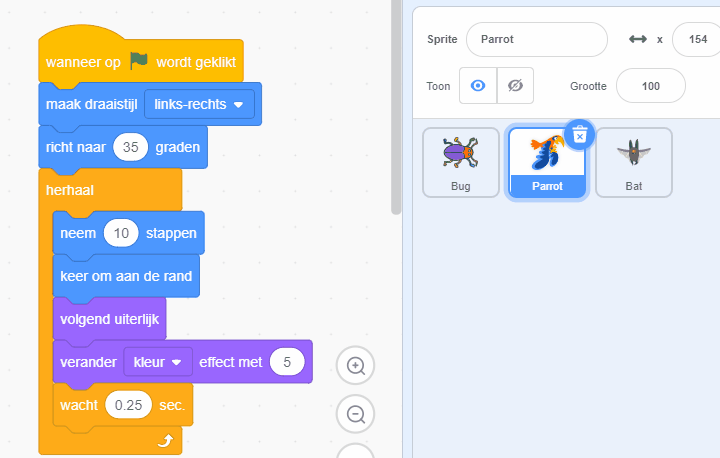

## Verbeter je spel

Als je tijd hebt, kun je meer niveaus en meer afleidingen aan je spel toevoegen. Je kunt ook de sprite die zich verstopt en de tekst op het bord veranderen.

--- task ---

Speel je spel en kijk hoe snel je de kevers kunt vinden.

Is er iemand anders die jouw spel kan uitproberen? Hoe snel kunnen ze de kevers vinden? Ze zullen niet weten waar je ze hebt verstopt, dus het kan hen wat meer tijd kosten!

Is er iets dat je wilt veranderen?

Je kunt:
- De papegaai nog vervelender kunnen maken
- Maak de kever kleiner
- Het `kleur effect`{:class="block3looks"} veranderen om de kever op elk niveau te camoufleren
- Het lettertype of kleur van de tekst veranderen

--- /task ---

### Voeg meer niveaus toe

--- task ---

Dit zijn de blokken die je nodig hebt om een kever op een nieuw niveau te verstoppen:

```blocks3
when backdrop switches to [new level v]

set size to [20] %

go to x: [0] y: [0] // drag to position the bug first

set [color v] effect to [50]
```

Voor elk niveau, moet je:
- Een achtergrond toevoegen
- Op het speelveld klikken, dan op het **Achtergronden** tabblad, en de nieuwe achtergrond dan naar de plaats vóór de **eind** achtergrond slepen
- Een `wanneer achtergrond verandert naar`{:class="block3events"} blok toevoegen voor de nieuwe achtergrond en code toevoegen om de kever te positioneren en te verstoppen

**Tip:** Om de kever naar een nieuwe verstopplek te slepen, moet je de code 'opbreken' zodat de achtergrond niet verandert als je op de kever klikt om een nieuwe positie te kiezen.

--- /task ---

### Voeg meer afleidingen toe

--- task ---

Je kunt meer papegaaien of andere sprites kiezen die zorgen voor afleiding.

Dit is de code die je gebruikt hebt voor de papegaai:

```blocks3
when flag clicked
set rotation style [left-right v] // do not go upside down
point in direction [35] // number from -180 to 180
forever // keep being annoying
move [10] steps // the number controls the speed
if on edge, bounce // stay on the Stage
next costume // flap
change [color v] effect by [5] // try 11 or 50
wait [0.25] seconds // try 0.1 or 0.5
end
```

**Tip:** Je kunt de code van de **Parrot** sprite verslepen naar een andere sprite om sneller een andere afleidingssprite te maken.



--- /task ---

--- collapse ---
---
title: Voltooid project
---

Je kan het [voltooid project hier](https://scratch.mit.edu/projects/486719939/){:target="_blank"} bekijken.

--- /collapse ---