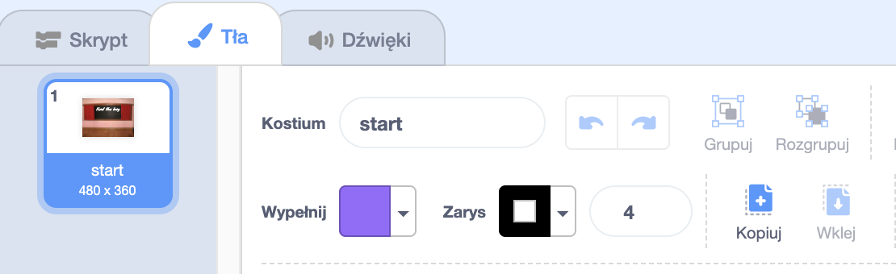

## Ekran startowy

Twoja gra rozpocznie się od ekranu "start", a gracze klikną robaka, aby przejść do pierwszego poziomu.

{:width="300px"}

--- task ---

Otwórz [projekt startowy Znajdź robaka ](https://scratch.mit.edu/projects/582214723/editor){:target="_blank"}. Scratch otworzy się w nowej zakładce przeglądarki.

[[[working-offline]]]

--- /task ---

--- task ---

Dodaj tło **Chalkboard** z kategorii **W pomieszczeniu**.

--- /task ---

**Scena** posiada zakładkę **tła** zamiast zakładki **Kostiumy**. Tutaj możesz tworzyć obrazki dla **Sceny**.

--- task ---

Kliknij panel Sceny.

--- /task ---

--- task ---

Kliknij na zakładkę **tła**, aby otworzyć edytor Paint.

--- /task ---

--- task ---

Wybierz **backdrop1** i kliknij ikonę **Usuń** aby usunąć **backdrop1** z projektu. W tym projekcie nie będziesz potrzebował tła **backdrop1**.

--- /task ---

Tło **Chalkboard** zostanie teraz podświetlone.

--- task ---

Kliknij **Konwertuj na wektor**. Teraz będziesz mógł dodać tekst, który możesz przemieszczać.

--- /task ---

--- task ---

Użyj narzędzia **Tekst**, aby dodać tekst `Znajdź robaka` na tablicy:

Użyliśmy czcionki **Marker** w kolorze białym, ale **wybierz** czcionkę i kolor, którego chcesz użyć.

**Wskazówka:** Przełącz się na narzędzie **Wybierz** (Strzałka), aby przemieścić tekst. Aby zmienić wielkość tekstu, chwyć róg tekstu i go przeciągnij.

--- /task ---

--- task ---

Zmień nazwę tła na `start`, ponieważ będziesz musiał wybrać je później w projekcie.

**Wskazówka** Jeśli użyjesz nazw, które mają sens, łatwiej będzie zrozumieć Twój projekt, zwłaszcza gdy wrócisz do niego później.

--- /task ---

--- task ---

Usuń duszka **Scratch Cat**.

--- /task ---

--- task ---

Kliknij na **Wybierz kostium** i wpisz `bug` w polu wyszukiwania.

**Wybierz:** Wybierz robaka, którego gracze będą musieli znaleźć w Twojej grze.

**Wskazówka** Nadaj swojemu projektowi nazwę. Możesz dołączyć nazwę robaka, którą właśnie wybrałeś.

--- /task ---

Błąd w programie komputerowym to **bug** (z angielskiego: robak). Proces znajdowania i usuwania błędów w programach komputerowych nazywamy **debugowaniem**. Grace Hopper jest znaną inżynier oprogramowania. Pewnego razu jej zespół znalazł ćmę w ich komputerze. Ich notatki mówią: "Pierwszy rzeczywisty przypadek wykrycia buga."

--- save ---

