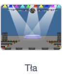

## Pierwszy poziom

<div style="display: flex; flex-wrap: wrap">
<div style="flex-basis: 200px; flex-grow: 1; margin-right: 15px;">
Dodaj nowe tło jako pierwszy poziom gry i ukryj robaka.
</div>
<div>

{:width="300px"}

</div>
</div>

### Dodaj kolejne tło

--- task ---

Dodaj tło **Spotlight** z kategorii **Muzyka**.


--- /task ---

### Zmień rozmiar robaka

--- task ---

Kliknij **robaka** na liście duszków. Dodaj skrypt, aby zmienić `rozmiar`{:class="block3looks"} swojego robaka `kiedy tło zmieni się na Spotlight`{:class="block3events"}:


```blocks3
when backdrop switches to [Spotlight v]
set size to [20] % // malutki
```

--- /task ---

--- task ---

Kliknij kod, by zmienić rozmiar, a następnie przeciągnij swojego malutkiego robaka do kryjówki.

Dodaj kod umieszczający tam Twojego robaka:


```blocks3
when backdrop switches to [Spotlight v]
set size to [20] % // malutki
+ go to x: [13] y: [132] // na kuli dyskotekowej
```

**Wybierz:** Jeśli wolisz, możesz wybrać inny rozmiar i miejsce.

--- /task ---

### Przejdź do następnego tła

Kiedy graczowi uda się odnaleźć robaka, gra przełączy się na następne tło. Ponadto, aby rozpocząć grę, trzeba będzie kliknąć robaka na ekranie początkowym.

Blok `następne tło`{:class="block3looks"} przełącza tło na następne, zgodnie z kolejnością, w jakiej tła są wymienione w zakładce **Tła** dla **Sceny**.

--- task ---

Dodaj skrypt do swojego duszka **robaka** aby `grał dźwięk pop`{:class="block3sound"} i za pomocą polecenia `następne tło`{:class="block3looks"} zmieniał tło, wtedy `kiedy ten duszek kliknięty`{:class="block3events"}:


```blocks3
when this sprite clicked
play sound [Pop v] until done
next backdrop
```

--- /task ---

### Spraw, aby gra zaczęła się od ekranu startowego

--- task ---

Kliknij panel Sceny i dodaj ten kod do **Sceny**:



```blocks3
when flag clicked
switch backdrop to [start v] // ekran startowy
```

--- /task ---

--- task ---

**Test:** Kliknij zieloną flagę, aby przetestować swój projekt.

Zauważ, że na ekranie „start” robak nadal będzie miał ustawienia ukrywania się w kryjówce z pierwszego poziomu (w tym przykładzie na kuli dyskotekowej).

**Wskazówka:** Po ostatnim tle na liście teł, `następne tło`{:class="block3looks"} przełączy się z powrotem na pierwsze tło na liście.

--- /task ---

--- task ---

Kliknij duszka **robaka** na liście duszków. Dodaj skrypt, aby `ustawić rozmiar`{:class="block3looks"} robaka, kiedy Twoje `tło zmieni się na`{:class="block3events"} ekran `start`{:class="block3events"}:


```blocks3
when backdrop switches to [start v]
set size to [100] % // pełnowymiarowy
```

--- /task ---

### Zmień położenie robaka

--- task ---

Spróbuj przenieść robaka w inne miejsce na ekranie „start”.

Twój kod zmienił tło po kliknięciu robaka! Nie jest to zbyt pomocne, gdy próbujesz go gdzieś ustawić.

Aby rozwiązać ten problem, musisz zatrzymać działanie kodu, który wykonuje się po kliknięciu robaka.

--- /task ---

--- task ---

Kliknij zieloną flagę, aby powrócić do ekranu „start”.

Kliknij duszka **robaka** na liście duszków i odłącz bloki kodu od bloku `kiedy ten duszek kliknięty`{:class="block3events"}:


--- /task ---

--- task ---

Spróbuj ponownie umieścić robaka. Przeciągnij robaka na tablicę i umieść go pod tekstem:


Dodaj kod, aby upewnić się, że robak jest umieszczany na tablicy za każdym razem, `kiedy tło zmienia się na`{:class="block3events"} ekran `start`{:class="block3events"}:


```blocks3
when backdrop switches to [start v]
set size to [100] % // pełnowymiarowy
+ go to x: [0] y: [30] // na tablicy
```

--- /task ---

--- task ---

Połącz bloki z powrotem, tak aby bloki kodu ponownie znajdowały się poniżej bloku `kiedy ten duszek kliknięty`{:class="block3events"}:


--- /task ---

--- task ---

**Test:** Kliknij zieloną flagę, aby przetestować swój projekt. Kliknij robaka, aby przejść do następnego tła. Robak powinien być duży na ekranie „start” i mały na poziomie „Spotlight”.

--- collapse ---
---
title: Nic się nie dzieje po kliknięciu robaka
---

Czy bloki kodu zostały ponownie połączone z blokiem `kiedy ten duszek kliknięty`{:class="block3events"}?

--- /collapse ---

--- /task ---