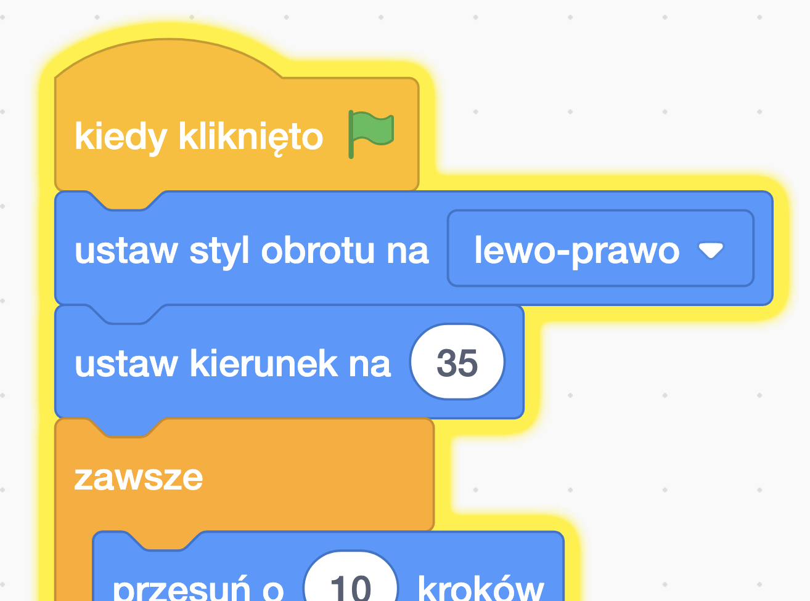

## Rozpraszająca papuga

<div style="display: flex; flex-wrap: wrap">
<div style="flex-basis: 200px; flex-grow: 1; margin-right: 15px;">
Aby utrudnić graczom znalezienie i kliknięcie błędu, dodasz irytującą papugę, aby odwrócić ich uwagę. 
</div>
<div>

{:width="300px"}

</div>
</div>

--- task ---

Dodaj duszka **Parrot**.


--- /task ---

W projekcie [Złap autobus](https://projects.raspberrypi.org/pl-PL/projects/catch-the-bus){:target="_blank"} użyłeś pętli `powtórz`{:class="block3control"}.

Użyjesz tutaj innej pętli. Pętla `zawsze`{:class="block3control"} uruchamia bloki kodu wewnątrz niej raz za razem. To idealna pętla dla irytującej papugi, która nie przestanie latać i przeszkadzać.

--- task ---

Dodaj kod, aby papuga trzepotała w rozpraszający sposób:


```blocks3
when flag clicked
set rotation style [left-right v] // nie idź do góry nogami
point in direction [35] // liczba od -180 do 180
forever // bądź denerwujący
move [10] steps // liczba kontroluje prędkość
if on edge, bounce // pozostań na scenie
next costume // machaj
change [color v] effect by [5] // spróbuj 11 albo 50
wait [0.25] seconds // spróbuj 0.1 albo 0.5
end
```

--- /task ---

--- task ---

**Test:** Kliknij zieloną flagę i ponownie przetestuj swój projekt. Czy pamiętasz, gdzie ukryłeś robaka?

W Scratchu uruchomiony kod jest podświetlony żółtym konturem:



**Wskazówka:** Jeśli papuga stanie się zbyt denerwująca podczas kodowania, możesz kliknąć czerwony przycisk zatrzymania nad sceną, aby zatrzymać wykonywanie kodu.

--- /task ---

--- save ---
