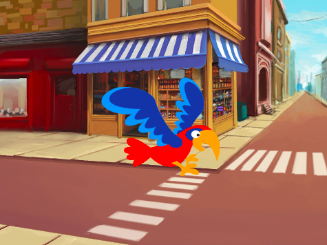
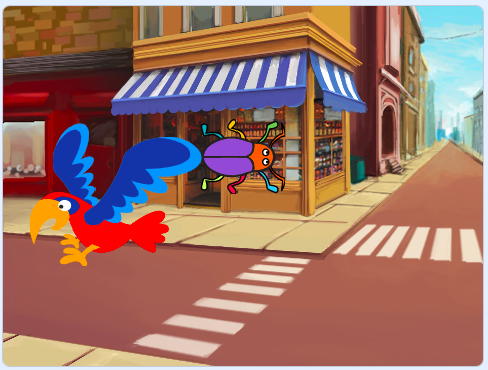
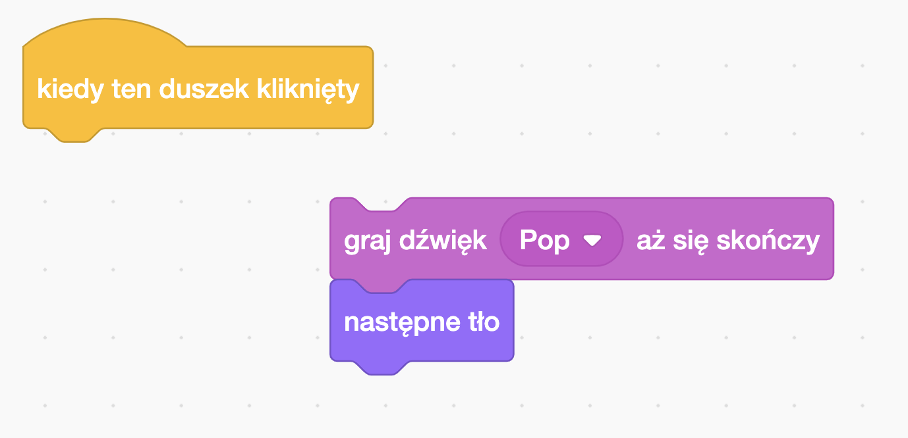
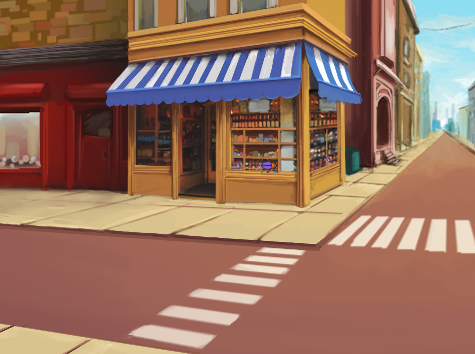
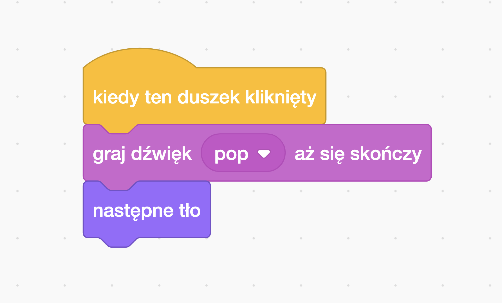

## Drugi poziom

<div style="display: flex; flex-wrap: wrap">
<div style="flex-basis: 200px; flex-grow: 1; margin-right: 15px;">
Wybierz tło, aby stworzyć drugi poziom dla swojej gry i spraw, aby trudno było znaleźć robaka. 
</div>
<div>

{:width="300px"}

</div>
</div>

### Dodaj kolejne tło

--- task ---

**Wybierz:** Wybierz tło dla drugiego poziomu. My wybraliśmy tło **Urban**, ale Ty możesz wybrać to, które najbardziej Ci się podoba.



**Wskazówka:** Pamiętaj, że tła z dużą ilością kolorów i detali utrudnią znalezienie robaka. Jak trudną zrobisz swoją grę?

--- /task ---

### Zatrzymaj działanie kodu

--- task ---

Odłącz bloki kodu od bloku `kiedy ten duszek kliknięty` {:class="block3events"}, aby nie wykonywały się po kliknięciu robaka:



--- /task ---

### Zmień rozmiar robaka

--- task ---

Dodaj kod, aby `ustawić rozmiar`{:class="block3looks"} robaka dla drugiego poziomu:


```blocks3
when backdrop switches to [Urban v] // choose your backdrop
set size to [20] % // try another size 
```

**Test:** Kliknij swój nowy skrypt, aby go uruchomić.

--- /task ---

### Ukryj robaka

--- task ---

Przeciągnij swojego robaka do dobrej kryjówki na tej scenie.



--- /task ---

Umieść swojego robaka w kryjówce.

--- task ---

Dodaj blok `idź do x: y:`{:class="block3motion"} do swojego kodu:


```blocks3
when backdrop switches to [Urban v]
set size to [20] % // try another size 
+ go to x: [24] y: [13] // in the shop window
```

--- /task ---

### Przetestuj swój kod

--- task ---

Dołącz bloki z powrotem do bloku `kiedy ten duszek kliknięty`{:class="block3events"} tak, aby po kliknięciu robaka tło zmieniło się na `następne tło`{:class="block3looks"}:



--- /task ---

--- task ---

**Test:** Kliknij zieloną flagę, aby przetestować swój projekt.

--- /task ---

Twój robak może teraz znajdować się przed papugą.

--- task ---

Dodaj skrypt, aby upewnić się, że robak jest zawsze na `spodzie`{class="block3looks"}:


```blocks3
when flag clicked
forever
go to [back v] layer
```

Teraz Twój robak zawsze będzie z tyłu, nawet jeśli zmienisz jego pozycję.

--- /task ---
