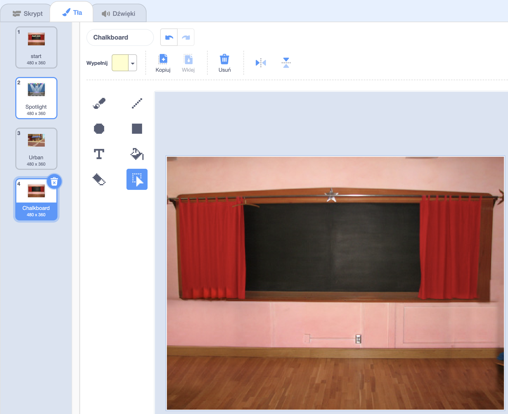
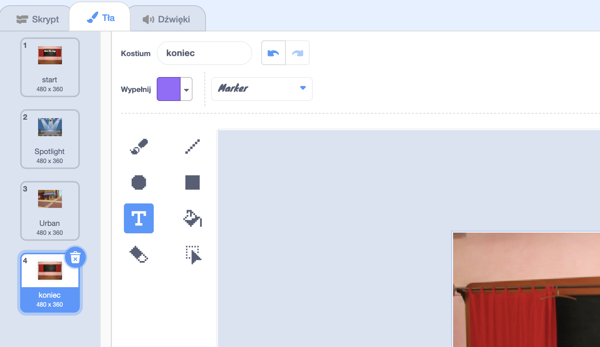
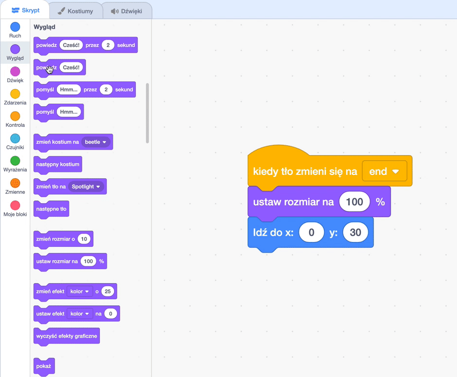

## Ekran końcowy

<div style="display: flex; flex-wrap: wrap">
<div style="flex-basis: 200px; flex-grow: 1; margin-right: 15px;">
Stworzysz ekran „koniec”, który pokaże liczbę sekund, ilu potrzebował gracz, aby znaleźć robaki. 
</div>
<div>

{:width="300px"}

</div>
</div>

<p style="border-left: solid; border-width:10px; border-color: #0faeb0; background-color: aliceblue; padding: 10px;">
Czasami samo przejście gry nie jest wystarczające. Gracze lubią wiedzieć, jak poradzili sobie w porównaniu do innych graczy lub swoich poprzednich prób. Czy potrafisz wymyślić grę, która pokazuje graczom, jak dobrze sobie poradzili?</p>

### Dodaj kolejne tło

--- task ---

Dodaj tło **Chalkboard** z kategorii **W pomieszczeniu**.


**Wskazówka:** W Scratchu możesz dodać to samo tło więcej niż raz.

--- /task ---

### Edytuj tło

--- task ---

Kliknij zakładkę **Tła**, aby otworzyć edytor Paint.



--- /task ---

--- task ---

Zmień nazwę tła na `koniec`:



**Wskazówka:** Zmiana nazwy tła na **koniec** ułatwia zrozumienie kodu.

--- /task ---

### Umieść robaka

--- task ---

Kliknij duszka **robaka** i dodaj kod, aby umieścić go na ekranie „koniec”:


```blocks3
when backdrop switches to [end v]
set size to [100] % // pełnowymiarowy
go to x: [0] y: [30] // na tablicy
```

--- /task ---

### Dodaj stoper

Ile czasu zajmuje Ci znalezienie i kliknięcie robaków? Scratch ma `stoper`{:class="block3sensing"}, którego możesz użyć, aby się tego dowiedzieć.

--- task ---

Blok `stoper`{:class="block3sensing"} znajduje się w sekcji bloków `Czujniki`{:class="block3sensing"}. Dodaj kod, aby robak `powiedział`{:class="block3looks"} `stoper`{:class="block3sensing"} na ekranie „koniec”:


```blocks3
when backdrop switches to [end v]
set size to [100] % // pełnowymiarowy
go to x: [0] y: [30] // na tablicy
+say (timer) // sekundy, które upłynęły
```



--- /task ---

--- task ---

**Test:** Kliknij zieloną flagę, aby przetestować swoje umiejętności szukania. Ile czasu zajmuje Ci znalezienie robaków?

--- /task ---

Aby wrócić do ekranu „start”, kliknij robaka na ekranie „koniec”.

--- task ---

Dodaj kod, aby robak przestał mówić `stoper`{:class="block3sensing"} po przejściu do ekranu „start”:


```blocks3
when backdrop switches to [start v]
set size to [100] % // pełnowymiarowy
go to x: [0] y: [30] // na tablicy
+say [] // nie mów nic
```

--- /task ---

### Zatrzymaj stoper

Jeśli zagrasz w grę po raz drugi, `stoper`{:class="block3sensing"} będzie kontynuował liczenie czasu.

--- task ---

Dodaj polecenie `resetuj stoper`{:class="block3sensing"} tak, aby wykonywało się `kiedy tło zmieni się na`{:class="block3events"} pierwszy poziom:


```blocks3
when backdrop switches to [Spotlight v] // pierwszy poziom
set size to [20] % // malutki
go to x: [13] y: [132] // na kuli dyskotekowej
+reset timer // uruchom stoper
```

--- /task ---

--- task ---

**Test:** Kliknij zieloną flagę i zagraj w swoją grę. Stoper powinien się zresetować po kliknięciu robaka na ekranie „start” przy przejściu do pierwszego poziomu. Kiedy klikniesz robaka na ekranie „koniec”, gra powinna wrócić do ekranu „start”, a robak nie powinien już mówić pomiaru `stopera`{:class="block3sensing"}.

--- /task ---

